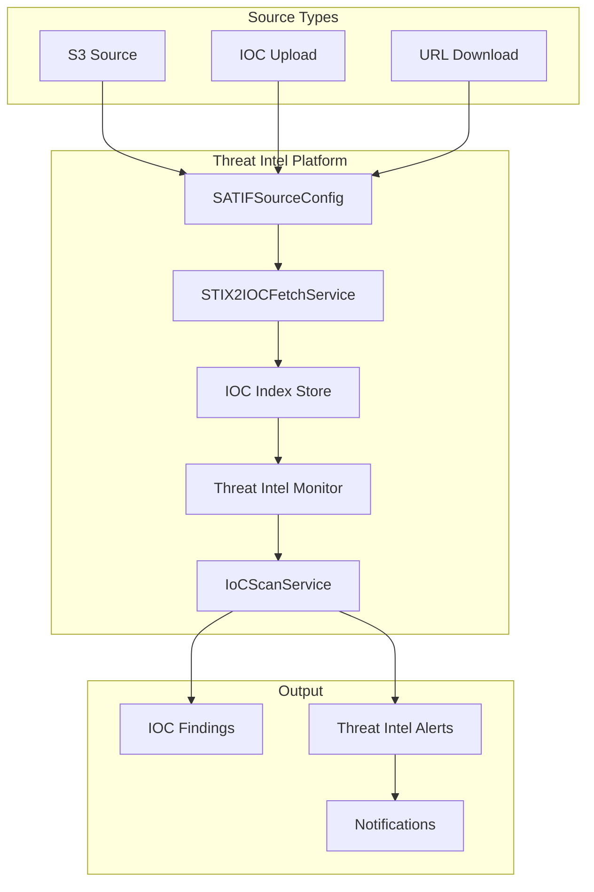

---
tags:
  - security-analytics
---
# Threat Intel Platform

## Summary

OpenSearch v2.16.0 introduces the Threat Intelligence Platform for Security Analytics, enabling users to integrate threat intelligence feeds and detect malicious indicators in their data. This release adds comprehensive IOC (Indicators of Compromise) management, threat intel monitors, and multiple source types including S3, local upload, and URL download.

## Details

### What's New in v2.16.0

The Threat Intel Platform is a major new feature that provides:

1. **Threat Intelligence Source Management**: Configure and manage multiple threat intel feeds
2. **IOC Storage and Indexing**: Store and index IOCs in STIX2 format
3. **Threat Intel Monitors**: Automated scanning of data against IOC stores
4. **Findings and Alerts**: Generate findings and alerts when malicious indicators are detected
5. **Multiple Source Types**: Support for S3, IOC upload, and URL download sources

### Architecture

### Technical Changes

| Component | Change |
|-----------|--------|
| `SecurityAnalyticsPlugin` | Extended to implement `RemoteMonitorRunnerExtension` for threat intel monitors |
| `SATIFSourceConfig` | New model for threat intelligence source configuration |
| `STIX2IOC` / `STIX2IOCDto` | IOC data models in STIX2 format |
| `ThreatIntelMonitorRunner` | Remote monitor runner for threat intel scanning |
| `SaIoCScanService` | Service for scanning data against IOC store |
| `IocFindingService` | Service for managing IOC findings |
| `ThreatIntelAlertService` | Service for managing threat intel alerts |
| `TIFSourceConfigRunner` | Job scheduler runner for source refresh |

### New REST APIs

| Endpoint | Method | Description |
|----------|--------|-------------|
| `/_plugins/_security_analytics/threat_intel/sources` | POST | Create threat intel source |
| `/_plugins/_security_analytics/threat_intel/sources/{id}` | GET | Get source configuration |
| `/_plugins/_security_analytics/threat_intel/sources/{id}` | DELETE | Delete source configuration |
| `/_plugins/_security_analytics/threat_intel/sources/_search` | POST | Search source configurations |
| `/_plugins/_security_analytics/threat_intel/sources/{id}/_refresh` | POST | Refresh source IOCs |
| `/_plugins/_security_analytics/threat_intel/monitors` | POST | Create threat intel monitor |
| `/_plugins/_security_analytics/threat_intel/monitors/{id}` | DELETE | Delete threat intel monitor |
| `/_plugins/_security_analytics/threat_intel/monitors/_search` | POST | Search threat intel monitors |
| `/_plugins/_security_analytics/threat_intel/iocs` | GET | List IOCs |
| `/_plugins/_security_analytics/threat_intel/alerts` | GET | Get threat intel alerts |
| `/_plugins/_security_analytics/threat_intel/alerts/status` | PUT | Update alert status |
| `/_plugins/_security_analytics/connections/s3/test` | POST | Test S3 connection |

### Supported IOC Types

| Type | Description |
|------|-------------|
| `ipv4-addr` | IPv4 addresses |
| `ipv6-addr` | IPv6 addresses |
| `domain-name` | Domain names |
| `hashes` | File hashes (MD5, SHA-1, SHA-256) |

### New Settings

| Setting | Description |
|---------|-------------|
| `plugins.security_analytics.ioc_finding_history_enabled` | Enable IOC finding history |
| `plugins.security_analytics.ioc_finding_history_max_docs` | Max docs for IOC finding history |
| `plugins.security_analytics.ioc_finding_history_index_max_age` | Max age for IOC finding history index |
| `plugins.security_analytics.ioc_finding_history_rollover_period` | Rollover period for IOC finding history |
| `plugins.security_analytics.ioc_finding_history_retention_period` | Retention period for IOC finding history |
| `plugins.security_analytics.ioc_index_retention_period` | IOC index retention period |
| `plugins.security_analytics.ioc_max_indices_per_alias` | Max indices per IOC alias |

## Limitations

- IOC_UPLOAD sources cannot be refreshed on a schedule; manual re-upload is required
- Threat intel monitors require at least one enabled source for scanning
- URL_DOWNLOAD source type added but requires proper network access configuration

## References

### Documentation
- [Threat Intelligence](https://docs.opensearch.org/2.16/security-analytics/threat-intelligence/index/)
- [Getting Started](https://docs.opensearch.org/2.16/security-analytics/threat-intelligence/getting-started/)
- [Threat Intelligence APIs](https://docs.opensearch.org/2.16/security-analytics/threat-intelligence/api/threat-intel-api/)

### Pull Requests
| PR | Description | Related Issue |
|----|-------------|---------------|
| [#1098](https://github.com/opensearch-project/security-analytics/pull/1098) | Threat Intel Analytics - main feature implementation | [#1117](https://github.com/opensearch-project/security-analytics/issues/1117) |
| [#1068](https://github.com/opensearch-project/security-analytics/pull/1068) | Support for URL_Download source type and activate/deactivate logic |  |
| [#1071](https://github.com/opensearch-project/security-analytics/pull/1071) | Fetch up to 10k source configs and IOCs under source details |  |
| [#1064](https://github.com/opensearch-project/security-analytics/pull/1064) | Show fields for aliases in correlation rule and threat intel monitor |  |
| [#1129](https://github.com/opensearch-project/security-analytics/pull/1129) | Error handling for incompatible IOC types from S3 |  |
| [#1130](https://github.com/opensearch-project/security-analytics/pull/1130) | Fix findingIds filter on IOC findings search API |  |
| [#1156](https://github.com/opensearch-project/security-analytics/pull/1156) | Adjusted IOCTypes usage |  |
| [#1157](https://github.com/opensearch-project/security-analytics/pull/1157) | Fix job scheduler parser, action listeners, and multi-node test |  |
| [#1163](https://github.com/opensearch-project/security-analytics/pull/1163) | ListIOCs API to return number of findings per IOC |  |
| [#1162](https://github.com/opensearch-project/security-analytics/pull/1162) | IOC upload integration tests and fix update |  |
| [#1173](https://github.com/opensearch-project/security-analytics/pull/1173) | Resolve aliases in monitor input to concrete indices |  |
| [#1178](https://github.com/opensearch-project/security-analytics/pull/1178) | Enum fix for IOC state |  |
| [#1184](https://github.com/opensearch-project/security-analytics/pull/1184) | Fix threat intel monitor finding to contain all doc_ids |  |
| [#1187](https://github.com/opensearch-project/security-analytics/pull/1187) | Fixed bulk indexing for IOCs |  |
| [#1192](https://github.com/opensearch-project/security-analytics/pull/1192) | Fix IOC upload update behavior and error response |  |
| [#1198](https://github.com/opensearch-project/security-analytics/pull/1198) | Catch and wrap exceptions |  |
| [#1076](https://github.com/opensearch-project/security-analytics/pull/1076) | Updated IOCTypes |  |
| [#1080](https://github.com/opensearch-project/security-analytics/pull/1080) | Fixed UI issues |  |
