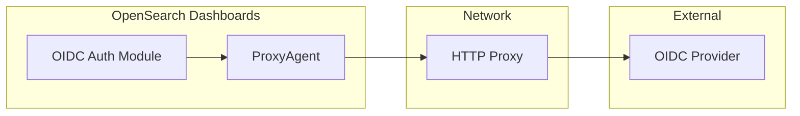

---
tags:
  - security-dashboards
---
# Security OIDC HTTP Proxy

## Summary

OpenSearch Dashboards v2.16.0 adds HTTP proxy support for OIDC (OpenID Connect) authentication. This enhancement enables organizations operating in closed network environments to use OIDC authentication by routing requests through HTTP/HTTPS proxies.

## Details

### What's New in v2.16.0

The OIDC authentication module now supports HTTP proxy configuration through standard environment variables (`http_proxy`, `https_proxy`, `HTTP_PROXY`, `HTTPS_PROXY`). This allows OpenSearch Dashboards to communicate with external OIDC identity providers through corporate proxy servers.

### Technical Changes

The implementation replaces the standard Node.js HTTP/HTTPS agents with `proxy-agent`, which automatically detects and uses proxy settings from environment variables.



Key changes in `openid_auth.ts`:
- Added `proxy-agent` dependency for automatic proxy detection
- Replaced `HTTP.Agent` and `HTTPS.Agent` with `ProxyAgent`
- Proxy settings are automatically read from environment variables

### Configuration

No explicit configuration is required in OpenSearch Dashboards. Set standard proxy environment variables before starting the service:

```bash
export https_proxy=http://proxy.example.com:8080
export http_proxy=http://proxy.example.com:8080
```

The `ProxyAgent` automatically detects these environment variables and routes OIDC-related HTTP requests through the configured proxy.

### Use Cases

- Corporate environments requiring all external traffic to pass through a proxy
- Air-gapped or restricted network deployments with controlled internet access
- Compliance scenarios where network traffic must be monitored/logged via proxy

## Limitations

- Proxy authentication (username/password) support depends on the `proxy-agent` library capabilities
- Only affects OIDC authentication flows; other OpenSearch Dashboards HTTP requests may not use the proxy
- Requires environment variables to be set before OpenSearch Dashboards starts

## References

### Pull Requests
| PR | Description | Related Issue |
|----|-------------|---------------|
| [#2024](https://github.com/opensearch-project/security-dashboards-plugin/pull/2024) | feat: http proxy support for oidc | [#911](https://github.com/opensearch-project/security-dashboards-plugin/issues/911) |

### Issues
- [#911](https://github.com/opensearch-project/security-dashboards-plugin/issues/911): Support httpsProxy in OpenSearch Dashboards for OIDC support
