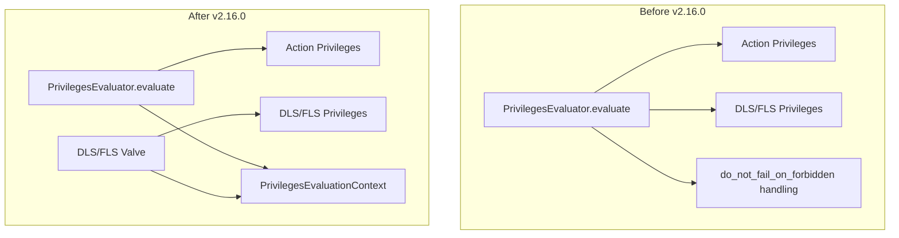

---
tags:
  - security
---
# Security DLS/FLS & Privilege Evaluation

## Summary

OpenSearch v2.16.0 includes foundational refactoring work for the Security plugin's privilege evaluation system. These changes separate DLS/FLS (Document-Level Security/Field-Level Security) privilege evaluation from action privilege evaluation, introduce a new action group resolution algorithm, fix system index permission checks, and simplify role handling. This work is part of a larger effort to optimize privilege evaluation performance (Issue #3870).

## Details

### What's New in v2.16.0

#### Separated DLS/FLS Privilege Evaluation
The `PrivilegesEvaluator.evaluate()` method was refactored to separate DLS/FLS privilege computation from action privilege evaluation. Key improvements:
- Better separation of concerns and modularization
- DLS/FLS computations now occur directly in the DLS/FLS valve code
- If DLS/FLS valve is disabled, no DLS/FLS privileges are computed (performance improvement)
- New `PrivilegesEvaluationContext` class combines commonly needed information for privilege evaluation

#### Removed do_not_fail_on_forbidden Special Handling
The special handling for `do_not_fail_on_forbidden` on cluster actions was removed. This eliminates inconsistent behavior where:
- Multi-part requests (`mget`, `msearch`, `mtv`, `scroll`) required permissions in both `cluster_permissions` and `index_permissions`
- `_mget` gained invalid index pattern support in `do_not_fail_on_forbidden` mode
- `indices:data/read/scroll` required index privileges but any index would satisfy the check

After this change, both clusters with `do_not_fail_on_forbidden` set to `true` or `false` require the same set of privileges.

#### New Action Group Resolution Algorithm
A new `FlattenedActionGroups` class replaces the previous action group resolution in `ConfigModelV7`:
- Independent class enhancing testability and reusability
- Handles action group configurations containing loops gracefully (previously caused StackOverflowErrors)
- Pre-computes resolved action groups for better performance

#### System Index Permission Check Fix
Fixed a bug where documents in normal indexes could not be queried when `plugins.security.system_indices.permission.enabled` was enabled. The `SecurityIndexSearcherWrapper` was incorrectly checking for `system:admin/system_index` permission for all indexes, not just system indexes.

#### SecurityRoles Simplification
Replaced uses of `SecurityRoles` with `Set<String> mappedRoles` where the full `SecurityRoles` functionality is not needed. This reduces coupling and prepares for future privilege evaluation optimizations.

### Technical Changes

## Limitations

- These changes are preparatory refactoring for the larger Optimized Privilege Evaluation effort (Issue #3870)
- Full performance improvements will be realized in future versions when the complete optimization is merged

## References

### Pull Requests
| PR | Description | Related Issue |
|----|-------------|---------------|
| [#4490](https://github.com/opensearch-project/security/pull/4490) | Separated DLS/FLS privilege evaluation from action privilege evaluation | [#3870](https://github.com/opensearch-project/security/issues/3870) |
| [#4486](https://github.com/opensearch-project/security/pull/4486) | Remove special handling for do_not_fail_on_forbidden on cluster actions | [#4485](https://github.com/opensearch-project/security/issues/4485) |
| [#4448](https://github.com/opensearch-project/security/pull/4448) | New algorithm for resolving action groups | [#4380](https://github.com/opensearch-project/security/pull/4380) |
| [#4430](https://github.com/opensearch-project/security/pull/4430) | Check block request only if system index | [#4429](https://github.com/opensearch-project/security/issues/4429) |
| [#4432](https://github.com/opensearch-project/security/pull/4432) | Replaced uses of SecurityRoles by Set<String> mappedRoles | [#4380](https://github.com/opensearch-project/security/pull/4380) |

### Related Issues
- [#3870](https://github.com/opensearch-project/security/issues/3870): Optimized Privilege Evaluation (parent issue)
- [#4485](https://github.com/opensearch-project/security/issues/4485): do_not_fail_on_forbidden mode introduces inconsistencies
- [#4429](https://github.com/opensearch-project/security/issues/4429): System index permission check bug

### Documentation
- [Document-Level Security](https://docs.opensearch.org/2.16/security/access-control/document-level-security/)
- [Field-Level Security](https://docs.opensearch.org/2.16/security/access-control/field-level-security/)
- [Security Settings](https://docs.opensearch.org/2.16/install-and-configure/configuring-opensearch/security-settings/)
