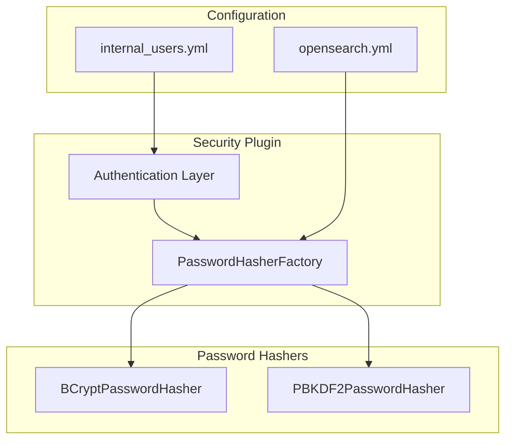

---
tags:
  - security
---
# Security Password Hashing

## Summary

OpenSearch 2.16.0 introduces PBKDF2 as an alternative password hashing algorithm and adds configuration options for both BCrypt and PBKDF2. This enhancement provides FIPS-compliant password hashing and allows administrators to customize hashing parameters for their security requirements.

## Details

### What's New in v2.16.0

1. **PBKDF2 Support**: Added PBKDF2 (Password-Based Key Derivation Function 2) as a FIPS-compliant alternative to BCrypt
2. **BCrypt Configuration**: Added ability to configure BCrypt rounds and minor version
3. **PBKDF2 Configuration**: Added configurable iterations, length, and hash function for PBKDF2
4. **Updated hash.sh Tool**: CLI tool now supports both algorithms with full parameter configuration

### Architecture



### Configuration

| Setting | Description | Default |
|---------|-------------|---------|
| `plugins.security.password.hashing.algorithm` | Algorithm selection: `bcrypt` or `pbkdf2` | `bcrypt` |
| `plugins.security.password.hashing.bcrypt.rounds` | BCrypt log rounds (4-31) | `12` |
| `plugins.security.password.hashing.bcrypt.minor` | BCrypt version: `A`, `B`, or `Y` | `Y` |
| `plugins.security.password.hashing.pbkdf2.iterations` | PBKDF2 iteration count | `600000` |
| `plugins.security.password.hashing.pbkdf2.length` | Output key length in bits | `256` |
| `plugins.security.password.hashing.pbkdf2.function` | Hash function: `SHA1`, `SHA224`, `SHA256`, `SHA384`, `SHA512` | `SHA256` |

### Usage Example

#### Enable PBKDF2 in opensearch.yml

```yaml
plugins.security.password.hashing.algorithm: pbkdf2
plugins.security.password.hashing.pbkdf2.iterations: 650000
plugins.security.password.hashing.pbkdf2.length: 512
plugins.security.password.hashing.pbkdf2.function: SHA512
```

#### Configure BCrypt Parameters

```yaml
plugins.security.password.hashing.algorithm: bcrypt
plugins.security.password.hashing.bcrypt.rounds: 14
plugins.security.password.hashing.bcrypt.minor: Y
```

#### Generate Hash Using CLI

```bash
# BCrypt with custom settings
./plugins/opensearch-security/tools/hash.sh -p "password" -a BCrypt -r 14 -min Y

# PBKDF2 with custom settings
./plugins/opensearch-security/tools/hash.sh -p "password" -a PBKDF2 -f SHA512 -l 512 -i 650000
```

### Technical Changes

- New `PasswordHasherFactory` creates appropriate hasher based on configuration
- `PBKDF2PasswordHasher` implements PBKDF2 using password4j library
- `BCryptPasswordHasher` updated to support configurable rounds and minor version
- `AbstractPasswordHasher` provides common functionality for password hashers
- Audit log redaction updated to handle both BCrypt and PBKDF2 hash patterns
- `hash.sh` CLI tool extended with algorithm selection and parameter options

## Limitations

- Changing the hashing algorithm requires rehashing all existing passwords
- All cluster nodes must use identical password hashing configuration
- PBKDF2 with high iteration counts increases authentication latency

## References

### Documentation
- [Security Settings](https://docs.opensearch.org/2.16/install-and-configure/configuring-opensearch/security-settings/): Official configuration reference

### Pull Requests
| PR | Description | Related Issue |
|----|-------------|---------------|
| [#4524](https://github.com/opensearch-project/security/pull/4524) | Add PBKDF2 support and BCrypt/PBKDF2 configuration | [#4590](https://github.com/opensearch-project/security/issues/4590), [#3420](https://github.com/opensearch-project/security/issues/3420) |
