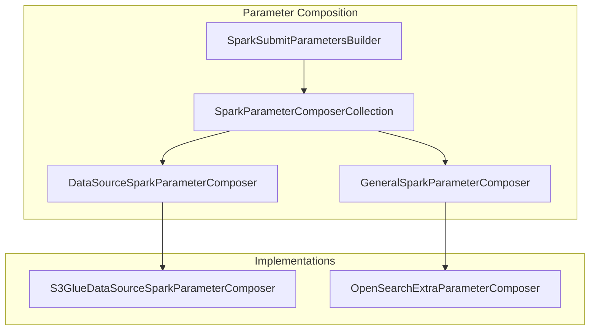

---
tags:
  - sql
---
# SparkParameterComposerCollection

## Summary

Introduces `SparkParameterComposerCollection` to abstract datasource-type-specific logic from the async-query-core module. This refactoring improves modularity by allowing datasource-specific Spark submit parameters to be composed through a collection of registered composers rather than being hardcoded in the core library.

## Details

### What's New in v2.16.0

The PR introduces a new parameter composition architecture that separates datasource-specific parameter handling from the core async query logic:

- **SparkParameterComposerCollection**: A registry that holds and dispatches parameter composition to registered composers
- **DataSourceSparkParameterComposer**: Interface for datasource-type-specific parameter composition (e.g., S3Glue)
- **GeneralSparkParameterComposer**: Interface for general parameter composition that applies regardless of datasource type
- **SparkSubmitParametersBuilder**: Builder class that uses the composer collection to construct Spark submit parameters
- **SparkSubmitParametersBuilderProvider**: Factory that provides builder instances with the composer collection injected

### Architecture

### Key Components

| Component | Description |
|-----------|-------------|
| `SparkParameterComposerCollection` | Registry for composers, dispatches composition requests |
| `DataSourceSparkParameterComposer` | Interface for datasource-specific parameters |
| `GeneralSparkParameterComposer` | Interface for general parameters |
| `SparkSubmitParametersBuilder` | Builds Spark submit parameters using composers |
| `SparkSubmitParametersBuilderProvider` | Factory for builder instances |
| `S3GlueDataSourceSparkParameterComposer` | S3Glue-specific parameter composition |
| `OpenSearchExtraParameterComposer` | Loads extra parameters from cluster settings |

### Technical Changes

- Removed hardcoded S3Glue datasource logic from `SparkSubmitParameters` class
- Moved `SparkSubmitParameters` from `asyncquery.model` to `parameter` package
- Deprecated `SparkSubmitParameterModifier` in favor of `GeneralSparkParameterComposer`
- Updated all query handlers to use `SparkSubmitParametersBuilderProvider`
- Created `SparkExecutionEngineConfigClusterSettingLoader` to load settings with privilege check

## Limitations

- `SparkSubmitParameterModifier` is deprecated but still supported for backward compatibility
- Datasource composers must be registered during initialization (e.g., in Guice Module)

## References

### Pull Requests
| PR | Description | Related Issue |
|----|-------------|---------------|
| [#2774](https://github.com/opensearch-project/sql/pull/2774) | Introduce SparkParameterComposerCollection | N/A |
| [#2824](https://github.com/opensearch-project/sql/pull/2824) | Backport to 2.x branch | N/A |
