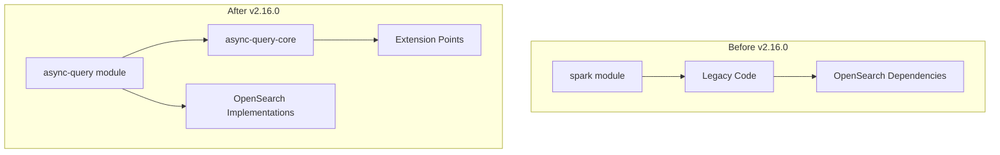

---
tags:
  - sql
---
# SQL Async Query Core Refactoring

## Summary

OpenSearch v2.16.0 introduces a major architectural refactoring of the async query functionality in the SQL plugin. The refactoring extracts core async query logic into a new `async-query-core` library module, separating it from OpenSearch-specific implementations. This enables better modularity, testability, and potential reuse of the async query functionality in different contexts.

## Details

### What's New in v2.16.0

The refactoring introduces two new modules:
- `async-query-core`: A standalone library containing the core async query logic with extension points
- `async-query`: OpenSearch-specific implementations using OpenSearch indices for storage

### Architecture

### Query Types

The async-query-core library supports the following query types, automatically identified by analyzing the query:

| Query Type | Description |
|------------|-------------|
| BatchQuery | Execute single query in Spark |
| InteractiveQuery | Establish session and execute queries in single Spark session |
| IndexDMLQuery | Handles DROP/ALTER/VACUUM operations for Flint indices |
| RefreshQuery | One-time query request to refresh (update) Flint index |
| StreamingQuery | Continuously update Flint index in single Spark session |

### Extension Points

The library provides extension points for custom implementations:

**Data Store Interfaces:**
- `AsyncQueryJobMetadataStorageService` - Job metadata storage
- `SessionStorageService` - Session state storage
- `StatementStorageService` - Statement storage
- `FlintIndexMetadataService` - Flint index metadata
- `FlintIndexStateModelService` - Flint index state model
- `IndexDMLResultStorageService` - DML result storage

**Other Interfaces:**
- `LeaseManager` - Lease management
- `JobExecutionResponseReader` - Job response reading
- `QueryIdProvider` / `SessionIdProvider` - ID generation
- `SessionConfigSupplier` - Session configuration
- `EMRServerlessClientFactory` - EMR Serverless client creation
- `SparkExecutionEngineConfigSupplier` - Spark configuration
- `DataSourceSparkParameterComposer` / `GeneralSparkParameterComposer` - Parameter composition

### Technical Changes

| Change | Description |
|--------|-------------|
| Module scaffolding | Created `async-query-core` and `async-query` modules |
| Class migration | Moved classes from `spark` module to new modules |
| DataSourceType refactor | Changed from enum to class for extensibility |
| Metrics abstraction | Abstracted metrics to reduce legacy dependencies |
| FlintIndex client abstraction | Created abstract FlintIndex client interface |
| Exception handling | Pushed down OpenSearch-specific exception handling |
| AsyncQueryId removal | Removed redundant AsyncQueryId class |
| SQLQueryUtils fix | Fixed extraction of multiple tables from queries |
| Integration tests | Added integration tests for async-query-core |

## Limitations

- This is an internal refactoring with no user-facing API changes
- The `SparkSubmitParameterModifier` interface is deprecated in favor of `GeneralSparkParameterComposer`

## References

### Pull Requests
| PR | Description |
|----|-------------|
| [#2751](https://github.com/opensearch-project/sql/pull/2751) | Scaffold async-query-core and async-query module |
| [#2750](https://github.com/opensearch-project/sql/pull/2750) | Move classes from spark to async-query-core and async-query |
| [#2746](https://github.com/opensearch-project/sql/pull/2746) | Change DataSourceType from enum to class |
| [#2745](https://github.com/opensearch-project/sql/pull/2745) | Fix code style issue |
| [#2752](https://github.com/opensearch-project/sql/pull/2752) | Separate build and validateAndBuild method in DataSourceMeta |
| [#2763](https://github.com/opensearch-project/sql/pull/2763) | Exclude integ-test, doctest and download task when built off |
| [#2768](https://github.com/opensearch-project/sql/pull/2768) | Abstract metrics to reduce dependency to legacy |
| [#2769](https://github.com/opensearch-project/sql/pull/2769) | Remove AsyncQueryId |
| [#2770](https://github.com/opensearch-project/sql/pull/2770) | Add README to async-query-core |
| [#2771](https://github.com/opensearch-project/sql/pull/2771) | Abstract FlintIndex client |
| [#2779](https://github.com/opensearch-project/sql/pull/2779) | Fix statement to store requested langType |
| [#2782](https://github.com/opensearch-project/sql/pull/2782) | Push down OpenSearch specific exception handling |
| [#2785](https://github.com/opensearch-project/sql/pull/2785) | Implement integration test for async-query-core |
| [#2791](https://github.com/opensearch-project/sql/pull/2791) | Fix SQLQueryUtils to extract multiple tables |
| [#2792](https://github.com/opensearch-project/sql/pull/2792) | Eliminate dependency from async-query-core to legacy |
| [#2822](https://github.com/opensearch-project/sql/pull/2822) | Pass accountId to EMRServerlessClientFactory.getClient |
