# Alerting Bugfixes

## Summary

OpenSearch v2.17.0 includes several bug fixes for the Alerting plugin and Alerting Dashboards plugin, addressing issues with monitor lock renewal, distribution builds, cypress tests, workspace navigation, unit tests, trigger name validation, alerts card rendering, and build configuration.

## Details

### What's New in v2.17.0

This release focuses on stability and reliability improvements across both the backend Alerting plugin and the frontend Alerting Dashboards plugin.

### Technical Changes

#### Backend Fixes (alerting)

| Fix | Description | Impact |
|-----|-------------|--------|
| Monitor Lock Renewal | Fixed issue where failed lock release prevented future lock renewal | Monitors no longer get stuck when lock release fails |
| Distribution Builds | Fixed build configuration issues affecting distribution packaging | Improved build reliability |

#### Frontend Fixes (alerting-dashboards-plugin)

| Fix | Description | Impact |
|-----|-------------|--------|
| Cypress Tests | Fixed cypress tests following alerting PR #1612 changes | Improved test reliability |
| Workspace Navigation | Removed `workspaceAvailability` field to make alerts visible within workspace | Alerts now properly visible in workspace navigation |
| Unit Test Fix | Fixed failed UT of `AddAlertingMonitor.test.js` | Improved test stability |
| Trigger Name Validation | Fixed trigger name validation for all monitor types | Prevents duplicate trigger names across monitors |
| Alerts Card Rendering | Fixed alerts card in all-use case overview page when MDS is disabled | Card renders correctly without multi-data-source |
| Build Configuration | Updated build.gradle to use alerting-spi snapshot version | Resolved dependency issues |

### Monitor Lock Renewal Fix

When a monitor run fails to release its lock, the lock could never be renewed, causing every subsequent monitor run to be skipped. The fix allows the lock to be renewed and acquired after a fixed timeout of 5 minutes.

```mermaid
flowchart TB
    subgraph "Before Fix"
        A1[Monitor Run] --> B1[Lock Acquired]
        B1 --> C1[Execution Fails]
        C1 --> D1[Lock Not Released]
        D1 --> E1[Future Runs Skipped]
    end
    
    subgraph "After Fix"
        A2[Monitor Run] --> B2[Lock Acquired]
        B2 --> C2[Execution Fails]
        C2 --> D2[Lock Not Released]
        D2 --> E2[5 min Timeout]
        E2 --> F2[Lock Renewed]
        F2 --> G2[Monitor Resumes]
    end
```

### Trigger Name Validation Fix

Updated the trigger name validation helper to work with the current trigger and monitor setup, applying validation to all monitor types and updating callback usage.

### Workspace Navigation Fix

Removed the `workspaceAvailability` field from the plugin configuration, which was preventing alerts from being visible within workspace navigation.

## Limitations

- Lock renewal timeout is fixed at 5 minutes and not configurable
- Trigger name validation applies only to new monitors; existing monitors with duplicate trigger names are not affected

## Related PRs

| PR | Repository | Description |
|----|------------|-------------|
| [#1623](https://github.com/opensearch-project/alerting/pull/1623) | alerting | Fix monitor renew lock issue |
| [#1637](https://github.com/opensearch-project/alerting/pull/1637) | alerting | Fix distribution builds |
| [#1640](https://github.com/opensearch-project/alerting/pull/1640) | alerting | Fix distribution builds |
| [#1027](https://github.com/opensearch-project/alerting-dashboards-plugin/pull/1027) | alerting-dashboards-plugin | Fixed cypress tests |
| [#1028](https://github.com/opensearch-project/alerting-dashboards-plugin/pull/1028) | alerting-dashboards-plugin | Fix workspace navigation visibility |
| [#1040](https://github.com/opensearch-project/alerting-dashboards-plugin/pull/1040) | alerting-dashboards-plugin | Fix failed UT of AddAlertingMonitor.test.js |
| [#794](https://github.com/opensearch-project/alerting-dashboards-plugin/pull/794) | alerting-dashboards-plugin | Issue #671 fix trigger name validation |
| [#1071](https://github.com/opensearch-project/alerting-dashboards-plugin/pull/1071) | alerting-dashboards-plugin | Backport trigger name validation to 2.17 |
| [#1073](https://github.com/opensearch-project/alerting-dashboards-plugin/pull/1073) | alerting-dashboards-plugin | Fix alerts card in all-use case overview page |

## References

- [Issue #1617](https://github.com/opensearch-project/alerting/issues/1617): Distribution build issue
- [Issue #671](https://github.com/opensearch-project/alerting-dashboards-plugin/issues/671): Trigger name validation issue
- [Issue #1039](https://github.com/opensearch-project/alerting-dashboards-plugin/issues/1039): AddAlertingMonitor test failure

## Related Feature Report

- [Full feature documentation](../../../../features/alerting/alerting.md)
