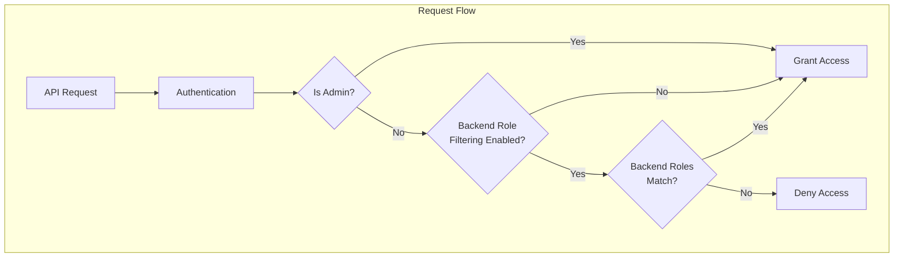

# Anomaly Detection Admin Backend Role Bypass

## Summary

This release adds admin priority over backend role filtering in Anomaly Detection. Users with the `all_access` role can now access, view, and manage all detectors regardless of backend role matching, enabling proper administrative oversight when backend role filtering is enabled.

## Details

### What's New in v2.17.0

Previously, when security was enabled with backend role filtering (`plugins.anomaly_detection.filter_by_backend_roles: true`), admin users were blocked from accessing detectors if their backend roles didn't match the detector's backend roles. This violated the principle that administrators should have full access to all resources.

### Technical Changes

#### Architecture Changes



#### New Components

| Component | Description |
|-----------|-------------|
| `ParseUtils.isAdmin()` | New utility method to check if user has `all_access` role |

#### Code Changes

The `isAdmin()` method checks if the user's roles contain `all_access`:

```java
public static boolean isAdmin(User user) {
    if (user == null) {
        return false;
    }
    return user.getRoles().contains("all_access");
}
```

This check is applied in:
- `ADSearchHandler.validateRole()` - Search operations
- `ParseUtils.onGetAdResponse()` - Get detector operations

### Usage Example

With backend role filtering enabled, an admin user can now:

```bash
# Admin can list all detectors regardless of backend roles
GET _plugins/_anomaly_detection/detectors

# Admin can access any detector
GET _plugins/_anomaly_detection/detectors/<detector_id>

# Admin can update detectors without overwriting backend roles
PUT _plugins/_anomaly_detection/detectors/<detector_id>
```

When an admin updates a detector, the detector's original backend roles are preserved (not replaced with the admin's backend roles).

### Migration Notes

No migration required. This is a behavioral change that takes effect immediately after upgrading to v2.17.0.

## Limitations

- Admin detection is based solely on the `all_access` role
- Custom admin roles are not automatically recognized
- Backend role filtering must still be explicitly enabled via cluster settings

## Related PRs

| PR | Description |
|----|-------------|
| [#859](https://github.com/opensearch-project/anomaly-detection/pull/859) | Backport: Giving admin priority over backend role filtering |
| [#850](https://github.com/opensearch-project/anomaly-detection/pull/850) | Original: Giving admin priority over backend role filtering |

## References

- [Issue #842](https://github.com/opensearch-project/anomaly-detection/issues/842): Prioritize admin access over backend roles
- [Anomaly Detection Security](https://docs.opensearch.org/2.17/observing-your-data/ad/security/): Security configuration documentation

## Related Feature Report

- [Anomaly Detection](../../../features/anomaly-detection/anomaly-detection.md)
