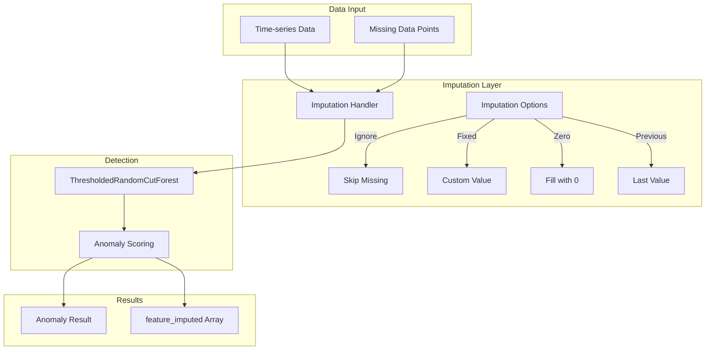

---
tags:
  - domain/observability
  - component/server
  - ml
---
# Anomaly Detection Missing Data Handling

## Summary

OpenSearch 2.17.0 introduces enhanced missing data handling for anomaly detection, giving users flexibility to choose how to address gaps in their time-series data. Options include ignoring missing data (default), filling with fixed values, zeros, or previous values. This feature improves recall in anomaly detection scenarios where data gaps are meaningful signals.

## Details

### What's New in v2.17.0

This release adds comprehensive missing data imputation capabilities to the anomaly detection plugin:

- **Imputation Options**: Four methods to handle missing data points
- **Feature Imputation Tracking**: New `feature_imputed` field in anomaly results to indicate which features were imputed
- **High-Cardinality Support**: Broadcast mechanism for HC detectors to identify entity models without data
- **Historical Analysis Support**: Imputation works in both real-time and historical analysis modes

### Technical Changes

#### Architecture Changes



#### New Components

| Component | Description |
|-----------|-------------|
| `ADRealTimeInferencer` | Handles real-time inference with imputation support |
| `ADHCImputeTransportAction` | Broadcast action for HC detector imputation |
| `FeatureImputed` | Model class tracking imputation status per feature |
| `ImputedFeatureResult` | Result class containing imputed values and flags |
| `ActionListenerExecutor` | Async handler for imputation responses in AD thread pool |

#### New Configuration

| Setting | Description | Default |
|---------|-------------|---------|
| `imputation_option.method` | Imputation method: `ignore`, `fixed`, `zero`, `previous` | `ignore` |
| `imputation_option.default_fill` | Custom values for fixed imputation | None |

#### API Changes

The detector creation/update API now accepts an `imputation_option` field:

```json
{
  "imputation_option": {
    "method": "FIXED",
    "default_fill": [
      {
        "feature_name": "cpu_usage",
        "data": 0.5
      }
    ]
  }
}
```

### Usage Example

#### Create Detector with Zero Fill Imputation

```json
POST _plugins/_anomaly_detection/detectors
{
  "name": "event-count-detector",
  "description": "Detect drops in event counts including missing data",
  "time_field": "timestamp",
  "indices": ["events-*"],
  "feature_attributes": [
    {
      "feature_name": "event_count",
      "feature_enabled": true,
      "aggregation_query": {
        "event_count": {
          "value_count": {
            "field": "event_id"
          }
        }
      }
    }
  ],
  "detection_interval": {
    "period": {
      "interval": 5,
      "unit": "Minutes"
    }
  },
  "imputation_option": {
    "method": "ZERO"
  }
}
```

#### Create Detector with Previous Value Imputation

```json
POST _plugins/_anomaly_detection/detectors
{
  "name": "metric-detector",
  "description": "Maintain continuity with previous values",
  "time_field": "timestamp",
  "indices": ["metrics-*"],
  "feature_attributes": [
    {
      "feature_name": "avg_latency",
      "feature_enabled": true,
      "aggregation_query": {
        "avg_latency": {
          "avg": {
            "field": "latency"
          }
        }
      }
    }
  ],
  "detection_interval": {
    "period": {
      "interval": 1,
      "unit": "Minutes"
    }
  },
  "imputation_option": {
    "method": "PREVIOUS"
  }
}
```

### Anomaly Result with Imputation

When imputation occurs, the anomaly result includes a `feature_imputed` array:

```json
{
  "detector_id": "abc123",
  "anomaly_score": 1.81,
  "anomaly_grade": 0.03,
  "confidence": 0.98,
  "feature_data": [
    {
      "feature_id": "processing_bytes_max",
      "feature_name": "processing bytes max",
      "data": 2322
    }
  ],
  "feature_imputed": [
    {
      "feature_id": "processing_bytes_max",
      "imputed": true
    }
  ]
}
```

### Migration Notes

- Existing detectors continue to work with default "ignore" behavior
- To enable imputation, update detector configuration with `imputation_option`
- The `feature_imputed` field only appears when imputation is enabled and occurs
- Confidence scores decrease when imputations occur

## Limitations

- Extensive imputation of missing data can compromise model accuracy
- Imputation with shingle size 1 is not meaningful (requires shingle size > 1)
- Preview mode uses linear interpolation instead of configured imputation for efficiency
- Quality of imputed data directly affects model performance

## References

### Documentation
- [Anomaly Detection Documentation](https://docs.opensearch.org/2.17/observing-your-data/ad/index/): Setting imputation options
- [Anomaly Result Mapping](https://docs.opensearch.org/2.17/observing-your-data/ad/result-mapping/): feature_imputed field documentation
- [Forum Discussion](https://forum.opensearch.org/t/do-missing-buckets-ruin-anomaly-detection/16535): Original feature request

### Pull Requests
| PR | Description |
|----|-------------|
| [#1274](https://github.com/opensearch-project/anomaly-detection/pull/1274) | Add Support for Handling Missing Data in Anomaly Detection |

## Related Feature Report

- Full feature documentation
