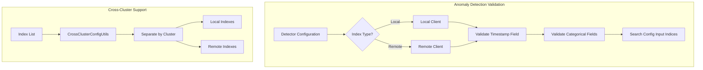

---
tags:
  - domain/observability
  - component/server
  - indexing
  - ml
  - search
---
# Anomaly Detection Remote/Multi-Index Support

## Summary

OpenSearch 2.17.0 adds support for remote indexes and multiple indexes in anomaly detection. This enhancement allows anomaly detectors to use data from remote clusters via cross-cluster search and to monitor multiple indexes simultaneously, enabling more comprehensive anomaly detection across distributed data sources.

## Details

### What's New in v2.17.0

This release introduces validation support for remote indexes and multi-index configurations in anomaly detection:

- **Remote Index Support**: Detectors can now use remote indexes as data sources using the `cluster-name:index-name` pattern
- **Multi-Index Validation**: Validation logic now properly handles multiple indexes, ensuring timestamp and categorical fields exist across all specified indexes
- **Cross-Cluster Configuration Utilities**: New utility class `CrossClusterConfigUtils` for parsing and managing cross-cluster index configurations

### Technical Changes

#### Architecture Changes



#### New Components

| Component | Description |
|-----------|-------------|
| `CrossClusterConfigUtils` | Utility class for parsing cluster:index patterns and managing cross-cluster configurations |
| `separateClusterIndexes()` | Method to separate indexes by cluster name |
| `getClientForCluster()` | Method to get appropriate client (local or remote) for a cluster |
| `parseClusterAndIndexName()` | Method to parse cluster and index names from combined string |

#### Key Implementation Details

The validation flow was refactored to handle multiple indexes across clusters:

1. **Time Field Validation**: Uses `MultiResponsesDelegateActionListener` to validate timestamp fields across all indexes in parallel
2. **Categorical Field Validation**: Recursively validates categorical fields across all cluster/index combinations
3. **Error Messages**: Enhanced error messages to indicate which specific index is missing required fields

### Usage Example

```json
// Creating a detector with remote and local indexes
PUT _plugins/_anomaly_detection/detectors
{
  "name": "cross-cluster-detector",
  "description": "Detector monitoring multiple clusters",
  "time_field": "timestamp",
  "indices": [
    "local-index",
    "remote-cluster:remote-index",
    "another-cluster:another-index"
  ],
  "feature_attributes": [
    {
      "feature_name": "cpu-sum",
      "feature_enabled": true,
      "aggregation_query": {
        "total_cpu": {
          "sum": {
            "field": "cpu"
          }
        }
      }
    }
  ],
  "detection_interval": {
    "period": {
      "interval": 1,
      "unit": "Minutes"
    }
  }
}
```

### Migration Notes

- Existing detectors using single local indexes continue to work without changes
- To use remote indexes, ensure cross-cluster search is properly configured
- When using remote indexes with the Security plugin, additional permissions are required:
  - `indices:data/read/field_caps`
  - `indices:admin/resolve/index`
  - `cluster:monitor/remote/info`

## Limitations

- All specified indexes must have the same timestamp field
- All specified indexes must have the same categorical fields (if using high-cardinality detection)
- Remote cluster connectivity must be established before creating detectors
- Fine-grained access control requires matching roles on both local and remote clusters

## References

### Documentation
- [Anomaly Detection Documentation](https://docs.opensearch.org/2.17/observing-your-data/ad/index/)
- [Anomaly Detection Security](https://docs.opensearch.org/2.17/observing-your-data/ad/security/)
- [Cross-Cluster Search](https://docs.opensearch.org/2.17/search-plugins/cross-cluster-search/)

### Pull Requests
| PR | Description |
|----|-------------|
| [#1290](https://github.com/opensearch-project/anomaly-detection/pull/1290) | Adding remote index and multi-index checks in validation |
| [#1295](https://github.com/opensearch-project/anomaly-detection/pull/1295) | Backport to 2.17 branch |

## Related Feature Report

- [Full feature documentation](../../../../features/anomaly-detection/anomaly-detection-remote-multi-index-support.md)
