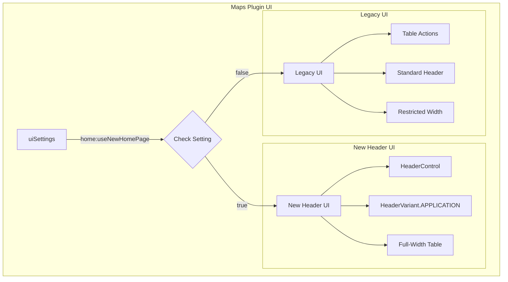

---
tags:
  - domain/geo
  - component/dashboards
  - dashboards
---
# Maps Plugin UI Updates

## Summary

OpenSearch Dashboards Maps plugin v2.17.0 introduces conditional support for the new header UI design (TriNeo project). When the `home:useNewHomePage` setting is enabled, the Maps plugin adapts its listing page and visualization page to use the new Page Header and Application Header variants, providing a more consistent and modern user experience across OpenSearch Dashboards.

## Details

### What's New in v2.17.0

This release adds three key UI improvements to the Maps plugin:

1. **New Page Header on Maps Listing Page** - The "Create map" button moves from the table to the header using `HeaderControl`
2. **New Application Header on Maps Visualization Page** - The visualization page uses `HeaderVariant.APPLICATION` with grouped actions
3. **Full-Width Table Layout** - The Maps listing table uses full width when the new home page UI is enabled

### Technical Changes

#### Architecture Changes



#### New Components

| Component | Description |
|-----------|-------------|
| `HeaderControl` | OSD navigation component for placing controls in the application header |
| `HeaderVariant.APPLICATION` | Chrome header variant for application-style pages |
| `TopNavMenuIconData` | Icon-based top nav menu configuration for grouped actions |

#### Configuration

| Setting | Description | Default |
|---------|-------------|---------|
| `home:useNewHomePage` | Enables the new home page UI including header changes | `false` |

### Usage Example

The new header UI is automatically enabled when the `home:useNewHomePage` advanced setting is turned on:

1. Navigate to **Management** > **Advanced Settings**
2. Search for `home:useNewHomePage`
3. Set the value to `true`
4. The Maps plugin will automatically use the new header UI

#### Maps Listing Page (New UI)

When enabled, the "Create map" button appears in the header:

```typescript
<HeaderControl
  setMountPoint={application.setAppRightControls}
  controls={[
    {
      id: 'Create map',
      label: 'Create map',
      iconType: 'plus',
      fill: true,
      href: `${MAPS_APP_ID}${APP_PATH.CREATE_MAP}`,
      testId: 'createButton',
      controlType: 'button',
    },
  ]}
/>
```

#### Maps Visualization Page (New UI)

The visualization page uses the Application header variant with icon-based actions:

```typescript
// Set header variant
chrome.setHeaderVariant?.(HeaderVariant.APPLICATION);

// Configure icon-based save button
const topNavConfig: TopNavMenuIconData[] = [
  {
    tooltip: 'Save',
    ariaLabel: 'Save your map',
    testId: 'mapSaveButton',
    run: onSaveButtonClick,
    iconType: 'save',
    controlType: 'icon',
  },
];
```

### Migration Notes

- No migration required - the feature is backward compatible
- The new UI is opt-in via the `home:useNewHomePage` setting
- When disabled, the Maps plugin continues to use the legacy UI

## Limitations

- The new header UI requires OpenSearch Dashboards core support for `HeaderControl` and `HeaderVariant`
- Integration tests for the new header UI are planned for a separate PR

## References

### Documentation
- [Maps Documentation](https://docs.opensearch.org/2.17/dashboards/visualize/maps/): Official Maps plugin documentation
- [OpenSearch Dashboards PR #7691](https://github.com/opensearch-project/OpenSearch-Dashboards/pull/7691): Full width table support

### Pull Requests
| PR | Description |
|----|-------------|
| [#653](https://github.com/opensearch-project/dashboards-maps/pull/653) | Conditionally use the new Page Header variant on the Maps listing page |
| [#654](https://github.com/opensearch-project/dashboards-maps/pull/654) | Conditionally use the new Application Header variant on the Maps visualization page |
| [#655](https://github.com/opensearch-project/dashboards-maps/pull/655) | Conditionally use full width for Maps listing page table |

### Issues (Design / RFC)
- [Issue #649](https://github.com/opensearch-project/dashboards-maps/issues/649): Support Trineo new headers change in maps

## Related Feature Report

- Full feature documentation
