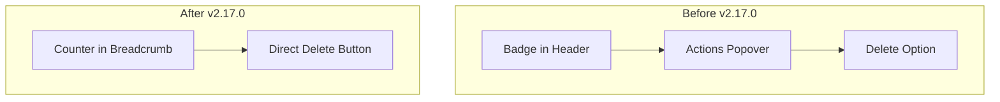

---
tags:
  - dashboards
  - observability
---

# Observability Notebooks Bugfixes

## Summary

This release includes UI improvements and bug fixes for the Notebooks feature in OpenSearch Dashboards Observability. The changes improve the navigation experience with badge counters in breadcrumbs, simplify the notebook deletion workflow, and fix sample notebook functionality for Multi-Data Source (MDS) environments.

## Details

### What's New in v2.17.0

Two bug fixes improve the Notebooks user experience:

1. **UI Improvements (PR #2110)**: Updated badge counter display and simplified notebook deletion
2. **Sample Notebooks Fix (PR #2108)**: Fixed sample notebook addition in MDS-enabled environments

### Technical Changes

#### UI Changes



| Change | Before | After |
|--------|--------|-------|
| Notebook count display | Badge in header component | Counter appended to breadcrumb text |
| Delete action | Actions popover → Delete menu item | Direct "Delete N notebook(s)" button |
| Delete button visibility | Always visible in popover | Only visible when notebooks selected |

#### Breadcrumb Counter Implementation

The `setNavBreadCrumbs` function now accepts an optional `counter` parameter:

```typescript
export const setNavBreadCrumbs = (
  parentBreadCrumb: EuiBreadcrumb[],
  pageBreadCrumb: EuiBreadcrumb[],
  counter?: number  // New parameter
) => {
  const isNavGroupEnabled = coreRefs?.chrome?.navGroup.getNavGroupEnabled();
  const updatedPageBreadCrumb = pageBreadCrumb.map((crumb) => ({
    ...crumb,
    text: isNavGroupEnabled && counter !== undefined 
      ? `${crumb.text} (${counter})` 
      : crumb.text,
  }));
  // ...
};
```

#### MDS Support for Sample Notebooks

The sample notebooks feature now properly supports Multi-Data Source environments:

| Component | Change |
|-----------|--------|
| `getSampleNotebooksModal` | Added DataSourceSelector when MDS enabled |
| `addSampleNotebooks` | Accepts `dataSourceMDSId` and `dataSourceMDSLabel` parameters |
| Sample data API calls | Include `data_source_id` query parameter |
| Visualization search | Appends data source label to visualization titles |

```typescript
// Sample data now includes data source ID
await this.props.http.post('../api/sample_data/flights', {
  query: { data_source_id: dataSourceMDSId },
});
```

### Usage Example

The delete workflow is now more direct:

1. Select one or more notebooks using checkboxes
2. Click the "Delete N notebook(s)" button that appears
3. Confirm deletion in the modal

For MDS environments, adding sample notebooks now prompts for data source selection:

1. Click "Add sample notebooks"
2. Select a data source from the dropdown (if MDS enabled)
3. Confirm to add sample data and notebooks

## Limitations

- Sample notebooks require the selected data source to be accessible
- Badge counter only displays when new navigation is enabled

## References

### Documentation
- [Notebooks Documentation](https://docs.opensearch.org/2.17/observing-your-data/notebooks/): Official documentation

### Pull Requests
| PR | Description |
|----|-------------|
| [#2110](https://github.com/opensearch-project/dashboards-observability/pull/2110) | UI update: badge counter in breadcrumbs, simplified delete workflow |
| [#2108](https://github.com/opensearch-project/dashboards-observability/pull/2108) | Fix sample notebooks for MDS environments |

## Related Feature Report

- [Full feature documentation](../../../../features/dashboards-observability/observability-notebooks.md)
