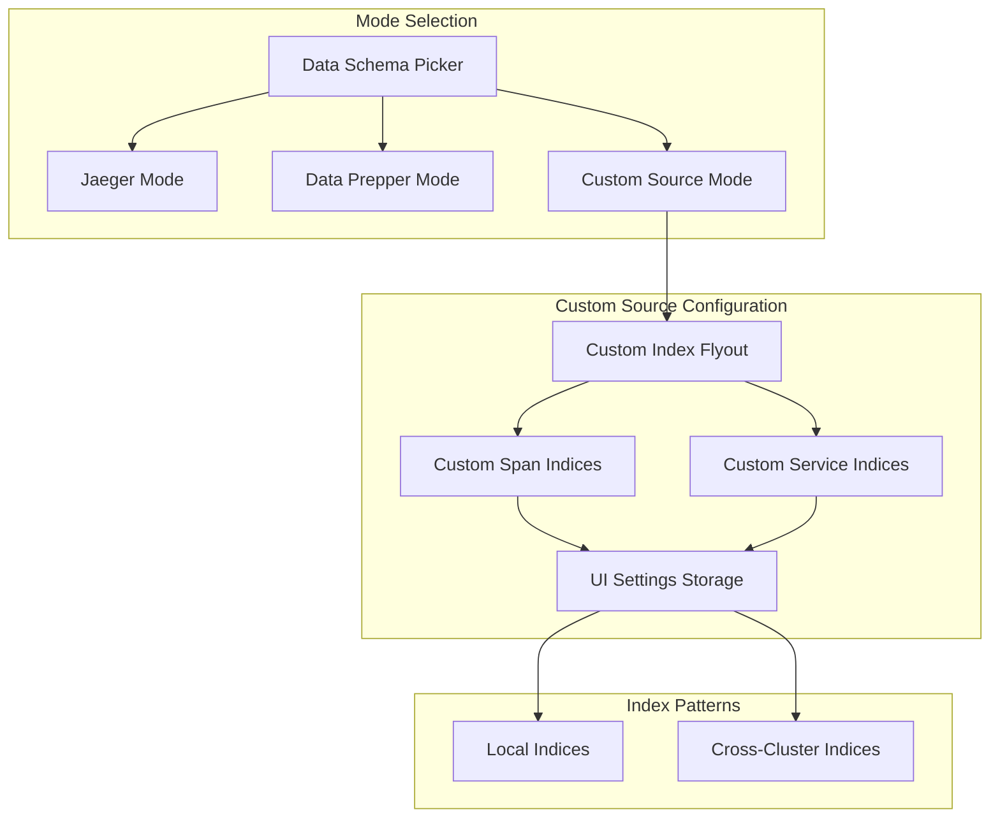

# Trace Analytics

## Summary

OpenSearch Dashboards Observability v2.17.0 introduces experimental support for custom trace sources in Trace Analytics. This enhancement allows users to configure custom span and service indices, enabling cross-cluster search (CCS) for tracing data and support for dynamically named indices from Data Prepper pipelines. The release also includes UX improvements such as changing the default landing page from Services to Traces.

## Details

### What's New in v2.17.0

This release adds a new "Custom source" mode to Trace Analytics, enabling users to:
- Configure custom span and service indices via user settings
- Support cross-cluster search (CCS) patterns for trace data
- Use wildcard patterns in index names for dynamic Data Prepper pipelines
- Default landing page changed from Services to Traces for better user experience

### Technical Changes

#### Architecture Changes



#### New Components

| Component | Description |
|-----------|-------------|
| `CustomIndexFlyout` | Flyout panel for managing custom span and service indices |
| `TraceAnalyticsMode` | Extended type to include `custom_data_prepper` mode |
| `ServicesList` | New selectable services list component for filtering |

#### New Configuration

| Setting | Description | Default |
|---------|-------------|---------|
| `observability:traceAnalyticsSpanIndices` | Custom span indices (supports wildcards and CCS patterns) | Empty |
| `observability:traceAnalyticsServiceIndices` | Custom service indices (supports wildcards and CCS patterns) | Empty |

#### API Changes

New helper functions added:
- `getSpanIndices(mode)` - Returns appropriate span index based on mode
- `getServiceIndices(mode)` - Returns appropriate service index based on mode
- `getTraceCustomSpanIndex()` - Retrieves custom span index from settings
- `getTraceCustomServiceIndex()` - Retrieves custom service index from settings

### Usage Example

#### Configuring Custom Source

1. Open Trace Analytics in OpenSearch Dashboards
2. Click the data schema picker dropdown
3. Select "Manage custom source" button
4. In the flyout, configure:

```
Custom span indices: index1,cluster1:index2,cluster:index3
Custom service indices: service-index1,cluster1:service-index2
```

5. Click Save
6. Select "Custom source" from the mode picker

#### Cross-Cluster Search Pattern

```
# Local index
otel-v1-apm-span-*

# Cross-cluster pattern
cluster1:otel-v1-apm-span-*,cluster2:otel-v1-apm-span-*
```

### Migration Notes

- The default landing page has changed from `/services` to `/traces`
- Existing Data Prepper and Jaeger configurations continue to work unchanged
- Custom source is marked as experimental and requires manual index configuration

## Limitations

- Custom source is an experimental feature
- Custom indices must adhere to Data Prepper index mappings
- No automatic index discovery for custom sources
- Service map calculations require proper span relationships in custom indices

## References

### Documentation
- [Trace Analytics Documentation](https://docs.opensearch.org/2.17/observing-your-data/trace/index/): Official documentation
- [Data Prepper Schema Documentation](https://github.com/opensearch-project/data-prepper/tree/main/docs/schemas/trace-analytics): Index mapping requirements

### Pull Requests
| PR | Description |
|----|-------------|
| [#2112](https://github.com/opensearch-project/dashboards-observability/pull/2112) | Trace Analytics support for custom sources |
| [#2125](https://github.com/opensearch-project/dashboards-observability/pull/2125) | Update trace analytics landing page to traces |

### Issues (Design / RFC)
- [Issue #2052](https://github.com/opensearch-project/dashboards-observability/issues/2052): Feature request for trace overview page and CCS support

## Related Feature Report

- [Full feature documentation](../../../../features/dashboards-observability/trace-analytics.md)
