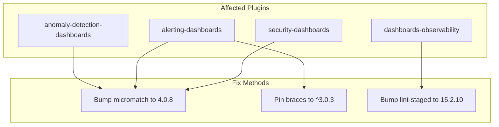

# CVE Fixes

## Summary

OpenSearch v2.17.0 addresses CVE-2024-4067 and CVE-2024-4068 across multiple dashboard plugins. These vulnerabilities affect the `micromatch` and `braces` npm packages, which are transitive dependencies used in build tooling. The fixes involve bumping package versions to patched releases.

## Details

### What's New in v2.17.0

This release addresses two related CVEs in the JavaScript ecosystem:

- **CVE-2024-4067**: Regular Expression Denial of Service (ReDoS) vulnerability in `micromatch` package (versions < 4.0.8)
- **CVE-2024-4068**: Denial of Service vulnerability in `braces` package (versions < 3.0.3)

### Technical Changes

#### Vulnerability Details

| CVE | Package | Severity | CVSS Score | Fixed Version |
|-----|---------|----------|------------|---------------|
| CVE-2024-4067 | micromatch | Moderate | 5.3 | 4.0.8 |
| CVE-2024-4068 | braces | Moderate | N/A | 3.0.3 |

#### Fix Approach

#### Affected Repositories

| Repository | Fix Method | PR |
|------------|------------|-----|
| anomaly-detection-dashboards-plugin | Bump micromatch to 4.0.8 | [#864](https://github.com/opensearch-project/anomaly-detection-dashboards-plugin/pull/864) |
| alerting-dashboards-plugin | Pin braces to ^3.0.3 | [#1024](https://github.com/opensearch-project/alerting-dashboards-plugin/pull/1024) |
| alerting-dashboards-plugin | Bump micromatch to 4.0.8 | [#1074](https://github.com/opensearch-project/alerting-dashboards-plugin/pull/1074) |
| security-dashboards-plugin | Bump micromatch to 4.0.8 | [#2144](https://github.com/opensearch-project/security-dashboards-plugin/pull/2144) |
| dashboards-observability | Bump lint-staged to 15.2.10 | [#2138](https://github.com/opensearch-project/dashboards-observability/pull/2138) |

### Usage Example

No user action required. The fixes are applied automatically when upgrading to OpenSearch Dashboards 2.17.0.

### Migration Notes

Users should upgrade to OpenSearch Dashboards 2.17.0 to receive these security fixes. No configuration changes are needed.

## Limitations

- These CVEs affect development/build dependencies and have limited runtime impact
- The vulnerabilities require crafted malicious input to exploit
- The micromatch maintainers consider these issues low-priority

## References

### Documentation
- [CVE-2024-4067 (GHSA-952p-6rrq-rcjv)](https://github.com/advisories/GHSA-952p-6rrq-rcjv): micromatch ReDoS vulnerability
- [CVE-2024-4068](https://nvd.nist.gov/vuln/detail/CVE-2024-4068): braces DoS vulnerability
- [micromatch v4.0.8 Release](https://github.com/micromatch/micromatch/releases/tag/4.0.8): Ultimate fix for both CVEs

### Pull Requests
| PR | Repository | Description |
|----|------------|-------------|
| [#864](https://github.com/opensearch-project/anomaly-detection-dashboards-plugin/pull/864) | anomaly-detection-dashboards | Address CVE-2024-4067 |
| [#866](https://github.com/opensearch-project/anomaly-detection-dashboards-plugin/pull/866) | anomaly-detection-dashboards | Backport to 2.17 |
| [#1024](https://github.com/opensearch-project/alerting-dashboards-plugin/pull/1024) | alerting-dashboards | Pin braces for CVE-2024-4068 |
| [#1074](https://github.com/opensearch-project/alerting-dashboards-plugin/pull/1074) | alerting-dashboards | Fix CVE-2024-4067 |
| [#1076](https://github.com/opensearch-project/alerting-dashboards-plugin/pull/1076) | alerting-dashboards | Backport to 2.17 |
| [#2138](https://github.com/opensearch-project/dashboards-observability/pull/2138) | dashboards-observability | Bump lint-staged for CVE-2024-4067 |
| [#2143](https://github.com/opensearch-project/dashboards-observability/pull/2143) | dashboards-observability | Backport to 2.17 |
| [#2144](https://github.com/opensearch-project/security-dashboards-plugin/pull/2144) | security-dashboards | Backport micromatch fix to 2.x |

## Related Feature Report

- [Full feature documentation](../../../../features/multi-plugin/cve-fixes-dependency-updates.md)
