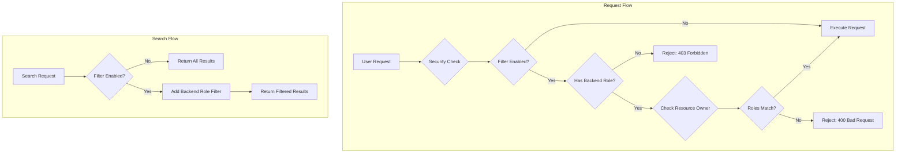

# Flow Framework Access Control

## Summary

OpenSearch 2.17.0 introduces user-level access control for the Flow Framework plugin based on backend roles. This feature enables fine-grained security where users can only access workflows created by users who share at least one backend role, providing an additional layer of security for multi-tenant environments.

## Details

### What's New in v2.17.0

This release adds backend role-based filtering to all Flow Framework APIs, allowing administrators to restrict workflow access based on user backend roles. When enabled, users can only view, modify, or execute workflows owned by users with matching backend roles.

### Technical Changes

#### Architecture Changes



#### New Components

| Component | Description |
|-----------|-------------|
| `SearchHandler` | Handles search requests with backend role filtering for workflows and workflow states |
| `ParseUtils.resolveUserAndExecute()` | Common utility to verify user permissions before executing workflow operations |
| `ParseUtils.checkFilterByBackendRoles()` | Validates that users have backend roles when filtering is enabled |
| `ParseUtils.addUserBackendRolesFilter()` | Adds nested query filter for backend roles to search requests |

#### New Configuration

| Setting | Description | Default |
|---------|-------------|---------|
| `plugins.flow_framework.filter_by_backend_roles` | Enable/disable backend role-based access control | `false` |

### Usage Example

Enable backend role filtering:

```json
PUT _cluster/settings
{
  "transient": {
    "plugins.flow_framework.filter_by_backend_roles": "true"
  }
}
```

Create users with backend roles:

```json
PUT _plugins/_security/api/internalusers/alice
{
  "password": "alice-password",
  "backend_roles": ["analyst"],
  "attributes": {}
}

PUT _plugins/_security/api/internalusers/bob
{
  "password": "bob-password",
  "backend_roles": ["human-resources"],
  "attributes": {}
}
```

Map users to Flow Framework roles:

```json
PUT _plugins/_security/api/rolesmapping/flow_framework_full_access
{
  "backend_roles": [],
  "hosts": [],
  "users": ["alice", "bob"]
}
```

With this configuration, `alice` and `bob` cannot view each other's workflows because they have different backend roles.

### APIs Affected

All Flow Framework APIs now support backend role filtering:

| API | Behavior with Filter Enabled |
|-----|------------------------------|
| Create Workflow | Blocked if user has no backend roles |
| Update Workflow | Requires matching backend role with workflow owner |
| Get Workflow | Requires matching backend role with workflow owner |
| Delete Workflow | Requires matching backend role with workflow owner |
| Provision Workflow | Requires matching backend role with workflow owner |
| Deprovision Workflow | Requires matching backend role with workflow owner |
| Reprovision Workflow | Requires matching backend role with workflow owner |
| Get Workflow Status | Requires matching backend role with workflow owner |
| Search Workflows | Results filtered by backend roles |
| Search Workflow States | Results filtered by backend roles |

### Migration Notes

- Existing workflows created before enabling `filter_by_backend_roles` will have their user information preserved
- Users without backend roles will be blocked from creating workflows when filtering is enabled
- Administrators (superadmin) can access all workflows regardless of backend role settings
- The `flow_framework_read_access` role allows viewing any workflow's results, even with filtering enabled

## Limitations

- Backend roles must be assigned before creating workflows; they cannot be changed after creation
- Users with `flow_framework_read_access` can still view results of any workflow (security consideration)
- The feature follows the same pattern as Anomaly Detection; changing backend roles after creation is not supported in this release

## References

### Documentation
- [Documentation](https://docs.opensearch.org/2.17/automating-configurations/workflow-security/): Workflow template security
- [Documentation PR #8076](https://github.com/opensearch-project/documentation-website/pull/8076): Documentation for this feature

### Pull Requests
| PR | Description |
|----|-------------|
| [#838](https://github.com/opensearch-project/flow-framework/pull/838) | Adds user level access control based on backend roles |

### Issues (Design / RFC)
- [Issue #668](https://github.com/opensearch-project/flow-framework/issues/668): Feature request for backend role-based access control

## Related Feature Report

- [Full feature documentation](../../../features/flow-framework/flow-framework-access-control.md)
