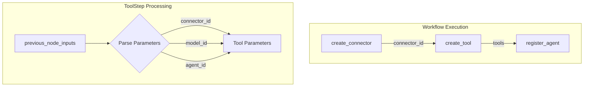

# Flow Framework Connector Tools

## Summary

This release adds support for parsing `connector_id` from previous workflow node inputs when creating tools in Flow Framework. Previously, only `model_id` and `agent_id` could be automatically passed from previous nodes to tool parameters. This enhancement enables seamless integration of ConnectorTool with dynamically created connectors in workflow templates.

## Details

### What's New in v2.17.0

The `ToolStep` class now supports parsing `connector_id` from `previous_node_inputs`, allowing workflows to chain connector creation with tool creation without manually specifying the connector ID.

### Technical Changes

#### Architecture Changes



#### Code Changes

The `getToolsParametersMap` method in `ToolStep.java` was refactored to:
1. Accept a set of tool parameter keys (`connector_id`, `model_id`, `agent_id`)
2. Iterate through all keys and extract values from previous node outputs
3. Automatically populate the tool's parameters map with resolved values

| Component | Description |
|-----------|-------------|
| `ToolStep.java` | Refactored to support generic parameter key parsing |
| `toolParameterKeys` | New set containing `CONNECTOR_ID`, `MODEL_ID`, `AGENT_ID` |

### Usage Example

```json
{
  "workflows": {
    "provision": {
      "nodes": [
        {
          "id": "create_connector",
          "type": "create_connector",
          "user_inputs": {
            "name": "OpenAI Chat Connector",
            "protocol": "http",
            "parameters": { "endpoint": "api.openai.com" },
            "credential": { "openAI_key": "..." },
            "actions": [{ "action_type": "predict", "method": "POST", "url": "..." }]
          }
        },
        {
          "id": "create_tool",
          "type": "create_tool",
          "previous_node_inputs": {
            "create_connector": "connector_id"
          },
          "user_inputs": {
            "parameters": {},
            "name": "ConnectorTool",
            "type": "ConnectorTool"
          }
        },
        {
          "id": "create_flow_agent",
          "type": "register_agent",
          "previous_node_inputs": {
            "create_tool": "tools"
          },
          "user_inputs": {
            "type": "flow",
            "name": "OpenAI Chat Agent"
          }
        }
      ]
    }
  }
}
```

### Migration Notes

No migration required. This is a backward-compatible enhancement. Existing workflows continue to work unchanged.

## Limitations

- Only `connector_id`, `model_id`, and `agent_id` are automatically parsed from previous node inputs
- Other custom parameters must still be specified explicitly in the `parameters` field

## Related PRs

| PR | Description |
|----|-------------|
| [#846](https://github.com/opensearch-project/flow-framework/pull/846) | Support parsing connector_id when creating tools |

## References

- [Issue #845](https://github.com/opensearch-project/flow-framework/issues/845): Feature request for connector_id parsing
- [Connector Tool Documentation](https://docs.opensearch.org/2.17/ml-commons-plugin/agents-tools/tools/connector-tool/): Official ConnectorTool documentation

## Related Feature Report

- [Full feature documentation](../../../features/flow-framework/flow-framework-connector-tools.md)
