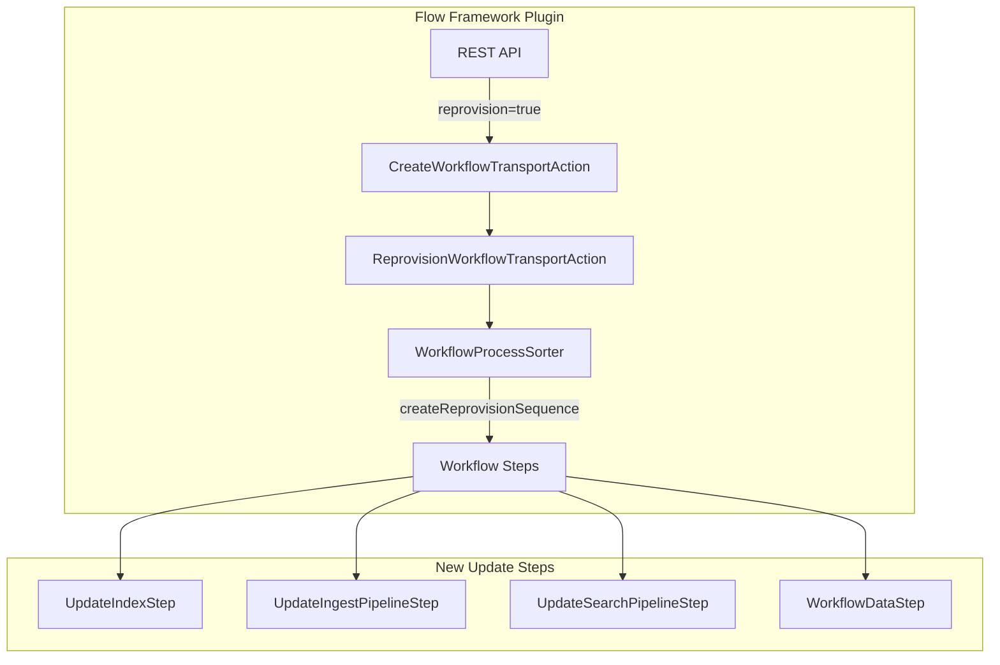

---
tags:
  - indexing
  - ml
  - search
---

# Flow Framework Reprovision API

## Summary

OpenSearch 2.17.0 introduces the Reprovision API for the Flow Framework plugin, enabling users to update and re-provision previously provisioned workflow templates without first deprovisioning their created resources. This feature allows iterative updates to search pipelines, ingest pipelines, and index settings while preserving existing resources.

## Details

### What's New in v2.17.0

The Reprovision API adds fine-grained provisioning capabilities that allow users to:

- Update existing template resources created through Flow Framework
- Add new resources to existing templates
- Add new predecessor workflow nodes to existing workflow nodes
- Update index settings, search pipelines, and ingest pipelines

### Technical Changes

#### Architecture Changes



#### New Components

| Component | Description |
|-----------|-------------|
| `ReprovisionWorkflowAction` | Transport action for reprovision requests |
| `ReprovisionWorkflowTransportAction` | Handles reprovision workflow execution |
| `ReprovisionWorkflowRequest` | Request object containing original and updated templates |
| `UpdateIndexStep` | Workflow step to update index settings |
| `UpdateIngestPipelineStep` | Workflow step to update ingest pipelines |
| `UpdateSearchPipelineStep` | Workflow step to update search pipelines |
| `WorkflowDataStep` | Internal step to pass created resources to dependent nodes |
| `AbstractUpdatePipelineStep` | Base class for pipeline update steps |

#### New Configuration

| Setting | Description | Default |
|---------|-------------|---------|
| `reprovision` | Query parameter to trigger reprovisioning | `false` |

#### API Changes

New query parameter `reprovision=true` added to the Create/Update Workflow API:

```
PUT /_plugins/_flow_framework/workflow/<workflow_id>?reprovision=true
{
  <updated complete template>
}
```

### Usage Example

```bash
# Step 1: Create and provision initial workflow
POST /_plugins/_flow_framework/workflow?provision=true
{
  "name": "semantic-search-workflow",
  "workflows": {
    "provision": {
      "nodes": [
        {
          "id": "register_model",
          "type": "register_local_pretrained_model",
          "user_inputs": {
            "name": "huggingface/sentence-transformers/paraphrase-MiniLM-L3-v2",
            "version": "1.0.1",
            "model_format": "TORCH_SCRIPT",
            "deploy": true
          }
        }
      ]
    }
  }
}

# Step 2: Add ingest pipeline using reprovision
PUT /_plugins/_flow_framework/workflow/<workflow_id>?reprovision=true
{
  "name": "semantic-search-workflow",
  "workflows": {
    "provision": {
      "nodes": [
        {
          "id": "register_model",
          "type": "register_local_pretrained_model",
          "user_inputs": {
            "name": "huggingface/sentence-transformers/paraphrase-MiniLM-L3-v2",
            "version": "1.0.1",
            "model_format": "TORCH_SCRIPT",
            "deploy": true
          }
        },
        {
          "id": "create_ingest_pipeline",
          "type": "create_ingest_pipeline",
          "previous_node_inputs": {
            "register_model": "model_id"
          },
          "user_inputs": {
            "pipeline_id": "nlp-ingest-pipeline",
            "configurations": {
              "description": "A text embedding pipeline",
              "processors": [
                {
                  "text_embedding": {
                    "model_id": "${{register_model.model_id}}",
                    "field_map": {
                      "passage_text": "passage_embedding"
                    }
                  }
                }
              ]
            }
          }
        }
      ]
    }
  }
}

# Step 3: Update index settings to remove default pipeline
PUT /_plugins/_flow_framework/workflow/<workflow_id>?reprovision=true
{
  "name": "semantic-search-workflow",
  "workflows": {
    "provision": {
      "nodes": [
        ...
        {
          "id": "create_index",
          "type": "create_index",
          "user_inputs": {
            "index_name": "my-nlp-index",
            "configurations": {
              "settings": {
                "index.knn": true,
                "default_pipeline": "_none"
              }
            }
          }
        }
      ]
    }
  }
}
```

### Migration Notes

- Reprovision can only be used on workflows that have been previously provisioned (state must be DONE or FAILED)
- Node deletions are not supported during reprovisioning
- Only index settings, search pipelines, and ingest pipelines can be updated
- A complete template must be provided in the request body

## Limitations

- Cannot delete workflow nodes during reprovisioning (fine-grained deprovisioning not yet implemented)
- Only supports updating index settings, search pipelines, and ingest pipelines
- Cannot reprovision workflows in PROVISIONING or NOT_STARTED state
- Substitution template parameters not yet supported during reprovisioning

## References

### Documentation
- [Create or Update Workflow API Documentation](https://docs.opensearch.org/2.17/automating-configurations/api/create-workflow/)

### Blog Posts
- [OpenSearch 2.17 Release Blog](https://opensearch.org/blog/introducing-opensearch-2-17/)

### Pull Requests
| PR | Description |
|----|-------------|
| [#804](https://github.com/opensearch-project/flow-framework/pull/804) | Adds reprovision API to support updating search pipelines, ingest pipelines, index settings |
| [#824](https://github.com/opensearch-project/flow-framework/pull/824) | Backport to 2.x branch |
| [#834](https://github.com/opensearch-project/flow-framework/pull/834) | Adding reprovision integration tests |

### Issues (Design / RFC)
- [Issue #717](https://github.com/opensearch-project/flow-framework/issues/717): Original feature request
- [Issue #822](https://github.com/opensearch-project/flow-framework/issues/822): Integration tests tracking

## Related Feature Report

- [Full feature documentation](../../../features/flow-framework/flow-framework.md)
