---
tags:
  - domain/data
  - component/server
  - indexing
  - performance
  - security
---
# Index Management Bugfixes

## Summary

This release includes three bugfixes for the Index Management plugin that improve cluster stability and test reliability. The key improvement is replacing expensive broadcast `NodesInfoRequest` calls with efficient cluster service lookups for version checking during ISM execution, which prevents blocking the Cluster Applier thread in large clusters.

## Details

### What's New in v2.17.0

Three bugfixes addressing performance, test reliability, and security integration:

1. **Skip Execution Performance Optimization** - Replaced expensive `NodesInfoRequest` broadcast calls with cluster service-based version checking
2. **Security Integration Test Fix** - Fixed test failures when running with security plugin by using `adminClient()` for system index operations
3. **Backport Workflow Fix** - Updated GitHub Actions backport workflow to skip already-backported PRs

### Technical Changes

#### Skip Execution Optimization

The ISM plugin checks cluster node versions to determine if execution should be skipped during rolling upgrades. Previously, this used expensive `NodesInfoRequest` broadcast calls that blocked the Cluster Applier thread.

```mermaid
graph TB
    subgraph "Before v2.17.0"
        A1[Cluster State Change] --> B1[PluginVersionSweepCoordinator]
        B1 --> C1[NodesInfoRequest Broadcast]
        C1 --> D1[Block Cluster Applier Thread]
        D1 --> E1[Performance Degradation]
    end
    
    subgraph "After v2.17.0"
        A2[Cluster State Change] --> B2[PluginVersionSweepCoordinator]
        B2 --> C2[ClusterService.state.nodes]
        C2 --> D2[minNodeVersion / maxNodeVersion]
        D2 --> E2[Non-blocking Check]
    end
```



#### Changed Components

| Component | Change |
|-----------|--------|
| `SkipExecution.kt` | Replaced `NodesInfoRequest` with `ClusterService.state().nodes.minNodeVersion/maxNodeVersion` |
| `PluginVersionSweepCoordinator.kt` | Updated to pass `ClusterService` to `sweepISMPluginVersion()` |
| `IndexManagementPlugin.kt` | Removed `Client` dependency from `SkipExecution` constructor |

#### New Implementation

```kotlin
fun sweepISMPluginVersion(clusterService: ClusterService) {
    try {
        val currentMinVersion = clusterService.state().nodes.minNodeVersion
        val currentMaxVersion = clusterService.state().nodes.maxNodeVersion

        if (currentMinVersion != null && !currentMinVersion.equals(currentMaxVersion)) {
            flag = true
            logger.info("There are multiple versions of Index Management plugins in the cluster: [$currentMaxVersion, $currentMinVersion]")
        } else {
            flag = false
        }

        if (currentMinVersion.major > Version.CURRENT.major && currentMinVersion != currentMaxVersion) {
            hasLegacyPlugin = true
        } else {
            hasLegacyPlugin = false
        }
    } catch (e: Exception) {
        logger.error("Unable to fetch node versions from cluster service", e)
    }
}
```

#### Security Integration Test Fix

Multiple test files were updated to use `adminClient()` instead of `client()` when interacting with system indexes:

| File | Change |
|------|--------|
| `IndexManagementIndicesIT.kt` | Use `adminClient()` for `INDEX_MANAGEMENT_INDEX` mapping updates |
| `IndexManagementRestTestCase.kt` | Use `adminClient()` for rollup/transform start time updates |
| `SecurityRestTestCase.kt` | Use `adminClient()` for index deletion |
| `NotificationActionListenerIT.kt` | Use `adminClient()` for `CONTROL_CENTER_INDEX` deletion |
| `LRONConfigRestTestCase.kt` | Use `adminClient()` for delete-by-query on `CONTROL_CENTER_INDEX` |
| `RestIndexLRONConfigActionIT.kt` | Use `adminClient()` for mapping retrieval |
| `IndexStateManagementRestTestCase.kt` | Use `adminClient()` for managed index updates |

### Migration Notes

No migration required. These are internal improvements that do not affect the public API.

## Limitations

- The skip execution check now relies on node versions rather than plugin versions, which may behave differently in heterogeneous clusters with different plugin installations

## References

### Documentation
- [Index State Management Documentation](https://docs.opensearch.org/2.17/im-plugin/ism/index/)

### Pull Requests
| PR | Description |
|----|-------------|
| [#1219](https://github.com/opensearch-project/index-management/pull/1219) | Skipping execution based on cluster service - replaces expensive NodesInfoRequest |
| [#1222](https://github.com/opensearch-project/index-management/pull/1222) | Use adminClient instead of client when interacting with system index in integTests |

### Issues (Design / RFC)
- [Issue #1075](https://github.com/opensearch-project/index-management/issues/1075): ISM listener blocking Cluster Applier thread with expensive nodes info call

## Related Feature Report

- [Full feature documentation](../../../../features/index-management/index-management.md)
