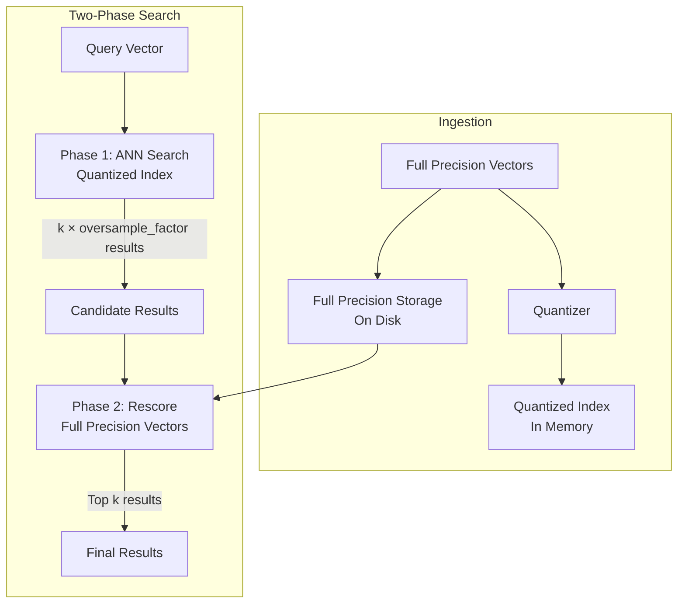

# Disk-Based Vector Search

## Summary

OpenSearch 2.17.0 introduces disk-based vector search, a new feature that significantly reduces memory requirements for vector workloads by using binary quantization and a two-phase search approach. Users can specify `mode: "on_disk"` in their k-NN field mappings to enable automatic configuration of compressed indexes with rescoring for high recall at lower memory costs.

## Details

### What's New in v2.17.0

- New `mode` parameter for knn_vector fields (`on_disk` / `in_memory`)
- New `compression_level` parameter supporting x1, x2, x8, x16, x32 compression
- Online binary quantization (no pretraining required)
- Two-phase search with automatic rescoring
- Default 32x compression for on_disk mode
- Automatic oversample factor configuration based on compression level

### Technical Changes

#### Architecture Changes



#### New Components

| Component | Description |
|-----------|-------------|
| `ModeBasedResolver` | Resolves KNN method context based on Mode and CompressionLevel |
| `Mode` enum | Defines workload modes: `ON_DISK`, `IN_MEMORY`, `NOT_CONFIGURED` |
| `CompressionLevel` enum | Defines compression levels: x1, x2, x8, x16, x32 |
| `RescoreContext` | Manages rescoring parameters including oversample factor |

#### New Configuration

| Setting | Description | Default |
|---------|-------------|--------|
| `mode` | Workload mode (`on_disk` / `in_memory`) | Not configured |
| `compression_level` | Vector compression ratio | `32x` for on_disk |
| `rescore.oversample_factor` | Multiplier for candidate retrieval | Based on compression level |

#### Default Oversample Factors by Compression Level

| Compression Level | Default Oversample Factor |
|-------------------|---------------------------|
| x1 (no compression) | 1.0 |
| x2 | 1.0 |
| x4 | 1.0 |
| x8 | 1.5 |
| x16 | 2.0 |
| x32 | 3.0 |

### Usage Example

#### Basic Index Creation

```json
PUT my-vector-index
{
  "settings": {
    "index": {
      "knn": true
    }
  },
  "mappings": {
    "properties": {
      "my_vector_field": {
        "type": "knn_vector",
        "dimension": 768,
        "space_type": "innerproduct",
        "data_type": "float",
        "mode": "on_disk"
      }
    }
  }
}
```

#### Custom Compression Level

```json
PUT my-vector-index
{
  "settings": {
    "index": {
      "knn": true
    }
  },
  "mappings": {
    "properties": {
      "my_vector_field": {
        "type": "knn_vector",
        "dimension": 768,
        "space_type": "innerproduct",
        "mode": "on_disk",
        "compression_level": "16x"
      }
    }
  }
}
```

#### Search with Custom Oversample Factor

```json
GET my-vector-index/_search
{
  "query": {
    "knn": {
      "my_vector_field": {
        "vector": [1.5, 2.5, 3.5, ...],
        "k": 10,
        "rescore": {
          "oversample_factor": 5.0
        }
      }
    }
  }
}
```

#### Model-Based Index Training

```json
POST /_plugins/_knn/models/my-model/_train
{
  "training_index": "train-index",
  "training_field": "train-field",
  "dimension": 768,
  "space_type": "innerproduct",
  "mode": "on_disk"
}
```

### Migration Notes

- Existing indexes are not affected; mode parameter only applies to new indexes
- The `on_disk` mode only works with `float` data type
- For 4x compression, the Lucene engine is used instead of Faiss
- Model-based indexes use Faiss IVF method by default with on_disk mode

## Limitations

- Radial search does not support disk-based vector search
- Only `float` data type is supported with `on_disk` mode
- Training support for mode/compression was partially implemented (quantization framework limitations)
- Performance varies by dataset; text embeddings generally perform better than image embeddings

## References

### Documentation
- [Documentation: Disk-based vector search](https://docs.opensearch.org/2.17/search-plugins/knn/disk-based-vector-search/)

### Blog Posts
- [Blog: Reduce costs with disk-based vector search](https://opensearch.org/blog/reduce-cost-with-disk-based-vector-search/)

### Pull Requests
| PR | Description |
|----|-------------|
| [#2034](https://github.com/opensearch-project/k-NN/pull/2034) | Introduce mode and compression param resolution |
| [#1984](https://github.com/opensearch-project/k-NN/pull/1984) | k-NN query rescore support for native engines |
| [#2044](https://github.com/opensearch-project/k-NN/pull/2044) | Add spaceType as top level parameter |
| [#2200](https://github.com/opensearch-project/k-NN/pull/2200) | Add CompressionLevel calculation for PQ |

### Issues (Design / RFC)
- [RFC: Disk-based Mode Design (#1949)](https://github.com/opensearch-project/k-NN/issues/1949)
- [RFC: Optimized Disk-Based Vector Search (#1779)](https://github.com/opensearch-project/k-NN/issues/1779)
- [RFC: Two-phased Search Re-score Design (#1861)](https://github.com/opensearch-project/k-NN/issues/1861)

## Related Feature Report

- [Full feature documentation](../../../features/k-nn/disk-based-vector-search.md)
