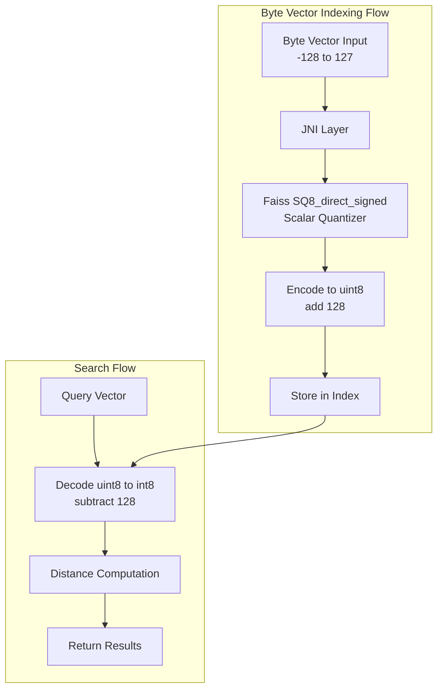

# k-NN Byte Vector Support

## Summary

OpenSearch 2.17.0 introduces byte vector support for the Faiss engine, enabling users to store quantized byte vector embeddings with significant memory savings. This feature allows vectors with signed 8-bit integer values (ranging from -128 to 127) to be indexed and searched using both HNSW and IVF algorithms, reducing memory consumption by up to 75% compared to float vectors.

## Details

### What's New in v2.17.0

- **Faiss HNSW byte vector support**: Index and search byte vectors using the HNSW algorithm with Faiss engine
- **Faiss IVF byte vector support**: Index and search byte vectors using the IVF algorithm with Faiss engine (requires training)
- **Memory optimization**: Byte vectors use `SQ8_direct_signed` scalar quantizer internally, reducing memory footprint by 4x
- **JNI layer enhancements**: New native methods for byte vector storage, training, and index creation

### Technical Changes

#### Architecture Changes



#### New Components

| Component | Description |
|-----------|-------------|
| `ByteIndexService` | New Faiss index service for byte vector operations |
| `ByteTrainingDataConsumer` | Handles training data for IVF byte indexes |
| `BinaryTrainingDataConsumer` | Separated from byte consumer for binary vectors |
| `OffHeapByteVectorTransfer` | Transfers byte vectors to native memory |

#### New Configuration

| Setting | Description | Default |
|---------|-------------|---------|
| `data_type` | Vector data type (`float`, `byte`, `binary`) | `float` |

#### API Changes

New JNI methods added to `FaissService`:
- `initByteIndex()` - Initialize byte vector index
- `insertToByteIndex()` - Insert byte vectors into index
- `writeByteIndex()` - Write byte index to disk
- `createByteIndexFromTemplate()` - Create byte index from trained template (IVF)
- `trainByteIndex()` - Train IVF index with byte vectors

### Usage Example

#### HNSW with Byte Vectors

```json
PUT test-index
{
  "settings": {
    "index": {
      "knn": true
    }
  },
  "mappings": {
    "properties": {
      "my_vector": {
        "type": "knn_vector",
        "dimension": 8,
        "data_type": "byte",
        "method": {
          "name": "hnsw",
          "space_type": "l2",
          "engine": "faiss",
          "parameters": {
            "ef_construction": 100,
            "m": 16
          }
        }
      }
    }
  }
}
```

#### Indexing Byte Vectors

```json
PUT test-index/_doc/1
{
  "my_vector": [-126, 28, 127, 0, 10, -45, 12, -110]
}
```

#### Searching

```json
GET test-index/_search
{
  "size": 2,
  "query": {
    "knn": {
      "my_vector": {
        "vector": [-1, 45, -100, 125, -128, -8, 5, 10],
        "k": 2
      }
    }
  }
}
```

### Migration Notes

- Vectors must be quantized to byte range [-128, 127] before ingestion
- Encoders (SQ, PQ) are not supported with byte vectors
- For IVF algorithm, training is required using byte vectors

## Limitations

- Vector values must be within signed byte range [-128, 127]
- Encoders cannot be used with byte data type
- Some recall loss compared to float vectors (typically 1-9% depending on dataset)
- SIMD optimization recommended for best performance

## References

### Documentation
- [Documentation](https://docs.opensearch.org/2.17/search-plugins/knn/knn-vector-quantization/): k-NN vector quantization

### Blog Posts
- [Blog](https://opensearch.org/blog/faiss-byte-vector/): Introducing byte vector support for Faiss

### Pull Requests
| PR | Description |
|----|-------------|
| [#1823](https://github.com/opensearch-project/k-NN/pull/1823) | Add HNSW support for Faiss byte vector |
| [#2002](https://github.com/opensearch-project/k-NN/pull/2002) | Add IVF support for Faiss byte vector |

### Issues (Design / RFC)
- [Issue #1659](https://github.com/opensearch-project/k-NN/issues/1659): Feature request for Faiss byte vector support

## Related Feature Report

- [Full feature documentation](../../../../features/k-nn/k-nn-byte-vector-support.md)
