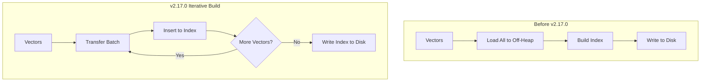

---
tags:
  - indexing
  - k-nn
  - performance
---

# k-NN Iterative Graph Build

## Summary

OpenSearch 2.17.0 introduces iterative graph build capability for FAISS indexes, significantly improving memory efficiency during k-NN index creation. Instead of loading all vectors into memory before building the graph, vectors are now transferred and indexed in batches, reducing peak memory consumption during indexing operations.

## Details

### What's New in v2.17.0

This release integrates FAISS iterative graph builds with the `NativeEngines990KnnVectorsFormat`, enabling memory-optimized index construction for native k-NN engines.

### Technical Changes

#### Architecture Changes



#### New Components

| Component | Description |
|-----------|-------------|
| `NativeIndexBuildStrategy` | Interface defining how indexes are built |
| `MemOptimizedNativeIndexBuildStrategy` | Iterative build strategy for FAISS |
| `DefaultIndexBuildStrategy` | Traditional bulk build strategy |
| `NativeIndexWriter` | Unified writer for native k-NN indexes |
| `OffHeapVectorTransfer` | Manages vector transfer to off-heap memory |
| `BuildIndexParams` | Parameters container for index building |

#### New JNI Methods

| Method | Description |
|--------|-------------|
| `initIndex` | Initialize a FAISS index in memory |
| `insertToIndex` | Add vectors to an existing index |
| `writeIndex` | Write the completed index to disk |

#### API Changes

The JNI layer now supports three-phase index creation:

1. **Initialize**: Create index structure with `initIndex()`
2. **Insert**: Add vectors in batches with `insertToIndex()`
3. **Write**: Persist to disk with `writeIndex()`

### Usage Example

No user-facing API changes are required. The iterative build is automatically used for FAISS indexes when:
- The engine is FAISS
- No model template is used

```json
PUT /my-index
{
  "settings": {
    "index": {
      "knn": true
    }
  },
  "mappings": {
    "properties": {
      "my_vector": {
        "type": "knn_vector",
        "dimension": 768,
        "method": {
          "name": "hnsw",
          "engine": "faiss",
          "parameters": {
            "ef_construction": 128,
            "m": 16
          }
        }
      }
    }
  }
}
```

### Memory Optimization

The `knn.memory.circuit_breaker.limit` setting controls the streaming memory limit for vector transfers. Vectors are transferred in batches calculated as:

```
transferLimit = max(1, streamingMemoryLimit / bytesPerVector)
```

### Migration Notes

- No migration required - the feature is automatically enabled for FAISS indexes
- Existing indexes continue to work without changes
- Model-based indexes still use the traditional bulk build approach

## Limitations

- Only available for FAISS engine (not nmslib or Lucene)
- Model-based indexes (using `model_id`) use the traditional bulk build
- Binary vector indexes use the default build strategy

## References

### Documentation
- [k-NN Index Documentation](https://docs.opensearch.org/2.17/search-plugins/knn/knn-index/): Official k-NN index documentation

### Pull Requests
| PR | Description |
|----|-------------|
| [#1950](https://github.com/opensearch-project/k-NN/pull/1950) | Integrates FAISS iterative builds with NativeEngines990KnnVectorsFormat |

### Issues (Design / RFC)
- [Issue #1853](https://github.com/opensearch-project/k-NN/issues/1853): RFC - Integrating KNNVectorsFormat in Native Vector Search Engine

## Related Feature Report

- [Full feature documentation](../../../../features/k-nn/k-nn-iterative-graph-build.md)
