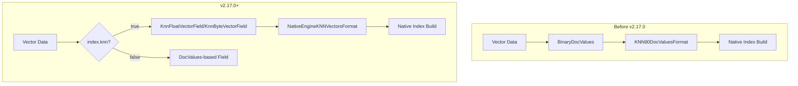

---
tags:
  - indexing
  - k-nn
  - performance
  - search
---

# k-NN Lucene Vector Integration

## Summary

This release integrates Lucene's KNNVectorsFormat with native vector search engines (FAISS and NMSLIB), replacing the previous BinaryDocValues-based storage. This architectural change provides significant performance improvements for vector deserialization, with up to 3.3x better p99 latency when reading vectors from disk.

## Details

### What's New in v2.17.0

The k-NN plugin now uses Lucene's native KNNVectorsFormat for storing vectors when using native engines (FAISS, NMSLIB), instead of the previous BinaryDocValues format. This change is foundational for future memory-optimized vector search capabilities.

### Technical Changes

#### Architecture Changes



#### New Components

| Component | Description |
|-----------|-------------|
| `NativeEngineKNNVectorsFormat` | Per-field vectors format for native engine vector fields |
| `KNNVectorValues` | Abstraction layer over FloatVectorValues, ByteVectorValues, and BinaryDocValues |
| `useLuceneBasedVectorField` | Flag in field mapper to determine vector field type |

#### New Configuration

| Setting | Description | Default |
|---------|-------------|---------|
| `knn.use.format.enabled` | Cluster setting to enable Lucene vector format (temporary) | `false` |

**Note**: The `knn.use.format.enabled` setting is temporary and will be removed once all related changes are complete.

#### Field Mapper Changes

The `KNNVectorFieldMapper` now conditionally creates different field types:

- **Lucene format enabled**: Uses `KnnFloatVectorField` or `KnnByteVectorField`
- **Lucene format disabled**: Uses `VectorField` with BinaryDocValues

### Usage Example

No changes to user-facing APIs. The format selection is automatic based on:
1. Index created version (>= 2.17.0)
2. Cluster setting `knn.use.format.enabled`

```json
PUT my-knn-index
{
  "settings": {
    "index": {
      "knn": true
    }
  },
  "mappings": {
    "properties": {
      "my_vector": {
        "type": "knn_vector",
        "dimension": 128,
        "method": {
          "name": "hnsw",
          "engine": "faiss"
        }
      }
    }
  }
}
```

### Performance Improvements

| Metric | BinaryDocValues | KNNVectorsFormat | Improvement |
|--------|-----------------|------------------|-------------|
| p99 Vector Read Latency (1M 768D) | 416ms | 124ms | 3.3x |
| Index Build Time | Baseline | 5-10% faster | - |

### Migration Notes

- **Backward Compatible**: Existing indices continue to use BinaryDocValues
- **New Indices**: Automatically use KNNVectorsFormat when conditions are met
- **No User Action Required**: Format selection is automatic

## Limitations

- Feature is behind a cluster setting (`knn.use.format.enabled`) in v2.17.0
- Old KNN80DocValuesFormat must be maintained until next major release
- Search interface migration to codec search interface is planned for future releases

## References

### Documentation
- [k-NN Index Documentation](https://docs.opensearch.org/2.17/search-plugins/knn/knn-index/)

### Pull Requests
| PR | Description |
|----|-------------|
| [#1945](https://github.com/opensearch-project/k-NN/pull/1945) | Integrate Lucene Vector field with native engines |
| [#1939](https://github.com/opensearch-project/k-NN/pull/1939) | Restructure mappers (dependency) |

### Issues (Design / RFC)
- [Issue #1853](https://github.com/opensearch-project/k-NN/issues/1853): RFC - Integrating KNNVectorsFormat in Native Vector Search Engine
- [Issue #1087](https://github.com/opensearch-project/k-NN/issues/1087): Original investigation

## Related Feature Report

- [Full feature documentation](../../../../features/k-nn/k-nn-lucene-vector-integration.md)
