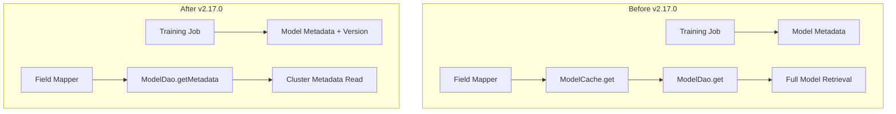

---
tags:
  - domain/search
  - component/server
  - indexing
  - k-nn
  - ml
  - performance
---
# k-NN Model Metadata

## Summary

This enhancement adds OpenSearch version tracking to k-NN model metadata and optimizes how model metadata is retrieved. When a model is trained, the OpenSearch version used during training is now stored as part of the model's metadata. Additionally, model metadata reads have been changed to retrieve data directly from cluster metadata instead of making separate model retrieval calls.

## Details

### What's New in v2.17.0

The k-NN plugin now tracks the OpenSearch version with which a model was created. This version information is stored in the model metadata and persisted in the k-NN model system index.

### Technical Changes

#### Architecture Changes



#### New Components

| Component | Description |
|-----------|-------------|
| `MODEL_VERSION` constant | New constant in `KNNConstants.java` for the model version field key |
| `getModelVersion()` method | New getter in `ModelMetadata` class to retrieve the stored version |
| Version serialization | Model version is now serialized/deserialized with model metadata |

#### New Configuration

| Setting | Description | Default |
|---------|-------------|---------|
| `model_version` | OpenSearch version when model was created | Current OpenSearch version |

The `model_version` field is automatically populated during model training and stored in the model index mapping.

#### API Changes

The model metadata response now includes a `model_version` field:

```json
GET /_plugins/_knn/models/my-model
{
  "model_id": "my-model",
  "model_blob": "...",
  "state": "created",
  "timestamp": "2024-09-05T17:29:20Z",
  "description": "My trained model",
  "error": "",
  "space_type": "l2",
  "dimension": 128,
  "engine": "faiss",
  "model_version": "2.17.0"
}
```

### Usage Example

When training a new model, the version is automatically captured:

```json
POST /_plugins/_knn/models/my-model/_train
{
  "training_index": "train-index",
  "training_field": "train-field",
  "dimension": 128,
  "method": {
    "name": "ivf",
    "engine": "faiss",
    "parameters": {
      "nlist": 128,
      "encoder": {
        "name": "pq",
        "parameters": {
          "code_size": 8
        }
      }
    }
  }
}
```

After training completes, the model metadata will include the version:

```json
GET /_plugins/_knn/models/my-model?filter_path=model_id,state,model_version
{
  "model_id": "my-model",
  "state": "created",
  "model_version": "2.17.0"
}
```

### Migration Notes

- Existing models created before v2.17.0 will have an empty version (`Version.V_EMPTY`)
- The version field is backward compatible - older clusters can still read model metadata
- No manual migration is required; the version is automatically populated for new models

## Limitations

- Models created before v2.17.0 will not have version information
- The version reflects the OpenSearch version at training time, not the current cluster version

## References

### Documentation
- [k-NN Plugin API Documentation](https://docs.opensearch.org/2.17/search-plugins/knn/api/): Official API documentation for k-NN models
- [Approximate k-NN Search](https://docs.opensearch.org/2.17/search-plugins/knn/approximate-knn/): Guide on training and using k-NN models

### Pull Requests
| PR | Description |
|----|-------------|
| [#2005](https://github.com/opensearch-project/k-NN/pull/2005) | Add model version to model metadata and change model metadata reads to be from cluster metadata |

## Related Feature Report

- [Full feature documentation](../../../features/k-nn/k-nn-model-metadata.md)
