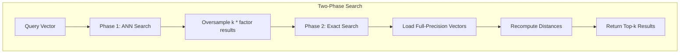

# k-NN Query Rescore

## Summary

This release introduces query-time rescoring support for k-NN searches using native engines (Faiss, NMSLIB). The feature enables a two-phase search approach where approximate nearest neighbor (ANN) results are first retrieved using quantized vectors, then rescored using full-precision vectors to improve recall while maintaining memory efficiency.

## Details

### What's New in v2.17.0

The k-NN query rescore feature adds the ability to improve search recall for quantized vector indexes by performing a two-phase search:

1. **First Phase (Oversampling)**: Retrieve `oversample_factor * k` results using the quantized ANN index
2. **Second Phase (Rescoring)**: Load full-precision vectors for the oversampled results and recompute exact distances to return the final top-k results

### Technical Changes

#### Architecture Changes



#### New Components

| Component | Description |
|-----------|-------------|
| `RescoreContext` | Holds rescoring configuration including oversample factor |
| `ExactSearcher` | Performs exact distance calculations using full-precision vectors |
| `ResultUtil` | Utility class for processing and reducing search results |

#### New Configuration

| Setting | Description | Default |
|---------|-------------|---------|
| `rescore.oversample_factor` | Multiplier for first-pass result count | 1.0 |

The `oversample_factor` must be between 1.0 and 100.0. The first-pass result count is calculated as `oversample_factor * k`, bounded between 100 and 10,000.

#### API Changes

New `rescore` parameter in k-NN query:

```json
{
  "query": {
    "knn": {
      "my_vector_field": {
        "vector": [1.0, 2.0, 3.0],
        "k": 10,
        "rescore": {
          "oversample_factor": 2.0
        }
      }
    }
  }
}
```

Alternatively, set `rescore: true` to use default oversample factor of 1.0:

```json
{
  "query": {
    "knn": {
      "my_vector_field": {
        "vector": [1.0, 2.0, 3.0],
        "k": 10,
        "rescore": true
      }
    }
  }
}
```

### Usage Example

```json
GET my-knn-index/_search
{
  "size": 10,
  "query": {
    "knn": {
      "my_vector_field": {
        "vector": [2.0, 3.0, 5.0, 6.0],
        "k": 10,
        "rescore": {
          "oversample_factor": 3.0
        }
      }
    }
  }
}
```

### Migration Notes

- Rescoring is only supported for the Faiss engine
- Rescoring is most beneficial when used with quantized indexes (disk-based mode)
- For non-quantized indexes, rescoring is not needed as scores are already fully precise
- Works with nested field searches

## Limitations

- Only supported for Faiss engine (not Lucene or NMSLIB)
- First-pass results are bounded between 100 and 10,000
- Adds latency due to the second-phase exact search
- Requires full-precision vectors to be stored for rescoring

## Related PRs

| PR | Description |
|----|-------------|
| [#1984](https://github.com/opensearch-project/k-NN/pull/1984) | k-NN query rescore support for native engines |

## References

- [Approximate k-NN Search Documentation](https://docs.opensearch.org/2.17/search-plugins/knn/approximate-knn/)
- [k-NN Vector Quantization](https://docs.opensearch.org/2.17/search-plugins/knn/knn-vector-quantization/)
- [Disk-based Vector Search](https://docs.opensearch.org/2.17/search-plugins/knn/disk-based-vector-search/)

## Related Feature Report

- [Full feature documentation](../../../../features/k-nn/k-nn-query-rescore.md)
