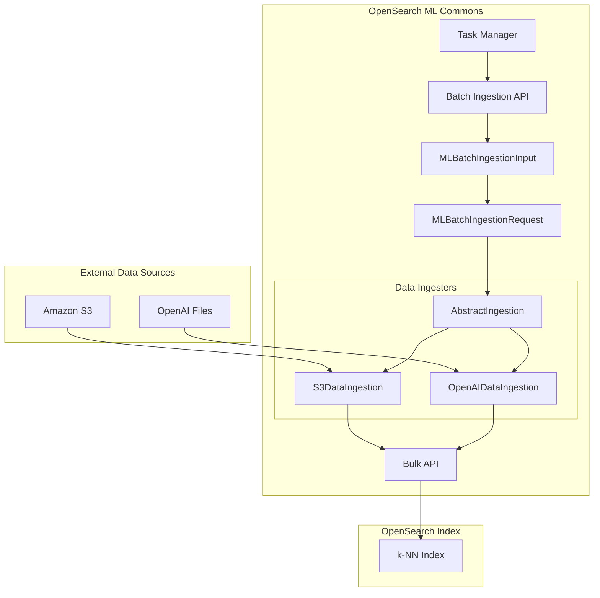

# ML Commons Batch Ingestion

## Summary

OpenSearch 2.17 introduces Asynchronous Batch Ingestion, a new capability in ML Commons that enables offline ingestion of documents and their pre-generated embeddings from remote file servers (Amazon S3 or OpenAI) into OpenSearch indexes. This feature completes the batch inference workflow by allowing users to ingest results from batch prediction jobs back into OpenSearch for neural search, eliminating the need for real-time embedding generation during ingestion.

## Details

### What's New in v2.17.0

- New Asynchronous Batch Ingestion API (`POST /_plugins/_ml/_batch_ingestion`)
- Support for S3 and OpenAI as data sources
- JSONPath-based field mapping for flexible data transformation
- New task type `BATCH_INGEST` for tracking ingestion progress
- Support for ingesting from multiple files with cross-file field mapping
- New connector action types: `CANCEL_BATCH_PREDICT` and `BATCH_PREDICT_STATUS`
- Enhanced Get Task API to fetch real-time batch job status from remote services

### Technical Changes

#### Architecture Changes



#### New Components

| Component | Description |
|-----------|-------------|
| `MLBatchIngestionInput` | Input class containing index name, field mappings, credentials, and data source configuration |
| `MLBatchIngestionRequest` | Transport request wrapper for batch ingestion operations |
| `MLBatchIngestionResponse` | Response containing task ID and status |
| `AbstractIngestion` | Base class for data ingesters with common bulk ingestion logic |
| `S3DataIngestion` | Ingester for reading JSONL files from Amazon S3 |
| `OpenAIDataIngestion` | Ingester for reading files from OpenAI's file storage |
| `CancelBatchJobTransportAction` | Transport action for canceling batch transform jobs |

#### New Configuration

| Setting | Description | Default |
|---------|-------------|---------|
| `index_name` | Target OpenSearch index for ingestion | Required |
| `field_map` | Maps source file fields to index fields using JSONPath | Required |
| `ingest_fields` | Fields to ingest directly without transformation | Optional |
| `credential` | Authentication credentials for data source | Required |
| `data_source.type` | Data source type (`s3` or `openAI`) | Required |
| `data_source.source` | Array of file paths or file IDs | Required |

#### API Changes

New endpoint for batch ingestion:

```
POST /_plugins/_ml/_batch_ingestion
```

New endpoint for canceling batch jobs:

```
POST /_plugins/_ml/tasks/{task_id}/_cancel_batch
```

### Usage Example

#### Ingesting from S3

```json
POST /_plugins/_ml/_batch_ingestion
{
  "index_name": "my-nlp-index",
  "field_map": {
    "chapter": "$.content[0]",
    "title": "$.content[1]",
    "chapter_embedding": "$.SageMakerOutput[0]",
    "title_embedding": "$.SageMakerOutput[1]",
    "_id": "$.id"
  },
  "ingest_fields": ["$.id"],
  "credential": {
    "region": "us-east-1",
    "access_key": "<ACCESS_KEY>",
    "secret_key": "<SECRET_KEY>",
    "session_token": "<SESSION_TOKEN>"
  },
  "data_source": {
    "type": "s3",
    "source": ["s3://bucket/output/batch_results.json.out"]
  }
}
```

#### Ingesting from Multiple OpenAI Files

```json
POST /_plugins/_ml/_batch_ingestion
{
  "index_name": "my-nlp-index-openai",
  "field_map": {
    "question": "source[1].$.body.input[0]",
    "answer": "source[1].$.body.input[1]",
    "question_embedding": "source[0].$.response.body.data[0].embedding",
    "answer_embedding": "source[0].$.response.body.data[1].embedding",
    "_id": ["source[0].$.custom_id", "source[1].$.custom_id"]
  },
  "ingest_fields": ["source[2].$.custom_field1"],
  "credential": {
    "openAI_key": "<OPENAI_KEY>"
  },
  "data_source": {
    "type": "openAI",
    "source": ["file-output-id", "file-input-id", "file-metadata-id"]
  }
}
```

### Migration Notes

This is a new feature with no migration required. To use batch ingestion:

1. Generate embeddings using the Batch Predict API (introduced in v2.16)
2. Store results in S3 or use OpenAI's batch API
3. Create a k-NN index with appropriate vector field mappings
4. Call the Batch Ingestion API with field mappings

## Limitations

- Supported data sources limited to S3 and OpenAI in this release
- Source files must be in JSONL format (one JSON object per line)
- Field mapping requires JSONPath syntax knowledge
- Credentials must be provided in plaintext in the request body
- No automatic retry mechanism for failed document ingestion

## References

### Documentation
- [Asynchronous Batch Ingestion Documentation](https://docs.opensearch.org/2.17/ml-commons-plugin/remote-models/async-batch-ingestion/): Official documentation
- [Asynchronous Batch Ingestion API](https://docs.opensearch.org/2.17/ml-commons-plugin/api/async-batch-ingest/): API reference
- [Batch Predict API](https://docs.opensearch.org/2.17/ml-commons-plugin/api/model-apis/batch-predict/): Related batch prediction API

### Pull Requests
| PR | Description |
|----|-------------|
| [#2844](https://github.com/opensearch-project/ml-commons/pull/2844) | Offline batch ingestion API actions and data ingesters |
| [#2825](https://github.com/opensearch-project/ml-commons/pull/2825) | Support get batch transform job status in get task API |

### Issues (Design / RFC)
- [Issue #2840](https://github.com/opensearch-project/ml-commons/issues/2840): Offline Batch Inference and Batch Ingestion

## Related Feature Report

- [Full feature documentation](../../../../features/ml-commons/batch-ingestion.md)
