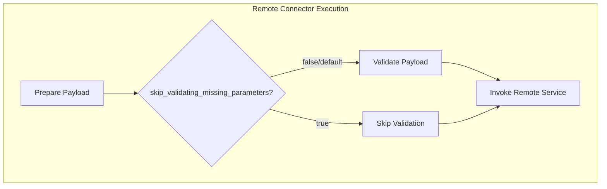

---
tags:
  - domain/ml
  - component/server
  - ml
---
# ML Commons Connector Enhancements

## Summary

This release adds a new `skip_validating_missing_parameters` parameter to ML Commons connectors, allowing users to bypass payload validation for missing parameter placeholders. This is particularly useful when using LLMs where prompts may intentionally contain unresolved `${parameters.xxx}` placeholders that should be passed through to the model.

## Details

### What's New in v2.17.0

A new connector parameter `skip_validating_missing_parameters` has been introduced to control whether the connector validates that all parameter placeholders in the request payload have been filled.

### Technical Changes

#### Problem Solved

When using ML Commons connectors with LLMs (e.g., Amazon Bedrock, OpenAI), prompts may contain substrings like `${parameters.role}` that are intended to be passed through to the model rather than being substituted. Previously, the connector's `validatePayload` function would throw an error: "Some parameter placeholder not filled in payload: xxx".

This was particularly problematic when using tools like `KnowledgeBaseTool` where the output from one tool might contain parameter-like patterns that triggered validation errors.

#### Solution

The `skip_validating_missing_parameters` parameter allows users to disable this validation when needed.

#### Architecture Changes



#### New Configuration

| Setting | Description | Default |
|---------|-------------|---------|
| `parameters.skip_validating_missing_parameters` | When set to `true`, skips validation of unfilled parameter placeholders in the request payload | `false` |

### Usage Example

```json
POST /_plugins/_ml/connectors/_create
{
  "name": "BedRock test connector",
  "description": "The connector to BedRock service for claude model",
  "version": 1,
  "protocol": "aws_sigv4",
  "parameters": {
    "region": "us-east-1",
    "service_name": "bedrock",
    "anthropic_version": "bedrock-2023-05-31",
    "endpoint": "bedrock-runtime.us-east-1.amazonaws.com",
    "auth": "Sig_V4",
    "content_type": "application/json",
    "max_tokens_to_sample": 8000,
    "temperature": 0.00001,
    "skip_validating_missing_parameters": "true"
  },
  "credential": {
    "access_key": "<YOUR_ACCESS_KEY>",
    "secret_key": "<YOUR_SECRET_KEY>"
  },
  "actions": [
    {
      "action_type": "predict",
      "method": "POST",
      "url": "https://bedrock-runtime.us-east-1.amazonaws.com/model/anthropic.claude-instant-v1/invoke",
      "headers": { 
        "content-type": "application/json",
        "x-amz-content-sha256": "required"
      },
      "request_body": "{\"prompt\":\"${parameters.prompt}\", \"max_tokens_to_sample\":${parameters.max_tokens_to_sample}, \"temperature\":${parameters.temperature}, \"anthropic_version\":\"${parameters.anthropic_version}\" }"
    }
  ]
}
```

### Migration Notes

- Existing connectors are unaffected as the default behavior (`false`) maintains backward compatibility
- To enable the new behavior, add `"skip_validating_missing_parameters": "true"` to the connector's `parameters` section
- The parameter value should be a string `"true"` or `"false"`

## Limitations

- When validation is skipped, malformed payloads with unfilled placeholders will be sent to the remote service, which may result in errors from the external API
- Users should ensure their prompts and payloads are correctly formatted when using this option

## References

### Documentation
- [Connector Blueprints Documentation](https://docs.opensearch.org/2.17/ml-commons-plugin/remote-models/blueprints/): Official documentation for connector configuration

### Pull Requests
| PR | Description |
|----|-------------|
| [#2830](https://github.com/opensearch-project/ml-commons/pull/2830) | Backport to 2.x: Support skip_validating_missing_parameters in connector |
| [#2812](https://github.com/opensearch-project/ml-commons/pull/2812) | Original implementation: Support skip_validating_missing_parameters in connector |

### Issues (Design / RFC)
- [Issue #2712](https://github.com/opensearch-project/ml-commons/issues/2712): KnowledgeBaseTool may return parameter placeholder not filled error

## Related Feature Report

- Full feature documentation
