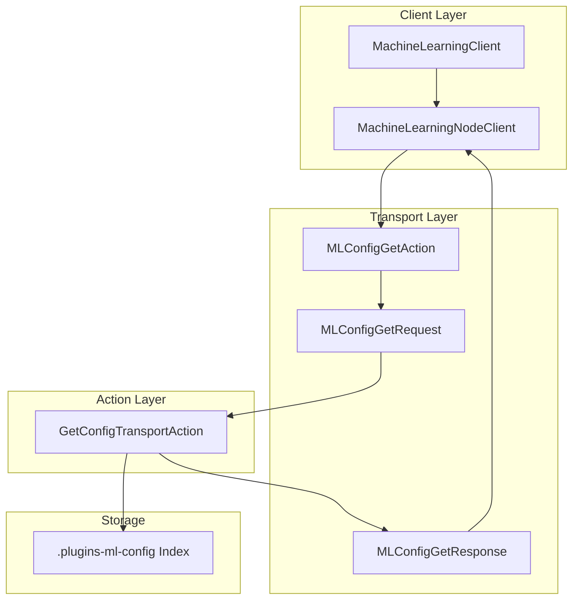

# ML Config API

## Summary

OpenSearch v2.17.0 exposes the ML Config API through the MachineLearningClient, enabling programmatic access to ML configuration documents. This enhancement allows applications to retrieve ML configuration settings via the Java client API, with built-in security to prevent access to sensitive internal configuration keys.

## Details

### What's New in v2.17.0

The ML Config API is now accessible through the `MachineLearningClient` interface, providing a standardized way to retrieve ML configuration documents stored in the `.plugins-ml-config` index.

### Technical Changes

#### Architecture Changes



#### New Components

| Component | Description |
|-----------|-------------|
| `MachineLearningClient.getConfig()` | New method to retrieve ML config by ID |
| `MachineLearningNodeClient.getConfig()` | Implementation of getConfig for node client |
| `MLConfigGetResponse.getMlConfig()` | Getter method exposed via Lombok annotation |

#### API Changes

New methods added to `MachineLearningClient`:

```java
// Synchronous retrieval
ActionFuture<MLConfig> getConfig(String configId);

// Asynchronous retrieval with listener
void getConfig(String configId, ActionListener<MLConfig> listener);
```

#### Security Enhancement

Access to the `MASTER_KEY` configuration document is explicitly blocked to prevent exposure of sensitive encryption keys:

```java
if (configId.equals(MASTER_KEY)) {
    actionListener.onFailure(
        new OpenSearchStatusException(
            "You are not allowed to access this config doc", 
            RestStatus.FORBIDDEN
        )
    );
    return;
}
```

### Usage Example

```java
// Using MachineLearningNodeClient
MachineLearningNodeClient mlClient = new MachineLearningNodeClient(client);

// Synchronous call
MLConfig config = mlClient.getConfig("my-config-id").actionGet();
String agentId = config.getConfiguration().getAgentId();

// Asynchronous call
mlClient.getConfig("my-config-id", ActionListener.wrap(
    mlConfig -> {
        // Handle successful response
        Configuration configuration = mlConfig.getConfiguration();
    },
    exception -> {
        // Handle error
    }
));
```

### MLConfig Structure

The `MLConfig` object contains:

| Field | Type | Description |
|-------|------|-------------|
| `type` | String | Configuration type identifier |
| `configType` | String | Alternative type field (v2.15.0+) |
| `configuration` | Configuration | Configuration object with settings |
| `mlConfiguration` | Configuration | Alternative configuration field (v2.15.0+) |
| `createTime` | Instant | Creation timestamp |
| `lastUpdateTime` | Instant | Last modification timestamp |
| `tenantId` | String | Tenant identifier (v2.19.0+) |

## Limitations

- The `MASTER_KEY` configuration document cannot be accessed via this API for security reasons
- No REST API endpoint is exposed; access is only through the Java client
- Configuration documents must already exist in the `.plugins-ml-config` index

## References

### Documentation
- [ML Commons APIs](https://docs.opensearch.org/2.17/ml-commons-plugin/api/index/): Official API documentation
- [ML Commons cluster settings](https://docs.opensearch.org/2.17/ml-commons-plugin/cluster-settings/): Configuration settings reference

### Pull Requests
| PR | Description |
|----|-------------|
| [#2850](https://github.com/opensearch-project/ml-commons/pull/2850) | Expose ML Config API |

## Related Feature Report

- [Full feature documentation](../../../../features/ml-commons/ml-config-api.md)
