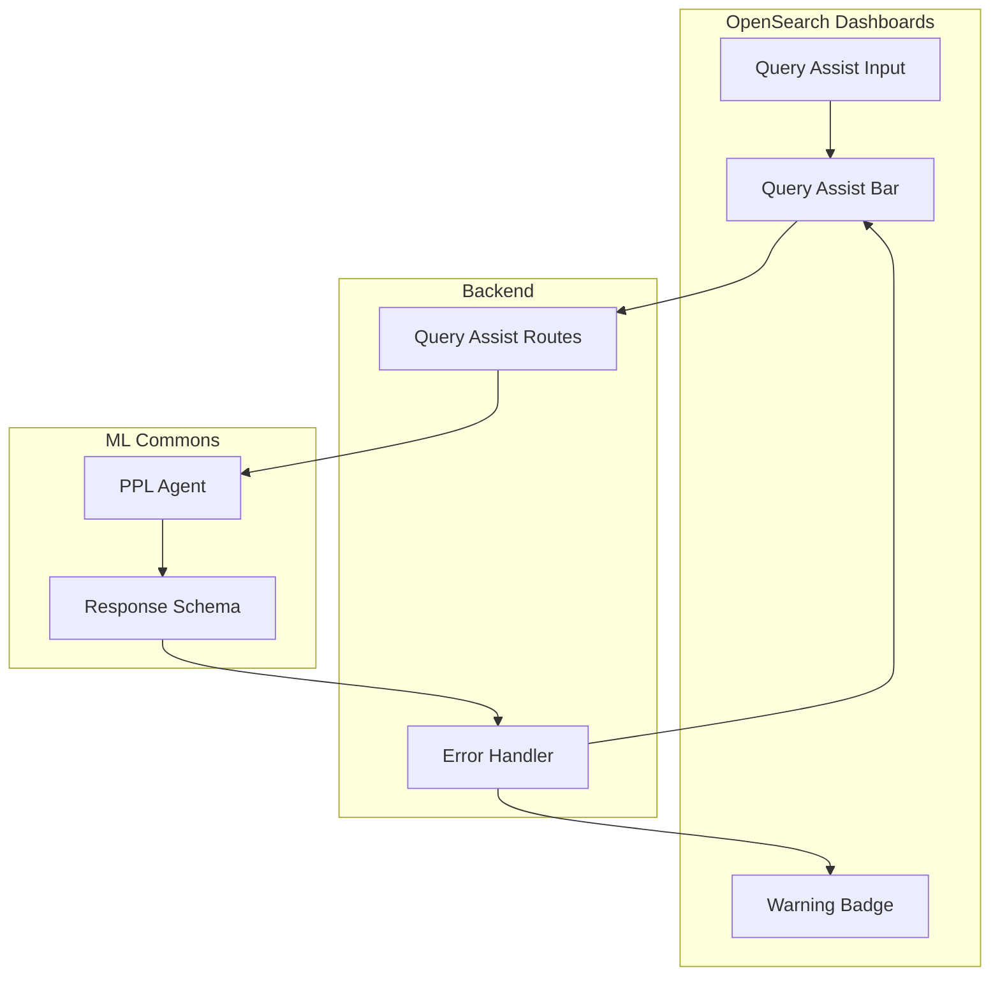
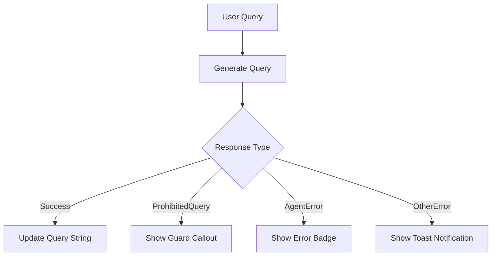

---
tags:
  - domain/ml
  - component/server
  - dashboards
  - indexing
  - ml
  - search
  - sql
---
# Query Assist

## Summary

This release enhances the Query Assist feature in OpenSearch Dashboards with improved error handling, updated ml-commons response schema processing, and better support for index patterns without data sources. Query Assist enables users to convert natural language questions into PPL queries using AI-powered agents.

## Details

### What's New in v2.17.0

The v2.17.0 release focuses on compatibility improvements and enhanced error handling for the Query Assist feature:

1. **Updated ml-commons Response Schema Processing**: The ml-commons API now returns `error.body` as a JSON object instead of a string. The frontend has been updated to handle both formats for backward compatibility with older ml-commons versions through Multi-Data Source (MDS).

2. **Agent Error Badge Display**: Errors from the ML agent are now displayed as a badge in the Query Assist input field, providing clearer feedback to users when query generation fails.

3. **Index Pattern Support**: Query Assist now works with index patterns that don't have an associated data source, expanding compatibility.

### Technical Changes

#### Architecture Changes



#### New Components

| Component | Description |
|-----------|-------------|
| `WarningBadge` | New UI component to display agent errors inline in the input field |
| `AgentError` | New error class for parsing and handling ML agent errors |

#### Error Handling Flow



#### API Changes

The server-side route handler now properly handles the updated ml-commons response format:

- On OpenSearch >= 2.17, `error.body` is returned as a JSON object
- For consistency, the frontend always receives the error in `error.body.message` as a JSON string
- The `AgentError` class parses this JSON to extract `reason`, `details`, `type`, and `status`

### Usage Example

Query Assist continues to work the same way for end users:

1. Select an index pattern in Discover
2. Switch to PPL language mode
3. Click the Query Assist icon to expand the natural language input
4. Enter a question like "Show me the top 10 error logs from yesterday"
5. The system generates a PPL query from your natural language input

When errors occur, they are now displayed more clearly:

```
// Error badge shows:
- Reason: Invalid Request
- Details: PPLTool doesn't support searching indexes starting with '.'
- Type: IllegalArgumentException
- Status: 400
```

### Migration Notes

No migration required. The changes are backward compatible with older ml-commons versions.

## Limitations

- Query Assist requires a configured PPL agent in ml-commons
- System indexes (starting with `.`) are not supported by the PPL tool
- External data source types (e.g., S3) are not supported as Query Assist relies on OpenSearch API for index mappings

## References

### Documentation
- [OpenSearch Assistant Documentation](https://docs.opensearch.org/2.17/dashboards/dashboards-assistant/index/)
- [PPL Tool Documentation](https://docs.opensearch.org/2.17/ml-commons-plugin/agents-tools/tools/ppl-tool/)
- [Event Analytics - Query Assist](https://docs.opensearch.org/2.17/observing-your-data/event-analytics/)

### Pull Requests
| PR | Description |
|----|-------------|
| [#7998](https://github.com/opensearch-project/OpenSearch-Dashboards/pull/7998) | Use badge to show agent errors, update ml-commons response schema processing |
| [#8146](https://github.com/opensearch-project/OpenSearch-Dashboards/pull/8146) | Backport to 2.x branch |

## Related Feature Report

- Full feature documentation
