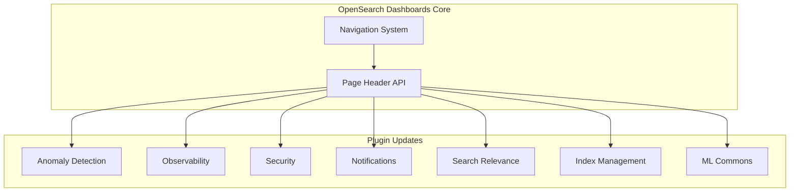

---
tags:
  - domain/infra
  - component/server
  - dashboards
  - indexing
  - ml
  - observability
  - search
  - security
---
# Header Redesign

## Summary

OpenSearch Dashboards v2.17.0 introduces a comprehensive header redesign across multiple plugins to provide a consistent, modern user interface. This coordinated effort updates page headers across 7 plugin repositories, implementing a new page header API that supports both the new navigation system and legacy navigation modes.

## Details

### What's New in v2.17.0

The header redesign standardizes the page header component across all OpenSearch Dashboards plugins, providing:

- Consistent visual design language across all plugin pages
- Support for the new navigation system with collapsible side navigation
- Backward compatibility with legacy navigation mode
- Unified breadcrumb handling and action button placement
- Feature flag control via `useNewHomePage` setting

### Technical Changes

#### Architecture Changes



#### Updated Plugins

| Plugin | Repository | PRs | Pages Updated |
|--------|------------|-----|---------------|
| Anomaly Detection | anomaly-detection-dashboards-plugin | [#841](https://github.com/opensearch-project/anomaly-detection-dashboards-plugin/pull/841) | Dashboard, List, Detail, Create |
| Observability | dashboards-observability | [#2050](https://github.com/opensearch-project/dashboards-observability/pull/2050), [#2081](https://github.com/opensearch-project/dashboards-observability/pull/2081), [#2099](https://github.com/opensearch-project/dashboards-observability/pull/2099) | Metrics, Applications, Notebooks |
| Security | security-dashboards-plugin | Multiple PRs | Threat Detection, Home Page |
| Notifications | dashboards-notifications | [#236](https://github.com/opensearch-project/dashboards-notifications/pull/236) | Notifications pages |
| Search Relevance | dashboards-search-relevance | [#428](https://github.com/opensearch-project/dashboards-search-relevance/pull/428) | Search Relevance pages |
| Index Management | index-management-dashboards-plugin | [#1105](https://github.com/opensearch-project/index-management-dashboards-plugin/pull/1105), [#1108](https://github.com/opensearch-project/index-management-dashboards-plugin/pull/1108), [#1115](https://github.com/opensearch-project/index-management-dashboards-plugin/pull/1115), [#1122](https://github.com/opensearch-project/index-management-dashboards-plugin/pull/1122), [#1124](https://github.com/opensearch-project/index-management-dashboards-plugin/pull/1124), [#1126](https://github.com/opensearch-project/index-management-dashboards-plugin/pull/1126) | Snapshots, ISM Policies, Data Streams, Rollups, Component Templates, Aliases, Index Templates, Transforms, Notification Settings |
| ML Commons | ml-commons-dashboards | [#351](https://github.com/opensearch-project/ml-commons-dashboards/pull/351) | Model Registry |

#### Key Implementation Details

1. **Feature Flag Control**: The new header is controlled by the `useNewHomePage` feature flag
2. **Breadcrumb Management**: Plugins set new breadcrumbs and register refresh components when the new header is enabled
3. **Action Button Registration**: Create/action buttons are registered to the header instead of inline placement
4. **Table Header Hiding**: Table header titles and global breadcrumbs are hidden when the new page header is enabled

### Usage Example

```typescript
// Example: Supporting new page header in a plugin
if (useNewPageHeader) {
  // Hide table header title and global breadcrumbs
  // Set new breadcrumbs
  chrome.setBreadcrumbs([{ text: 'Plugin Name' }, { text: 'Page Name' }]);
  
  // Register refresh component to header
  chrome.setHeaderActionMenu(refreshComponent);
}
```

### Migration Notes

- Plugins automatically detect the navigation mode and render appropriate headers
- No user action required - the header style is determined by the navigation system setting
- Both old and new navigation modes continue to work

## Limitations

- Some plugins may have minor visual inconsistencies during the transition period
- Custom plugin pages not updated in this release will retain the old header style

## References

### Documentation
- [OpenSearch Dashboards Quickstart Guide](https://docs.opensearch.org/2.17/dashboards/quickstart/): Navigation menu documentation
- [Custom Branding](https://docs.opensearch.org/2.17/dashboards/branding/): Condensed header configuration

### Pull Requests
| PR | Repository | Description |
|----|------------|-------------|
| [#841](https://github.com/opensearch-project/anomaly-detection-dashboards-plugin/pull/841) | anomaly-detection-dashboards-plugin | Header redesign for AD pages |
| [#2050](https://github.com/opensearch-project/dashboards-observability/pull/2050) | dashboards-observability | New page header for metrics |
| [#2081](https://github.com/opensearch-project/dashboards-observability/pull/2081) | dashboards-observability | New page header for applications |
| [#2099](https://github.com/opensearch-project/dashboards-observability/pull/2099) | dashboards-observability | New page header for notebooks |
| [#236](https://github.com/opensearch-project/dashboards-notifications/pull/236) | dashboards-notifications | Page header for notifications |
| [#428](https://github.com/opensearch-project/dashboards-search-relevance/pull/428) | dashboards-search-relevance | New page header for search relevance |
| [#1105](https://github.com/opensearch-project/index-management-dashboards-plugin/pull/1105) | index-management-dashboards-plugin | Update header for Snapshot pages |
| [#1108](https://github.com/opensearch-project/index-management-dashboards-plugin/pull/1108) | index-management-dashboards-plugin | Update header for ISM policies |
| [#1115](https://github.com/opensearch-project/index-management-dashboards-plugin/pull/1115) | index-management-dashboards-plugin | Update header for data streams and rollups |
| [#1122](https://github.com/opensearch-project/index-management-dashboards-plugin/pull/1122) | index-management-dashboards-plugin | Update header for component templates |
| [#1124](https://github.com/opensearch-project/index-management-dashboards-plugin/pull/1124) | index-management-dashboards-plugin | Update header for aliases, templates, transforms |
| [#1126](https://github.com/opensearch-project/index-management-dashboards-plugin/pull/1126) | index-management-dashboards-plugin | Update header for notification settings |
| [#351](https://github.com/opensearch-project/ml-commons-dashboards/pull/351) | ml-commons-dashboards | Support new page header |

## Related Feature Report

- [Full feature documentation](../../../../features/multi-plugin/multi-plugin-header-redesign.md)
