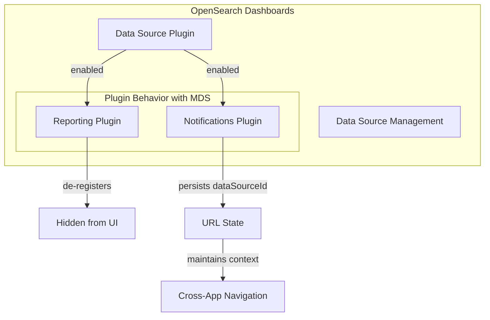

# Multi-Data Source Support

## Summary

OpenSearch Dashboards v2.17.0 enhances Multi-Data Source (MDS) support across multiple plugins. The Reporting plugin now de-registers when MDS is enabled (since reporting doesn't support MDS), and the Notifications plugin improves data source ID persistence across application navigation with the new navigation experience.

## Details

### What's New in v2.17.0

This release includes two key MDS-related enhancements:

1. **Reporting Plugin De-registration**: The dashboards-reporting plugin now automatically de-registers itself when MDS is enabled, preventing users from accessing unsupported functionality.

2. **Notifications Data Source Persistence**: The dashboards-notifications plugin now persists the selected `dataSourceId` in the URL when navigating between pages under the new navigation experience.

### Technical Changes

#### Architecture Changes



#### Reporting Plugin Changes

The reporting plugin checks for the presence of the `dataSource` plugin during setup. If MDS is enabled, the plugin skips application registration:

| Behavior | MDS Disabled | MDS Enabled |
|----------|--------------|-------------|
| Application Registration | Registered | Skipped |
| Side Navigation | Visible | Hidden |
| Report Generation | Available | Unavailable |

#### Notifications Plugin Changes

| Component | Change | Purpose |
|-----------|--------|---------|
| `MDSEnabledComponent` | Added `useUpdateUrlWithDataSourceProperties` hook | Persist dataSourceId in URL |
| `PageHeader` | Integrated URL update hook | Automatic URL sync on page load |
| `EmailSenders` | Integrated URL update hook | Maintain context in email sender pages |
| `Main.tsx` | Added `dataSourceObservable` subscription | Track data source changes |
| `plugin.ts` | Added `appStateUpdater` with `updater$` | Update default routes with dataSourceId |
| `constants.ts` | Added `dataSourceObservable` BehaviorSubject | Global data source state management |

#### New Configuration

| Setting | Description | Default |
|---------|-------------|---------|
| `data_source.enabled` | Enable/disable MDS feature | `false` |
| `data_source.hideLocalCluster` | Hide local cluster option | `false` |

### Usage Example

When MDS is enabled, the Notifications plugin automatically appends the `dataSourceId` to URLs:

```
# Before navigation
/app/notifications#/channels

# After selecting a data source
/app/notifications#/channels?dataSourceId=abc123
```

This ensures that when users navigate between Channels, Email Senders, and Email Recipient Groups, the selected data source context is preserved.

### Migration Notes

- **Reporting users**: If you rely on the Reporting plugin and plan to enable MDS, note that reporting functionality will be unavailable. Consider disabling MDS or using alternative reporting methods.
- **Notifications users**: No action required. The data source persistence is automatic when MDS is enabled.

## Limitations

- The Reporting plugin does not support MDS and is completely hidden when MDS is enabled
- Data source persistence in Notifications requires the new navigation experience to be enabled
- The `dataSourceId` URL parameter is only added when `multiDataSourceEnabled` is true

## Related PRs

| PR | Repository | Description |
|----|------------|-------------|
| [#411](https://github.com/opensearch-project/dashboards-reporting/pull/411) | dashboards-reporting | De-register reporting when MDS is enabled |
| [#249](https://github.com/opensearch-project/dashboards-notifications/pull/249) | dashboards-notifications | Persist dataSourceId across applications under new Nav change |

## References

- [PR #411](https://github.com/opensearch-project/dashboards-reporting/pull/411): De-register reporting when MDS is enabled
- [PR #249](https://github.com/opensearch-project/dashboards-notifications/pull/249): Persist dataSourceId across applications
- [PR #244](https://github.com/opensearch-project/dashboards-notifications/pull/244): Original implementation (main branch)
- [Documentation](https://docs.opensearch.org/2.17/dashboards/management/multi-data-sources/): Configuring and using multiple data sources

## Related Feature Report

- [Full feature documentation](../../../../features/multi-plugin/multi-data-source-support.md)
