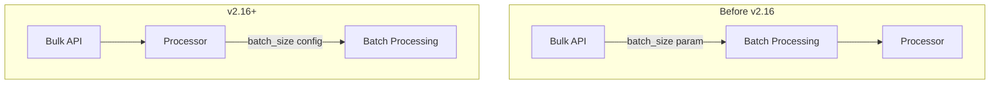

# Neural Search Bugfixes

## Summary

This release item addresses test infrastructure improvements in the neural-search plugin for v2.17.0. The changes migrate batch ingestion tests from using the deprecated `batch_size` parameter in the Bulk API to using `batch_size` in the processor configuration, aligning with the recommended approach for batch processing.

## Details

### What's New in v2.17.0

The PR removes the use of `batch_size` parameter from the Bulk API in tests and updates them to use `batch_size` in the processor configuration instead. This change reflects the shift in batch ingestion architecture where batch size control moved from the API level to the processor level.

### Technical Changes

#### Architecture Changes



#### Test Infrastructure Updates

| Component | Change |
|-----------|--------|
| `BatchIngestionIT` | Updated to use `batch_size` in processor configuration |
| `AbstractRestartUpgradeRestTestCase` | Added `batchSize` parameter to pipeline creation methods |
| `AbstractRollingUpgradeTestCase` | Added `batchSize` parameter support |
| `BaseNeuralSearchIT` | Removed `batch_size` from bulk request parameters |

#### BWC Version Check Refactoring

The PR also refactors the backward compatibility version checks in Gradle build files:

```groovy
// Before: Repetitive version checks
if (ext.neural_search_bwc_version.startsWith("2.9") || 
    ext.neural_search_bwc_version.startsWith("2.10") || ...)

// After: Cleaner version list approach
def versionsBelow2_16 = versionsBelow2_15 + "2.15"
if (versionsBelow2_16.any { ext.neural_search_bwc_version.startsWith(it) })
```

#### Pipeline Configuration Changes

```json
{
  "description": "Sparse encoding pipeline",
  "processors": [
    {
      "sparse_encoding": {
        "model_id": "%s",
        "batch_size": 2,
        "field_map": {
          "passage_text": "passage_embedding"
        }
      }
    }
  ]
}
```

### Migration Notes

If you have tests or code that uses `batch_size` as a Bulk API parameter:

1. Remove `batch_size` from Bulk API request parameters
2. Add `batch_size` to the processor configuration in your ingest pipeline
3. The processor-level `batch_size` provides the same batching functionality

## Limitations

- This is a test infrastructure change only; no user-facing functionality is affected
- The `batch_size` parameter in Bulk API was deprecated in favor of processor-level configuration

## References

### Documentation
- [Batch Ingestion Documentation](https://docs.opensearch.org/2.17/ml-commons-plugin/remote-models/batch-ingestion/): Official docs
- [Sparse Encoding Processor](https://docs.opensearch.org/2.17/ingest-pipelines/processors/sparse-encoding/): Processor configuration

### Pull Requests
| PR | Description |
|----|-------------|
| [#852](https://github.com/opensearch-project/neural-search/pull/852) | Remove batch_size of bulk API from tests & refactor BWC version check |

### Issues (Design / RFC)
- [Issue #14283](https://github.com/opensearch-project/OpenSearch/issues/14283): Make batch ingestion automatic, not a parameter on _bulk

## Related Feature Report

- [Batch Ingestion feature documentation](../../../../features/neural-search/batch-ingestion.md)
