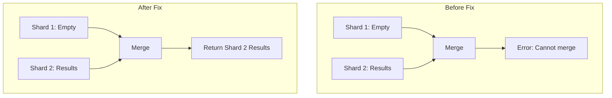

---
tags:
  - domain/search
  - component/server
  - indexing
  - neural-search
  - search
---
# Neural Search Hybrid Query Bugfixes

## Summary

OpenSearch v2.17.0 includes two critical bugfixes for hybrid query in the neural-search plugin. These fixes address pagination behavior and shard result merging issues that affected hybrid search reliability, particularly when concurrent segment search is enabled.

## Details

### What's New in v2.17.0

Two bugs were fixed in this release:

1. **Pagination Error Handling (PR #867)**: Removed misleading code that gave users the impression pagination worked with hybrid queries when it did not. Now throws a clear error message when pagination is attempted.

2. **Multi-Shard Merge Logic Fix (PR #877)**: Fixed a bug where hybrid query results could fail to merge correctly when concurrent segment search is enabled and one shard returns empty results first.

### Technical Changes

#### Bug 1: Pagination Behavior Clarification

The `HybridTopScoreDocCollector` previously contained code that cut search results in the priority queue, which gave users a false impression that pagination worked. This code was removed, and an explicit error is now thrown when `from` parameter is non-zero:

```java
// HybridQueryPhaseSearcher.java
if (searchContext.from() != 0) {
    throw new IllegalArgumentException(
        "In the current OpenSearch version pagination is not supported with hybrid query"
    );
}
```

**Impact**: Users attempting to use pagination with hybrid queries now receive a clear error message instead of silently incorrect results.

#### Bug 2: Empty Shard Result Merge Fix

The `TopDocsMerger` class was updated to handle scenarios where:
- Concurrent segment search is enabled
- One shard returns no results
- That empty shard appears first in the merge sequence



The fix adds symmetric handling for empty source objects:

```java
// TopDocsMerger.java
if (isEmpty(newTopDocs)) {
    return source;
}
if (isEmpty(source)) {
    return newTopDocs;
}
```

### Affected Components

| Component | File | Change |
|-----------|------|--------|
| Collector | `HybridTopScoreDocCollector.java` | Removed result cutting code |
| Query Phase | `HybridQueryPhaseSearcher.java` | Added pagination validation |
| Merger | `TopDocsMerger.java` | Added empty source handling |

### Error Messages

When attempting pagination with hybrid query:
```
illegal_argument_exception: In the current OpenSearch version pagination is not supported with hybrid query
```

## Limitations

- **Pagination not supported**: Hybrid queries do not support the `from` parameter. Use `search_after` for pagination instead.
- **Concurrent segment search edge cases**: While the merge logic fix addresses the known issue, the order of shard results is non-deterministic with concurrent segment search.

## References

### Documentation
- [Hybrid Search Documentation](https://docs.opensearch.org/2.17/search-plugins/hybrid-search/)
- [Hybrid Query DSL](https://docs.opensearch.org/2.17/query-dsl/compound/hybrid/)

### Pull Requests
| PR | Description |
|----|-------------|
| [#867](https://github.com/opensearch-project/neural-search/pull/867) | Removing code to cut search results of hybrid search in the priority queue |
| [#877](https://github.com/opensearch-project/neural-search/pull/877) | Fixed merge logic in hybrid query for multiple shards case |

### Issues (Design / RFC)
- [Issue #875](https://github.com/opensearch-project/neural-search/issues/875): Unable to merge results from shards
- [Issue #280](https://github.com/opensearch-project/neural-search/issues/280): Pagination support tracking issue

## Related Feature Report

- Full feature documentation
