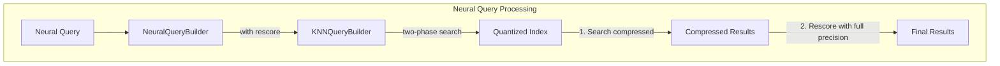

# Neural Search Rescore

## Summary

OpenSearch 2.17.0 adds rescore parameter support to the neural query, enabling rescoring functionality for k-NN indexes built using quantization. This enhancement allows neural search queries to leverage the same rescoring capabilities available in k-NN queries, improving search recall for disk-based vector search scenarios.

## Details

### What's New in v2.17.0

The `rescore` parameter is now available in the `neural` query, allowing users to configure rescoring behavior when searching quantized vector indexes. This is particularly useful for disk-based vector search where vectors are compressed using binary quantization.

### Technical Changes

#### Architecture Changes



#### New Configuration

| Parameter | Description | Default |
|-----------|-------------|---------|
| `rescore` | Object containing rescoring configuration | `null` |
| `rescore.oversample_factor` | Factor to oversample results before rescoring | `3.0` (for disk-optimized indexes) |

### Usage Example

```json
GET /my-nlp-index/_search
{
  "query": {
    "neural": {
      "passage_embedding": {
        "query_text": "semantic search query",
        "model_id": "my-model-id",
        "k": 10,
        "rescore": {
          "oversample_factor": 5.0
        }
      }
    }
  }
}
```

The rescore parameter can be combined with other neural query parameters:

```json
GET /my-nlp-index/_search
{
  "query": {
    "neural": {
      "passage_embedding": {
        "query_text": "semantic search query",
        "model_id": "my-model-id",
        "k": 10,
        "method_parameters": {
          "ef_search": 100
        },
        "rescore": {
          "oversample_factor": 10.0
        }
      }
    }
  }
}
```

### Migration Notes

- The rescore parameter is optional and backward compatible
- Existing neural queries continue to work without modification
- For disk-optimized indexes, rescoring is enabled by default with an `oversample_factor` of `3.0`

## Limitations

- Rescore is primarily designed for quantized/disk-based vector indexes
- Radial search does not support disk-based vector search with rescoring
- The `on_disk` mode only works with the `float` data type

## References

### Documentation
- [Neural Query Documentation](https://docs.opensearch.org/2.17/query-dsl/specialized/neural/): Official neural query reference
- [Disk-based Vector Search](https://docs.opensearch.org/2.17/search-plugins/knn/disk-based-vector-search/): Documentation on disk-based vector search and rescoring

### Pull Requests
| PR | Description |
|----|-------------|
| [#885](https://github.com/opensearch-project/neural-search/pull/885) | Adds rescore parameter support in neural search |

## Related Feature Report

- [Full feature documentation](../../../../features/neural-search/neural-search-rescore.md)
