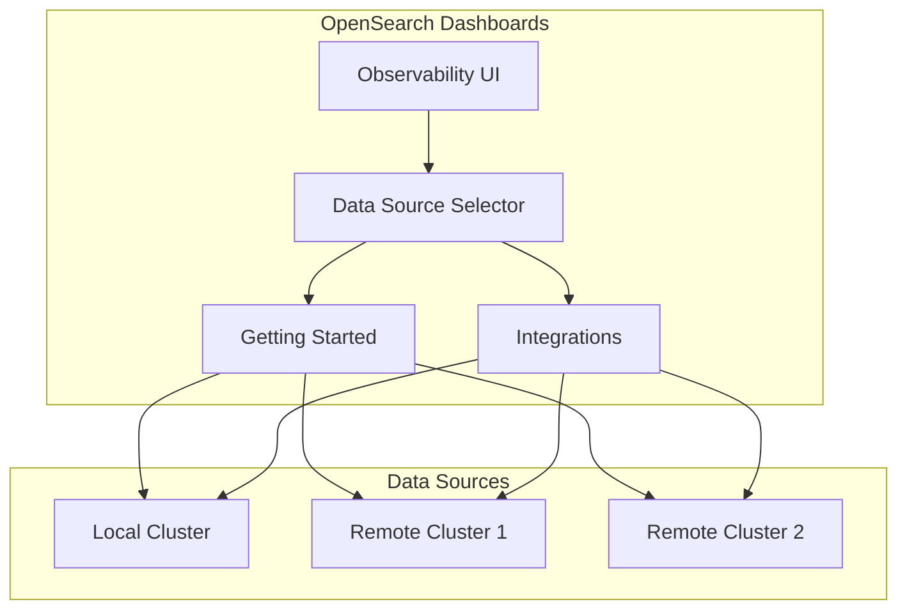

---
tags:
  - domain/observability
  - component/server
  - dashboards
  - observability
---
# Observability Multi-Data Source Support

## Summary

OpenSearch Dashboards v2.17.0 extends Multi-Data Source (MDS) support to the Observability plugin, enabling users to work with observability data from multiple OpenSearch clusters through a single Dashboards instance. This release adds MDS support to Getting Started workflows, Integrations, and includes enhancements for plugin registration when the local cluster is absent.

## Details

### What's New in v2.17.0

This release introduces comprehensive MDS support across several Observability components:

1. **Getting Started MDS Support**: Users can now select a data source when using Getting Started workflows, with assets created in the selected remote cluster.

2. **Integrations MDS Support**: The Integrations feature now supports multiple data sources, allowing users to install and manage integrations across different OpenSearch clusters.

3. **Plugin Deregistration in MDS Mode**: When MDS is enabled, certain plugins (dashboards, applications, logs) are deregistered to prevent conflicts with the multi-data source architecture.

4. **Data Source Registration Without Local Cluster**: Added support for registering data sources when the local cluster is absent, resolving 500 errors that occurred when no backend plugins were available.

### Technical Changes

#### Architecture Changes



#### New Components

| Component | Description |
|-----------|-------------|
| `DataSourceSelector` | UI component for selecting target data source in Getting Started |
| `dataSourceMDSId` | Parameter for tracking selected MDS ID across components |
| `dataSourceMDSLabel` | Parameter for displaying selected data source name |
| `featureFlagStatus` | Flag to track MDS enablement status |

#### New Configuration

| Setting | Description | Default |
|---------|-------------|---------|
| `data_source.enabled` | Enables multiple data source support | `false` |

#### API Changes

New endpoint for creating assets with MDS support:

```
POST /api/observability/gettingStarted/createAssets
```

Request body:
```json
{
  "mdsId": "data-source-id",
  "mdsLabel": "Data Source Name",
  "tutorialId": "tutorial-name"
}
```

New DSL routes for MDS-aware operations:
- `POST /api/observability/dsl/integrations/refresh` - Refresh indices with MDS support
- `POST /api/observability/dsl/integrations/mapping` - Get mappings with MDS support

### Usage Example

When MDS is enabled, users see a data source selector in the Getting Started and Integrations pages:

```typescript
// Select data source and create assets
const onSelectedDataSource = (e) => {
  const dataSourceId = e[0] ? e[0].id : undefined;
  const dataSourceLabel = e[0] ? e[0].label : undefined;
  setDataSourceMDSId(dataSourceId);
  setDataSourceMDSLabel(dataSourceLabel);
};

// Assets are created with MDS reference
await UploadAssets(tutorialId, selectedDataSourceId, selectedDataSourceLabel);
```

### Migration Notes

- When upgrading to v2.17.0 with MDS enabled, existing integrations will continue to work with the local cluster
- New integrations can be installed to any configured data source
- The `references` field in integration instances now includes data source information

## Limitations

- Some Observability features (dashboards, applications, logs) are deregistered when MDS is enabled
- S3 data source registration is disabled when MDS feature flag is enabled
- Integration assets must be manually migrated if moving between data sources

## References

### Documentation
- [Multiple Data Sources Documentation](https://docs.opensearch.org/2.17/dashboards/management/multi-data-sources/): Official docs

### Blog Posts
- [Multiple Data Sources Blog](https://opensearch.org/blog/multiple-data-source/): Launch announcement

### Pull Requests
| PR | Description |
|----|-------------|
| [#2048](https://github.com/opensearch-project/dashboards-observability/pull/2048) | Multi-data Source Support for Getting Started |
| [#2051](https://github.com/opensearch-project/dashboards-observability/pull/2051) | MDS support in Integrations for observability plugin |
| [#2097](https://github.com/opensearch-project/dashboards-observability/pull/2097) | Deregister dashboards, applications, logs in MDS |
| [#2140](https://github.com/opensearch-project/dashboards-observability/pull/2140) | Add support for register data sources during absence of local cluster |

### Issues (Design / RFC)
- [Issue #1440](https://github.com/opensearch-project/dashboards-observability/issues/1440): Feature request for MDS support in Trace Analytics

## Related Feature Report

- [Full feature documentation](../../../features/dashboards-observability/dashboards-observability-observability-multi-plugin-multi-data-source-support.md)
