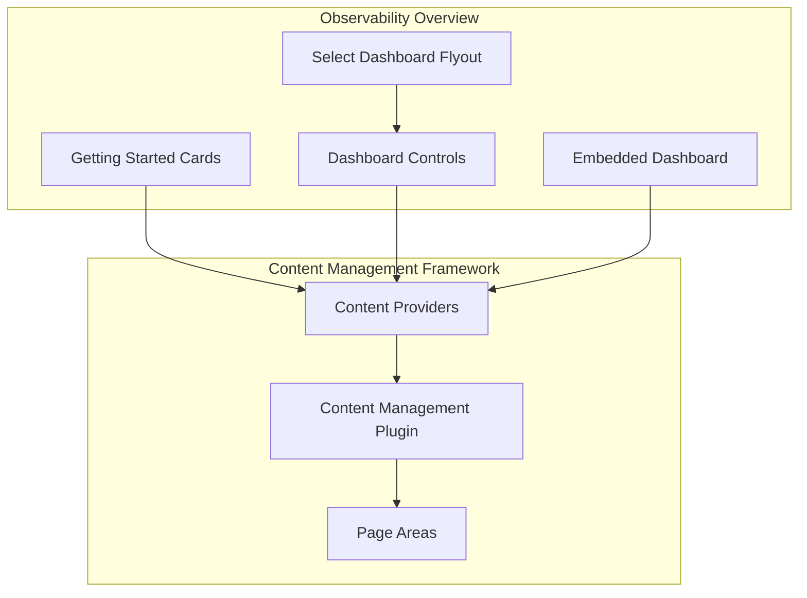
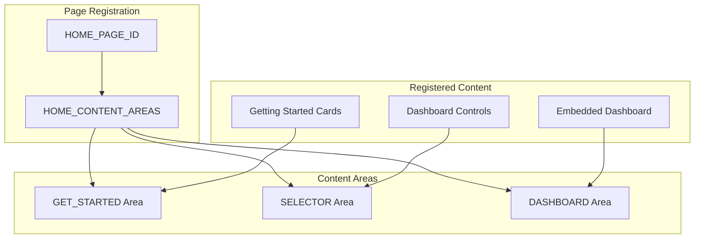

---
tags:
  - dashboards
  - observability
---

# Observability Workspace Integration

## Summary

OpenSearch Dashboards v2.17.0 introduces workspace integration for the Observability plugin. This release includes two key enhancements: making the `createAssets` API compatible with workspaces and rebuilding the Overview page using the Content Management framework. These changes enable better multi-tenant support and provide a more dynamic, customizable overview experience.

## Details

### What's New in v2.17.0

#### 1. Workspace-Compatible createAssets API

The `/api/observability/gettingStarted/createAssets` API now supports workspace isolation. Previously, this API used static IDs for created objects, which caused conflicts in multi-workspace environments.

**Key Changes:**
- Detects `workspaceId` from the request context
- Prepends workspace ID to object IDs and their references when workspace is active
- Maintains backward compatibility for non-workspace environments

```typescript
// ID transformation logic
if (requestWorkspaceId) {
  newId = `workspaceId-${requestWorkspaceId}-${newId}`;
  references = references?.map((ref) => ({
    ...ref,
    id: `workspaceId-${requestWorkspaceId}-${ref.id}`,
  }));
}
```

#### 2. Overview Page with Content Management

The Observability Overview page has been rebuilt using the Content Management plugin, providing a dynamic and extensible page structure.



### Technical Changes

#### New Components

| Component | Description |
|-----------|-------------|
| `DashboardControls` | Controls for selecting and managing the embedded dashboard |
| `SelectDashboardFlyout` | Flyout UI for selecting a dashboard to display |
| `AddDashboardCallout` | Callout prompting users to select a dashboard |
| `ObsDashboardStateManager` | RxJS-based state manager for dashboard state |
| `cardConfigs` | Configuration for Getting Started cards |

#### New Configuration

| Setting | Description | Default |
|---------|-------------|---------|
| `observability:defaultDashboard` | ID of the default dashboard to display on Overview page | (none) |

#### Architecture Changes

The Overview page now uses Content Management's page rendering system:



### Usage Example

The Overview page automatically displays:

1. **Getting Started Cards** - Quick links to key Observability features:
   - Add your data (Getting Started Guide)
   - Discover insights
   - Monitor system performance (Metrics)
   - Identify performance issues (Traces)
   - Monitor service health (Services)
   - Get notified (Alerting) - if plugin installed
   - Detect anomalies (Anomaly Detection) - if plugin installed

2. **Dashboard Section** - Embeddable dashboard with:
   - Dashboard selector flyout
   - Date range picker
   - Link to full dashboard view

### Migration Notes

- Existing Observability assets created before v2.17.0 will continue to work
- New assets created in workspaces will have workspace-prefixed IDs
- The Overview page setting `observability:defaultDashboard` can be configured in Advanced Settings

## Limitations

- Dashboard state management uses RxJS BehaviorSubjects (temporary solution, planned migration to Redux or React Context)
- The `createAssets` API workspace support only applies to new asset creation, not existing assets

## References

### Documentation
- [Observability Documentation](https://docs.opensearch.org/2.17/observing-your-data/): Official observability docs
- [OpenSearch-Dashboards #7201](https://github.com/opensearch-project/OpenSearch-Dashboards/pull/7201): Content Management plugin introduction

### Pull Requests
| PR | Description |
|----|-------------|
| [#2101](https://github.com/opensearch-project/dashboards-observability/pull/2101) | Make createAssets API compatible with workspace |
| [#2077](https://github.com/opensearch-project/dashboards-observability/pull/2077) | OverviewPage made with Content Management |

## Related Feature Report

- [Full feature documentation](../../../../features/dashboards-observability/dashboards-observability-observability-workspace-integration.md)
