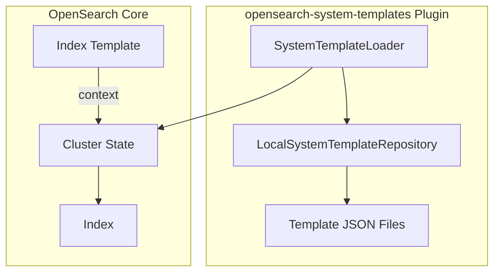

# System Templates

## Summary

OpenSearch 2.17.0 introduces Application-Based Configuration (ABC) templates through the `opensearch-system-templates` plugin. This feature provides predefined system templates that simplify index configuration for various use cases like logs, metrics, and application-specific logging. Templates automatically apply optimized settings including `zstd_no_dict` compression and `log_byte_size` merge policy.

## Details

### What's New in v2.17.0

The `opensearch-system-templates` plugin was introduced as a new repository for system templates loaded during cluster setup. These templates provide sensible defaults for common OpenSearch use cases.

### Technical Changes

#### Architecture



#### New Components

| Component | Description |
|-----------|-------------|
| `ApplicationBasedConfigurationSystemTemplatesPlugin` | Main plugin class implementing `SystemTemplatesPlugin` |
| `LocalSystemTemplateRepository` | Repository implementation that loads templates from plugin resources |
| Template JSON files | Predefined configurations for various use cases |

#### Available Templates

| Template | Use Case | Settings |
|----------|----------|----------|
| `logs` | General log data | `zstd_no_dict` codec, `log_byte_size` merge policy, 60s refresh |
| `metrics` | Metrics data | `zstd_no_dict` codec, `log_byte_size` merge policy, 60s refresh |
| `nginx-logs` | Nginx access logs | Full mapping with HTTP fields |
| `apache-web-logs` | Apache web server logs | HTTP communication mappings |
| `amazon-cloudtrail-logs` | AWS CloudTrail logs | AWS-specific field mappings |
| `amazon-elb-logs` | AWS ELB logs | Load balancer field mappings |
| `amazon-s3-logs` | AWS S3 access logs | S3-specific field mappings |
| `k8s-logs` | Kubernetes logs | Container and pod field mappings |

#### Template Settings

All templates include optimized settings:

| Setting | Value | Benefit |
|---------|-------|---------|
| `index.codec` | `zstd_no_dict` | ~20% storage improvement |
| `index.merge.policy` | `log_byte_size` | Better time-range query performance |
| `index.refresh_interval` | `60s` | Reduced indexing overhead |
| `index.mapping.total_fields.limit` | `10000` | Support for complex mappings |

### Usage Example

```json
PUT /_index_template/my-metrics-template
{
  "index_patterns": ["my-metrics-*"],
  "context": {
    "name": "metrics"
  }
}
```

When an index matching the pattern is created, it automatically inherits the optimized settings from the `metrics` template.

### Performance Benefits

Based on testing with HTTP logs dataset:
- **Storage**: ~20% improvement with `zstd_no_dict` vs default compression
- **Indexing p99 latency**: ~6% improvement due to smaller segments
- **Query performance**: Improved time-range filter queries due to `log_byte_size` merge policy

## Limitations

- Templates are experimental in v2.17.0
- Requires `cluster.application_templates.enabled: true` setting
- Context cannot be removed once configured for an index
- Cannot override template-defined settings during index creation

## References

### Documentation
- [Documentation: Index context](https://opensearch.org/docs/latest/im-plugin/index-context/)
- [Repository: opensearch-system-templates](https://github.com/opensearch-project/opensearch-system-templates)

### Blog Posts
- [Blog: OpenSearch simplified: The power of ABC templates](https://opensearch.org/blog/opensearch-simplified-the-power-of-application-based-templates/)

### Pull Requests
| PR | Description |
|----|-------------|
| [#3](https://github.com/opensearch-project/opensearch-system-templates/pull/3) | Basic templates and addition of build steps |
| [#11](https://github.com/opensearch-project/opensearch-system-templates/pull/11) | Backport: Onboarding new templates and adding zstd support |
| [#8](https://github.com/opensearch-project/opensearch-system-templates/pull/8) | Onboarding new templates and adding zstd support (main) |

## Related Feature Report

- [Full feature documentation](../../../features/opensearch-system-templates/system-templates.md)
