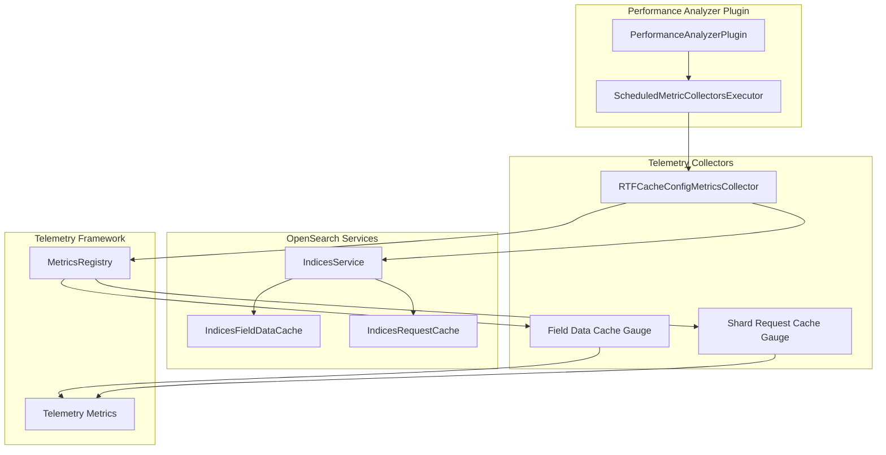

---
tags:
  - domain/observability
  - component/server
  - indexing
  - observability
  - performance
  - search
---
# Performance Analyzer Cache Config

## Summary

This release adds a new telemetry collector (`RTFCacheConfigMetricsCollector`) to Performance Analyzer that exposes cache configuration metrics for the Field Data Cache and Shard Request Cache. This enables monitoring of cache maximum size settings through the OpenSearch telemetry framework.

## Details

### What's New in v2.17.0

A new `RTFCacheConfigMetricsCollector` class has been added to collect and expose cache configuration metrics via the OpenSearch telemetry framework. This collector provides visibility into the maximum size configuration of two critical caches:

- **Field Data Cache**: Used for field data (doc values) caching
- **Shard Request Cache**: Used for caching search request results at the shard level

### Technical Changes

#### Architecture Changes



#### New Components

| Component | Description |
|-----------|-------------|
| `RTFCacheConfigMetricsCollector` | Telemetry collector for cache configuration metrics |
| `CacheMaxSizeStatus` | Inner class representing cache max size metric status |

#### New Configuration

| Setting | Description | Default |
|---------|-------------|---------|
| Sampling Interval | Collection interval for cache config metrics | 60000 ms (60 seconds) |

### Metrics Exposed

| Metric | Description | Unit | Dimensions |
|--------|-------------|------|------------|
| `CacheMaxSize` | Maximum configured size of the cache | Bytes | `CacheType` (FIELD_DATA_CACHE, SHARD_REQUEST_CACHE) |

### Usage Example

The cache configuration metrics are automatically collected when Performance Analyzer is enabled. Query the metrics via the Performance Analyzer API:

```bash
GET localhost:9600/_plugins/_performanceanalyzer/metrics/units
```

The response will include `Cache_MaxSize` metric with byte units.

### Implementation Details

The collector uses Java reflection (`FieldUtils.readField`) to access internal cache configuration:

1. **Field Data Cache**: Accessed via `IndicesService.getIndicesFieldDataCache().getCache()`
2. **Shard Request Cache**: Accessed via reflection on `indicesRequestCache` field

The collector creates gauge metrics that are lazily initialized and properly cleaned up when the collector is disabled.

## Limitations

- Uses reflection to access internal OpenSearch fields, which may break with internal API changes
- Metrics are only available when Performance Analyzer is enabled
- Collection interval is fixed at 60 seconds

## References

### Documentation
- [Performance Analyzer Documentation](https://docs.opensearch.org/latest/monitoring-your-cluster/pa/index/): Official documentation
- [Performance Analyzer Repository](https://github.com/opensearch-project/performance-analyzer): Source code

### Pull Requests
| PR | Description |
|----|-------------|
| [#690](https://github.com/opensearch-project/performance-analyzer/pull/690) | Added CacheConfig Telemetry collectors |

## Related Feature Report

- [Full feature documentation](../../../features/performance-analyzer/performance-analyzer.md)
