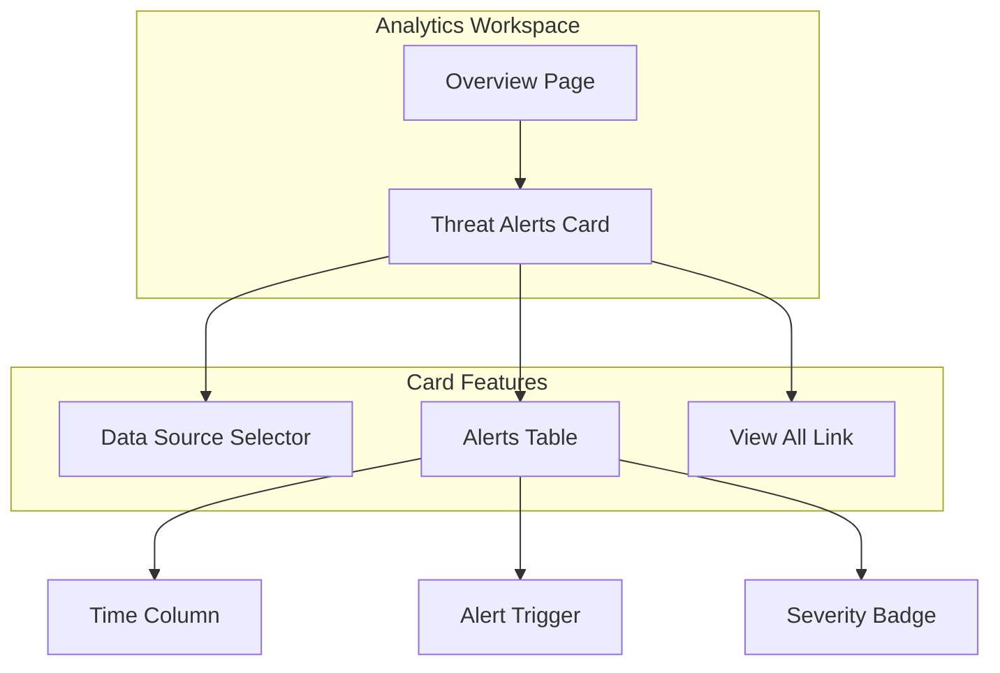

# Security Analytics UI Updates

## Summary

OpenSearch v2.17.0 introduces several UI enhancements to the Security Analytics Dashboards plugin, including improved data source selection labels, a new threat alerts card for the Analytics workspace, better URL handling with data source IDs, and comprehensive fit-and-finish styling updates across all pages.

## Details

### What's New in v2.17.0

This release focuses on improving the user experience through better labeling, workspace integration, URL state management, and visual consistency.

### Technical Changes

#### UI Improvements

| Change | Description |
|--------|-------------|
| Data Source Label Update | Changed "Select or input source indexes or index patterns" to "Select indexes/aliases" with help text recommending aliases |
| Threat Alerts Card | Added recent threat alerts card to Analytics (All) workspace overview page |
| URL Data Source ID | URLs now include data source ID parameter for proper state persistence |
| Fit and Finish | Semantic header sizes, smaller text, compressed context menus and tabs |

#### Data Source Selection Enhancement (PR #1100)

Updated the detector creation workflow to provide clearer guidance:

- Simplified label: "Select indexes/aliases"
- Added help text linking to alias documentation
- Recommends using aliases for optimal detector functioning

```tsx
<EuiFormRow
  label={<FormFieldHeader headerTitle={'Select indexes/aliases'} />}
  helpText={
    <span>
      <a href="https://opensearch.org/docs/latest/im-plugin/index-alias" target="_blank">
        Aliases
      </a>{' '}
      are recommended for optimal functioning of detectors.
    </span>
  }
>
```

#### Threat Alerts Card for Workspace (PR #1124)

New `DataSourceThreatAlertsCard` component displays recent threat alerts in the Analytics (All) workspace:



Features:
- Data source selection dropdown
- Table showing time, alert trigger, and severity
- Color-coded severity badges
- "View all" link to full alerts dashboard

#### URL State Management (PR #1125)

Improved URL handling for multi-data source environments:

- URLs now include `dataSourceId` parameter
- Automatic redirect to parent page if data source ID is missing on reload
- Threat Intel pages onboarded to multi-data source selection
- History wrapper ensures data source ID persists across navigation

#### Fit and Finish Styling (PR #1147)

Comprehensive visual updates following OpenSearch Dashboards design guidelines:

| Element | Change |
|---------|--------|
| Headers | Semantic sizing (H1 for page, H2 for panels/modals, H3 for sub-sections) |
| Text | Using `EuiText size="s"` consistently |
| Context Menus | Small context menus |
| Tabs | Small tabs (`size="s"`) |
| Panels | Consistent margin sizes |
| Date Picker | Compressed super date picker |

Pages updated:
- Getting Started
- Overview
- Findings
- Security Alerts
- Threat Intelligence
- Detectors (Create, Rule)
- Correlation Rules

### Usage Example

The threat alerts card automatically appears in the Analytics (All) workspace overview:

```typescript
// Registering the threat alerts card
getContentManagement().registerContentProvider({
  id: 'analytics_all_recent_threat_alerts_card_content',
  getTargetArea: () => ANALYTICS_ALL_OVERVIEW_CONTENT_AREAS.SERVICE_CARDS,
  getContent: () => ({
    id: 'analytics_all_recent_threat_alerts_card',
    kind: 'custom',
    order: 20,
    render: () => (
      <DataSourceThreatAlertsCard
        getDataSourceMenu={getDataSourceManagementPlugin().ui.getDataSourceMenu}
        detectorService={getBrowserServices().detectorsService}
      />
    ),
  }),
});
```

## Limitations

- Threat alerts card requires `contentManagement` plugin dependency
- URL data source ID handling requires multi-data source to be enabled
- Fit and finish changes may affect custom CSS overrides

## Related PRs

| PR | Description |
|----|-------------|
| [#1100](https://github.com/opensearch-project/security-analytics-dashboards-plugin/pull/1100) | Update data source selection label and help text |
| [#1124](https://github.com/opensearch-project/security-analytics-dashboards-plugin/pull/1124) | Add threat alerts card for Analytics (All) workspace |
| [#1125](https://github.com/opensearch-project/security-analytics-dashboards-plugin/pull/1125) | Update URL with data source ID; redirect on reload |
| [#1147](https://github.com/opensearch-project/security-analytics-dashboards-plugin/pull/1147) | Fit and Finishes Changes for Security Analytics |

## References

- [About Security Analytics](https://docs.opensearch.org/2.17/security-analytics/): Overview documentation
- [Setting up Security Analytics](https://docs.opensearch.org/2.17/security-analytics/sec-analytics-config/index/): Configuration guide
- [Index Aliases](https://opensearch.org/docs/latest/im-plugin/index-alias): Alias documentation referenced in help text

## Related Feature Report

- [Full feature documentation](../../../features/security-analytics-dashboards/security-analytics-dashboards-plugin.md)
