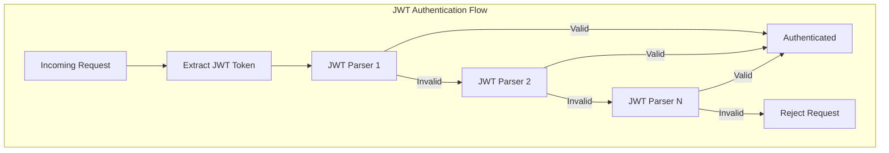

---
tags:
  - domain/security
  - component/server
  - dashboards
  - security
---
# Security Auth Enhancements

## Summary

OpenSearch v2.17.0 introduces several authentication and authorization enhancements across the security plugin and security-dashboards-plugin. Key improvements include support for multiple JWT signing keys for seamless key rotation, proxy authentication support in multi-auth configurations, an `ignore_hosts` option for IP-based rate limiting, and improved redirect URL handling in OpenSearch Dashboards.

## Details

### What's New in v2.17.0

#### 1. Multiple JWT Signing Keys Support

Previously, JWT authentication only supported a single signing key, causing downtime during key rotation. Now administrators can configure multiple signing keys, enabling zero-downtime key rotation.

```yaml
jwt_auth_domain:
  http_enabled: true
  transport_enabled: true
  order: 0
  http_authenticator:
    type: jwt
    challenge: false
    config:
      signing_key:
        - "-----BEGIN PUBLIC KEY-----\nMIGfMA0GCSqGSIb3DQEBAQUAA4GNADCBiQK...\n-----END PUBLIC KEY-----"
        - "-----BEGIN PUBLIC KEY-----\nMIGfMA0GCSqGSIb3DQEBAQUAA4GNADCBiQK...\n-----END PUBLIC KEY-----"
      jwt_header: "Authorization"
      subject_key: preferred_username
      roles_key: roles
```

The authenticator tries each key in order until one successfully validates the token.

#### 2. Proxy Authentication in Multi-Auth

Proxy authentication can now be used alongside other authentication types (basic, SAML, OpenID Connect) in multi-auth configurations.

```yaml
# opensearch_dashboards.yml
opensearch_security.auth.type: ["proxy", "basicauth"]
opensearch_security.auth.multiple_auth_enabled: true
opensearch_security.proxycache:
  user_header: "x-proxy-user"
  roles_header: "x-proxy-roles"
```

When proxy auth headers are not present, users are redirected to the standard login page for other authentication methods.

#### 3. IP Rate Limiting `ignore_hosts` Option

A new `ignore_hosts` configuration allows excluding specific IP addresses or hostnames from rate limiting. This is useful for trusted proxies or internal services.

```yaml
auth_failure_listeners:
  ip_rate_limiting:
    type: ip
    allowed_tries: 3
    time_window_seconds: 60
    block_expiry_seconds: 180
    max_blocked_clients: 100000
    max_tracked_clients: 100000
    ignore_hosts:
      - "127.0.0.1"
      - "10.0.0.*"
      - "proxy.internal.example.com"
```

Supports wildcards and hostname matching when `hosts_resolver_mode` is set to `ip-hostname`.

#### 4. Improved Redirect URL Handling

OpenSearch Dashboards now uses the core `getRedirectUrl` utility for generating `nextUrl` parameters, ensuring consistent and secure redirect behavior across SAML and OpenID Connect authentication flows.

### Technical Changes

#### Architecture Changes



#### New Configuration

| Setting | Description | Default |
|---------|-------------|---------|
| `signing_key` (list) | Multiple JWT signing keys for validation | - |
| `ignore_hosts` | List of IPs/hostnames to exclude from rate limiting | `[]` |

#### Modified Components

| Component | Repository | Change |
|-----------|------------|--------|
| `HTTPJwtAuthenticator` | security | Support for multiple signing keys |
| `AbstractRateLimiter` | security | Added `ignore_hosts` configuration |
| `BackendRegistry` | security | Host pattern matching for rate limiting |
| `MultipleAuthentication` | security-dashboards-plugin | Proxy auth handler support |
| `login-page.tsx` | security-dashboards-plugin | Proxy auth UI handling |

### Usage Example

#### Multiple JWT Keys Configuration

```yaml
# config.yml
config:
  dynamic:
    authc:
      jwt_auth_domain:
        http_enabled: true
        transport_enabled: true
        order: 0
        http_authenticator:
          type: jwt
          challenge: false
          config:
            signing_key:
              - "key1_base64_encoded"
              - "key2_base64_encoded"
            jwt_header: "Authorization"
            subject_key: "sub"
            roles_key: "roles"
        authentication_backend:
          type: noop
```

#### Multi-Auth with Proxy

```yaml
# opensearch_dashboards.yml
opensearch_security.auth.type: ["proxy", "basicauth"]
opensearch_security.auth.multiple_auth_enabled: true
opensearch_security.proxycache:
  user_header: "x-proxy-user"
  roles_header: "x-proxy-roles"

# opensearch.yml - requestHeadersAllowlist must include proxy headers
opensearch.requestHeadersAllowlist:
  - "securitytenant"
  - "Authorization"
  - "x-forwarded-for"
  - "x-proxy-user"
  - "x-proxy-roles"
```

### Migration Notes

- **JWT Key Rotation**: To rotate keys without downtime, add the new key to the `signing_key` list before removing the old key
- **Proxy Multi-Auth**: Ensure proxy headers are included in `requestHeadersAllowlist`
- **Rate Limiting**: Review existing rate limiting configurations and add trusted hosts to `ignore_hosts` if needed

## Limitations

- Multiple JWT keys are tried sequentially, which may add slight latency if the first key fails
- `ignore_hosts` hostname matching requires `hosts_resolver_mode: ip-hostname` configuration
- Proxy auth in multi-auth requires proper header configuration on both OpenSearch and Dashboards

## References

### Documentation
- [JWT Documentation](https://docs.opensearch.org/2.17/security/authentication-backends/jwt/): JSON Web Token authentication
- [API Rate Limiting](https://docs.opensearch.org/2.17/security/configuration/api-rate-limiting/): Rate limiting configuration

### Pull Requests
| PR | Repository | Description |
|----|------------|-------------|
| [#4632](https://github.com/opensearch-project/security/pull/4632) | security | Allow multiple signing keys to be provided |
| [#4666](https://github.com/opensearch-project/security/pull/4666) | security | Backport multiple signing keys to 2.x |
| [#4538](https://github.com/opensearch-project/security/pull/4538) | security | Add `ignore_hosts` config option for auth failure listener |
| [#2076](https://github.com/opensearch-project/security-dashboards-plugin/pull/2076) | security-dashboards-plugin | Add Proxy Auth to Multi Auth Options |
| [#2072](https://github.com/opensearch-project/security-dashboards-plugin/pull/2072) | security-dashboards-plugin | Use `getRedirectUrl` from OSD to generate nextUrl |

### Issues (Design / RFC)
- [Issue #4613](https://github.com/opensearch-project/security/issues/4613): Support multiple keys in JWT configuration
- [Issue #4262](https://github.com/opensearch-project/security/issues/4262): IP rate-limiting should support ignore hosts
- [Issue #1724](https://github.com/opensearch-project/security-dashboards-plugin/issues/1724): Add proxy authentication support to multi-auth framework

## Related Feature Report

- [Full feature documentation](../../../../features/security/security-auth-enhancements.md)
