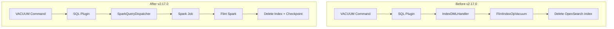

---
tags:
  - domain/search
  - component/server
  - indexing
  - sql
---
# Flint Index Operations

## Summary

This release delegates the Flint index vacuum operation from the SQL plugin to Apache Spark (Flint Spark). Previously, the SQL plugin handled vacuum operations directly to minimize latency and cost. However, with the need for checkpoint cleanup functionality, this approach became impractical. The change removes redundant vacuum logic from the SQL plugin and fully delegates the operation to Flint Spark, enabling proper checkpoint data cleanup.

## Details

### What's New in v2.17.0

The vacuum operation for Flint indexes is now delegated to Spark instead of being handled directly by the SQL plugin. This architectural change enables:

1. **Checkpoint cleanup**: The vacuum operation can now delete checkpoint data stored in S3, which was not possible when handled by the SQL plugin
2. **Simplified codebase**: Removes duplicate vacuum logic that existed in both the SQL plugin and Flint Spark
3. **Consistent behavior**: All vacuum operations now go through Spark, ensuring consistent handling across all index types

### Technical Changes

#### Architecture Changes



#### Removed Components

| Component | Description |
|-----------|-------------|
| `FlintIndexOpVacuum` | Class that handled vacuum operations in the SQL plugin |
| `FlintIndexOpFactory.getVacuum()` | Factory method for creating vacuum operations |
| Vacuum statement visitors | SQL parser visitors for VACUUM statements |

#### Changed Components

| Component | Change |
|-----------|--------|
| `IndexDMLHandler` | Removed VACUUM case from index operation handling |
| `SparkQueryDispatcher` | VACUUM no longer eligible for IndexDML handling |
| `SQLQueryUtils` | Removed vacuum statement visitor methods |

### Usage Example

The VACUUM command syntax remains unchanged. The difference is in how it's processed internally:

```sql
-- Create a materialized view with checkpoint
CREATE MATERIALIZED VIEW mys3.default.my_view AS 
SELECT clientip FROM mys3.default.http_logs 
WITH (auto_refresh = true, checkpoint_location = 's3://checkpoint/my-view')

-- Drop the materialized view (index remains in DELETED state)
DROP MATERIALIZED VIEW mys3.default.my_view

-- Vacuum to clean up both index and checkpoint data
VACUUM MATERIALIZED VIEW mys3.default.my_view
```

After vacuum, both the OpenSearch index and the S3 checkpoint data are deleted.

### Migration Notes

- No user-facing changes required
- VACUUM commands continue to work with the same syntax
- Vacuum operations may take slightly longer as they now run as Spark jobs
- Checkpoint data is now properly cleaned up during vacuum operations

## Limitations

- Vacuum operations now require a Spark job to be submitted, which may increase latency compared to the previous direct handling
- The operation depends on Flint Spark availability

## References

### Documentation
- [PR #2557](https://github.com/opensearch-project/sql/pull/2557): Original vacuum implementation in SQL plugin

### Pull Requests
| PR | Description |
|----|-------------|
| [#2985](https://github.com/opensearch-project/sql/pull/2985) | Delegate Flint index vacuum operation to Spark (main) |
| [#2995](https://github.com/opensearch-project/sql/pull/2995) | Manual backport to 2.17 branch |

### Issues (Design / RFC)
- [Issue #580](https://github.com/opensearch-project/opensearch-spark/issues/580): VACUUM index statement should delete checkpoint data

## Related Feature Report

- Full feature documentation
