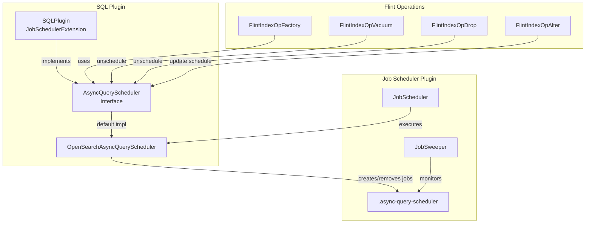

---
tags:
  - indexing
  - search
  - sql
---

# Flint Query Scheduler

## Summary

The Flint Query Scheduler introduces an external scheduling mechanism for managing automatic index refreshes in OpenSearch's async query feature. This feature integrates with the OpenSearch Job Scheduler plugin to provide cost-effective, observable, and controllable refresh operations for Flint indexes (skipping indexes, covering indexes, and materialized views) used with external data sources like Amazon S3.

## Details

### What's New in v2.17.0

This release introduces the complete Flint Query Scheduler feature through three main components:

1. **Job Scheduler Plugin Integration** - SQLPlugin now extends JobSchedulerExtension, enabling scheduled job management
2. **Async Query Scheduler Service** - Abstract scheduler interface with OpenSearch implementation for managing refresh jobs
3. **Feature Flag Support** - Configuration option to enable/disable the external scheduler mode

### Technical Changes

#### Architecture Changes



#### New Components

| Component | Description |
|-----------|-------------|
| `OpenSearchAsyncQueryScheduler` | Implementation of `AsyncQueryScheduler` using OpenSearch Job Scheduler |
| `AsyncQuerySchedulerRequest` | Data model for scheduler job requests |
| `OpenSearchRefreshIndexJob` | Scheduled job runner for index refresh operations |
| `OpenSearchRefreshIndexJobRequest` | Job request model stored in scheduler index |

#### New Configuration

| Setting | Description | Default |
|---------|-------------|---------|
| `plugins.query.executionengine.async_query.enabled` | Enable async query execution | `true` |
| `plugins.query.executionengine.async_query.external_scheduler.interval` | External scheduler check interval | `5 minutes` |

#### Index Changes

| Index | Description |
|-------|-------------|
| `.async-query-scheduler` | System index storing scheduled job metadata |
| `.opendistro-job-scheduler-lock` | Lock index for job execution coordination |

### Usage Example

```sql
-- Create index with external scheduler (default)
CREATE SKIPPING INDEX example_index
WITH (
    auto_refresh = true,
    refresh_interval = '15 minutes'
);

-- Create index with internal scheduler
CREATE SKIPPING INDEX example_index
WITH (
    auto_refresh = true,
    refresh_interval = '15 minutes',
    scheduler_mode = 'internal'
);

-- Switch to external scheduler
ALTER MATERIALIZED VIEW myglue_test.default.count_by_status
WITH (scheduler_mode = 'external');

-- Disable auto-refresh
ALTER MATERIALIZED VIEW myglue_test.default.count_by_status
WITH (auto_refresh = false);
```

### Migration Notes

- Existing streaming jobs are automatically migrated to scheduled jobs during cluster bootstrap
- The `scheduler_mode` parameter controls whether to use internal (Spark) or external (OpenSearch) scheduling
- External scheduler requires `checkpoint_location` for state management

## Limitations

- External scheduler is designed for batch refresh operations, not low-latency streaming use cases
- Only one refresh operation can be active for any given index or materialized view at a time
- Feature flag must be enabled for the scheduler to function

## References

### Documentation
- [Documentation](https://docs.opensearch.org/2.17/dashboards/management/scheduled-query-acceleration/): Scheduled Query Acceleration

### Pull Requests
| PR | Description |
|----|-------------|
| [#2834](https://github.com/opensearch-project/sql/pull/2834) | Flint query scheduler part 1 - integrate job scheduler plugin |
| [#2961](https://github.com/opensearch-project/sql/pull/2961) | Flint query scheduler part 2 - scheduler service and Flint integration |
| [#2973](https://github.com/opensearch-project/sql/pull/2973) | Add feature flag for async query scheduler |
| [#2889](https://github.com/opensearch-project/sql/pull/2889) | Backport to 2.x |
| [#2975](https://github.com/opensearch-project/sql/pull/2975) | Backport to 2.17 |
| [#2989](https://github.com/opensearch-project/sql/pull/2989) | Backport feature flag to 2.17 |

### Issues (Design / RFC)
- [Issue #2832](https://github.com/opensearch-project/sql/issues/2832): Integrate job scheduler plugin
- [Issue #2833](https://github.com/opensearch-project/sql/issues/2833): Introduce scheduling service
- [RFC #416](https://github.com/opensearch-project/opensearch-spark/issues/416): Direct Query External Query Scheduler

## Related Feature Report

- [Full feature documentation](../../../../features/sql/flint-query-scheduler.md)
