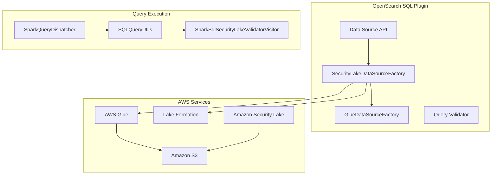

---
tags:
  - indexing
  - ml
  - search
  - security
  - sql
---

# Security Lake Data Source

## Summary

OpenSearch v2.17.0 introduces a new `SECURITY_LAKE` data source type that enables querying Amazon Security Lake tables directly from OpenSearch. This feature adds query validation to restrict Security Lake queries to SELECT statements and Flint index operations only, preventing privilege escalation beyond Lake Formation permissions.

## Details

### What's New in v2.17.0

This release introduces two key enhancements:

1. **New SECURITY_LAKE Data Source Type**: A dedicated connector for Amazon Security Lake that automatically enables Iceberg and Lake Formation integration
2. **Query Validation for Security Lake**: Restricts queries to SELECT statements and Flint commands to prevent unauthorized data modifications

### Technical Changes

#### Architecture Changes



#### New Components

| Component | Description |
|-----------|-------------|
| `SecurityLakeDataSourceFactory` | Factory class for creating Security Lake data sources, extends `GlueDataSourceFactory` |
| `SparkSqlSecurityLakeValidatorVisitor` | ANTLR visitor that validates queries for Security Lake, allowing only SELECT statements |
| `DataSourceType.SECURITY_LAKE` | New data source type constant |

#### New Configuration

| Setting | Description | Default |
|---------|-------------|---------|
| `glue.iceberg.enabled` | Enable Iceberg catalog support | `false` |
| `glue.lakeformation.enabled` | Enable Lake Formation authorization | `false` |
| `glue.lakeformation.session_tag` | Session tag for Lake Formation role assumption | Required when LF enabled |

### Usage Example

Create a Security Lake data source:

```json
POST /_plugins/_query/_datasources
{
  "name": "my_security_lake",
  "connector": "security_lake",
  "properties": {
    "glue.auth.type": "iam_role",
    "glue.auth.role_arn": "arn:aws:iam::123456789012:role/SecurityLakeRole",
    "glue.indexstore.opensearch.uri": "https://opensearch.example.com:9200",
    "glue.indexstore.opensearch.auth": "awssigv4",
    "glue.indexstore.opensearch.auth.region": "us-west-2",
    "glue.lakeformation.session_tag": "opensearch-query"
  },
  "resultIndex": "query_execution_result"
}
```

Query Security Lake data:

```sql
SELECT * FROM my_security_lake.amazon_security_lake_glue_db_us_west_2.amazon_security_lake_table_us_west_2_vpc_flow_2_0 LIMIT 10
```

### Migration Notes

- Security Lake data sources automatically enable Iceberg and Lake Formation
- The `glue.lakeformation.session_tag` property is required for Security Lake data sources
- Only SELECT queries and Flint index operations are allowed on Security Lake data sources

## Limitations

- Only SELECT statements and Flint index commands (CREATE INDEX, REFRESH INDEX) are supported
- DDL operations (CREATE TABLE, DROP TABLE, etc.) are blocked
- DML operations (INSERT, UPDATE, DELETE) are blocked
- Covering index acceleration is disabled when Lake Formation is enabled

## References

### Documentation
- [Amazon Security Lake Documentation](https://docs.aws.amazon.com/security-lake/latest/userguide/what-is-security-lake.html)
- [OpenSearch S3 Data Source Documentation](https://docs.opensearch.org/2.17/dashboards/management/S3-data-source/)

### Pull Requests
| PR | Description |
|----|-------------|
| [#2858](https://github.com/opensearch-project/sql/pull/2858) | Add flags for Iceberg and Lake Formation and Security Lake as a data source type |
| [#2978](https://github.com/opensearch-project/sql/pull/2978) | Backport #2858 to 2.17 |
| [#2959](https://github.com/opensearch-project/sql/pull/2959) | Adds validation to allow only flint queries and sql SELECT queries to security lake type datasource |
| [#2977](https://github.com/opensearch-project/sql/pull/2977) | Backport #2959 to 2.17 |

### Issues (Design / RFC)
- [Issue #2907](https://github.com/opensearch-project/sql/issues/2907): Limit Spark SQL queries to SELECT + FLINT commands when Lake Formation is enabled

## Related Feature Report

- [Full feature documentation](../../../../features/sql/sql-security-lake-data-source.md)
