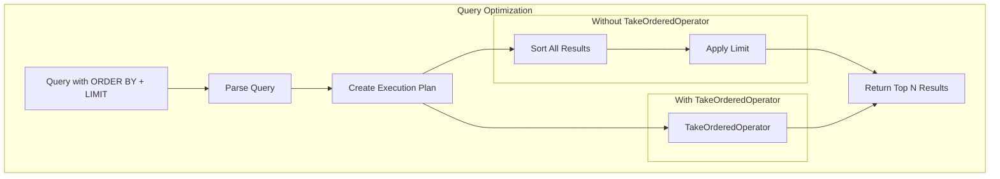

# SQL/PPL Enhancements

## Summary

OpenSearch v2.17.0 introduces several enhancements to the SQL/PPL plugin, including an increased default query size limit, support for common geo point formats, a new TakeOrderedOperator for query optimization, and complex predicate support in the PPL `IF` function.

## Details

### What's New in v2.17.0

#### 1. Increased Default Query Size Limit

The default value of `plugins.query.size_limit` has been changed from 200 to 10000 (matching `index.max_result_window`). The previous default of 200 was insufficient for many use cases and resulted in incorrect query outcomes.

| Setting | Old Default | New Default |
|---------|-------------|-------------|
| `plugins.query.size_limit` | 200 | 10000 |

#### 2. Common Format Geo Point Support

SQL/PPL now supports all common geo point formats as described in OpenSearch documentation, not just the object format with latitude and longitude.

Supported formats:
- Object: `{"lat": 40.71, "lon": -74.00}`
- String: `"40.71,-74.00"`
- Geohash: `"drm3btev3e86"`
- Array: `[-74.00, 40.71]`
- WKT: `"POINT (-74.00 40.71)"`

#### 3. TakeOrderedOperator

A new `TakeOrderedOperator` has been added to optimize queries that combine sorting and limiting. This operator efficiently handles `ORDER BY ... LIMIT` patterns by maintaining only the top N results during processing.



#### 4. Complex Predicates in PPL IF Function

The `IF` function in PPL now supports complex predicate expressions. Previously, only `TrueLiteral` and `FalseLiteral` were supported.

Newly supported patterns:
- Comparison: `if(a > 2, arg1, arg2)`
- Inequality: `if(a != 2, arg1, arg2)`
- Null check: `if(isnull(a), arg1, arg2)`
- Negation: `if(not a > 2, arg1, arg2)`
- IN clause: `if(not a in (0, 1), arg1, arg2)`
- Compound: `if(not a in (0, 1) OR isnull(a), arg1, arg2)`
- Pattern matching: `if(like(a, '_a%b%c_d_'), arg1, arg2)`

### Usage Example

```bash
# PPL query with complex IF predicate
POST /_plugins/_ppl
{
  "query": "source=my_index | eval status = if(response_code >= 400, 'error', 'success') | fields timestamp, status"
}

# PPL query with geo point (various formats supported)
POST /_plugins/_ppl
{
  "query": "source=locations | where geopoint = '40.71,-74.00'"
}

# Query benefiting from TakeOrderedOperator
POST /_plugins/_sql
{
  "query": "SELECT * FROM logs ORDER BY timestamp DESC LIMIT 100"
}
```

### Migration Notes

The increased `plugins.query.size_limit` default may affect memory usage for queries that previously returned truncated results. If you need to maintain the old behavior, explicitly set:

```bash
PUT _cluster/settings
{
  "persistent": {
    "plugins.query.size_limit": 200
  }
}
```

## Limitations

- The TakeOrderedOperator optimization applies only to specific query patterns
- Geo point format support is for reading/querying; indexing behavior unchanged

## Related PRs

| PR | Description |
|----|-------------|
| [#2877](https://github.com/opensearch-project/sql/pull/2877) | Change default value of plugins.query.size_limit to MAX_RESULT_WINDOW (10000) |
| [#2896](https://github.com/opensearch-project/sql/pull/2896) | Support common format geo point |
| [#2906](https://github.com/opensearch-project/sql/pull/2906) | Add TakeOrderedOperator |
| [#2970](https://github.com/opensearch-project/sql/pull/2970) | IF function should support complex predicates in PPL |

## References

- [Issue #2859](https://github.com/opensearch-project/sql/issues/2859): Query size limit issue
- [Issue #1432](https://github.com/opensearch-project/sql/issues/1432): Geo point format support request
- [Issue #2857](https://github.com/opensearch-project/sql/issues/2857): TakeOrderedOperator feature request
- [Issue #2600](https://github.com/opensearch-project/sql/issues/2600): IF function complex predicate support
- [Issue #2653](https://github.com/opensearch-project/sql/issues/2653): IF function predicate parsing issue
- [Geo Point Documentation](https://opensearch.org/docs/latest/field-types/supported-field-types/geo-point/): OpenSearch geo point formats
- [SQL and PPL Documentation](https://docs.opensearch.org/2.17/search-plugins/sql/index/): Official documentation

## Related Feature Report

- [Full feature documentation](../../../features/sql/sql-ppl-engine.md)
