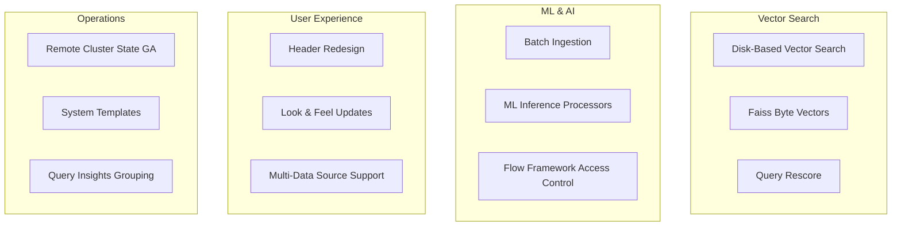

---
tags:
  - dashboards
  - k-nn
  - ml
  - performance
  - search
  - security
---

# OpenSearch v2.17.0 Release Summary

## Summary

OpenSearch 2.17.0 delivers significant advancements in vector search, machine learning workflows, and user experience. This release makes remote cluster state publication generally available, introduces disk-optimized vector search for cost-effective large-scale deployments, and adds comprehensive batch inference and ingestion capabilities. The Dashboards experience receives a major refresh with consistent header redesign across all plugins, while security enhancements enable zero-downtime JWT key rotation and improved multi-auth support.

## Highlights

## New Features

| Feature | Description | Report |
|---------|-------------|--------|
| Disk-Based Vector Search | Reduces memory by up to 32x using binary quantization and two-phase search | Details |
| Faiss Byte Vector Support | 75% memory reduction with byte vectors for HNSW and IVF algorithms | Details |
| Batch Asynchronous Ingestion | Ingest pre-generated embeddings from S3 or OpenAI into OpenSearch | Details |
| Flow Framework Access Control | Backend role-based access control for workflow templates | Details |
| Missing Data Handling | Imputation options for anomaly detection (zero, fixed, previous) | Details |
| Query Shape Generation | Group similar queries by structural similarity in Query Insights | Details |
| Security Lake Data Source | Query Amazon Security Lake tables directly from OpenSearch | Details |
| System Templates (Experimental) | Pre-defined index templates with optimized settings for logs/metrics | Details |

## Improvements

| Area | Description | Report |
|------|-------------|--------|
| Header Redesign | Consistent page headers across 7+ Dashboards plugins | Details |
| Look & Feel Updates | Smaller, compressed UI components for improved density | Details |
| Multi-Data Source Support | Extended MDS support to Observability and Integrations | Details |
| JWT Multiple Keys | Support for multiple signing keys enabling zero-downtime rotation | Details |
| Proxy Multi-Auth | Proxy authentication support in multi-auth configurations | Details |
| k-NN Query Rescore | Two-phase search with rescoring for improved recall | Details |
| ML Inference One-to-One | Run model predictions per document in search response processor | Details |
| Flow Framework Reprovision | Update pipelines and index settings without full deprovision | Details |
| Remote/Multi-Index AD | Anomaly detection across remote clusters and multiple indices | Details |
| Flint Query Scheduler | Integrated job scheduler for async query management | Details |
| Performance Analyzer Cache Config | New collector for cache configuration metrics | Details |

## Bug Fixes

| Fix | Description | PR |
|-----|-------------|-----|
| k-NN Memory Overflow | Fixed cache behavior causing memory overflow | [#2015](https://github.com/opensearch-project/k-NN/pull/2015) |
| Hybrid Search Results | Fixed merge logic for multiple shards in hybrid query | [#877](https://github.com/opensearch-project/neural-search/pull/877) |
| Monitor Lock Renewal | Fixed alerting monitor lock renewal issue | [#1623](https://github.com/opensearch-project/alerting/pull/1623) |
| ML Model Deletion | Fixed 500 error when deleting local model twice quickly | [#2806](https://github.com/opensearch-project/ml-commons/pull/2806) |
| Threat Intel Fixes | Multiple fixes for threat intel source configs and IOC handling | [#1254](https://github.com/opensearch-project/security-analytics/pull/1254) |
| Job Scheduler v1 Templates | Fixed system index compatibility with v1 templates | [#658](https://github.com/opensearch-project/job-scheduler/pull/658) |
| SQL Boolean Functions | Boolean functions in PPL now case insensitive | [#2842](https://github.com/opensearch-project/sql/pull/2842) |
| Trace Analytics MDS | Fixed local cluster rendering and breadcrumb issues | [#2006](https://github.com/opensearch-project/dashboards-observability/pull/2006) |

## Breaking Changes

| Change | Migration | Report |
|--------|-----------|--------|
| None | N/A | N/A |

## Experimental Features

| Feature | Description | Report |
|---------|-------------|--------|
| System Templates | Application-based configuration templates for logs, metrics, and cloud services | Details |
| Search-Only Replicas | New replica shard type for search isolation (not covered in reports) | - |
| Approximation Framework | Short-circuit expensive queries by scoring only relevant documents | - |
| Custom Trace Source | OpenTelemetry-based trace source with redesigned UI | Details |

## Dependencies

Notable dependency updates:

- Spring Framework: 5.3.37 → 5.3.39
- Gradle: Updated to 8.10
- JUnit Jupiter: 5.10.3 → 5.11.0
- Various CVE fixes for micromatch, braces, and lint-staged

## Statistics

| Category | Count |
|----------|-------|
| Feature Reports | 83 |
| Plugins Updated | 30+ |
| New Features | 8 |
| Improvements | 50+ |
| Bug Fixes | 60+ |

## References

- [Official Release Notes](https://github.com/opensearch-project/opensearch-build/blob/main/release-notes/opensearch-release-notes-2.17.0.md)
- [OpenSearch 2.17.0 Announcement](https://opensearch.org/blog/introducing-opensearch-2-17)
- [OpenSearch 2.17.0 Downloads](https://opensearch.org/versions/opensearch-2-17-0.html)
- [Feature Reports](features/)
