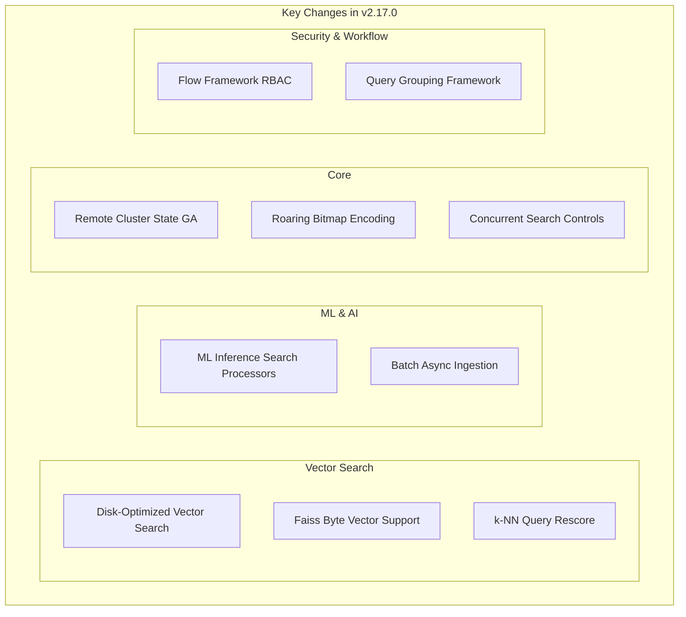

# OpenSearch v2.17.0 Release Summary

## Summary

OpenSearch 2.17.0 focuses on machine learning integration, vector search optimization, and cost efficiency improvements. Key highlights include GA release of remote cluster state publication, disk-optimized vector search, Faiss byte vector support, ML inference search processors, and batch asynchronous ingestion capabilities.

## Highlights

## New Features

| Feature | Description | Component |
|---------|-------------|-----------|
| Remote Cluster State Publication (GA) | Previously experimental, now generally available for improved cluster resilience | OpenSearch Core |
| Disk-Optimized Vector Search | Significantly reduces operational costs for vector workloads | k-NN |
| Faiss Byte Vector Support | Memory-efficient encoding reducing requirements by up to 75% with minimal recall drop | k-NN |
| ML Inference Search Processors | Run model predictions during search queries | ML Commons |
| Batch Asynchronous Ingestion | Trigger batch inference jobs, monitor status, and ingest results | ML Commons |
| Flow Framework RBAC | User-level access control based on backend roles for workflows | Flow Framework |
| Roaring Bitmap Encoding | Efficient encoding for numeric term values, improving filter performance | OpenSearch Core |
| Concurrent Search Controls | New index/cluster settings for granular control over concurrent segment search | OpenSearch Core |
| Missing Data Handling in AD | Support for handling missing data in anomaly detection | Anomaly Detection |
| Flint Query Scheduler | Integration with job scheduler plugin for async query scheduling | SQL |

## Experimental Features

| Feature | Description | Component |
|---------|-------------|-----------|
| Application-Based Config Templates | Pre-defined component templates for streamlined index creation | OpenSearch Core |
| Search-Only Replica Shards | New replica shard type for indexing/search isolation | OpenSearch Core |
| Approximation Framework | Short-circuit expensive queries by scoring only relevant documents | OpenSearch Core |
| Custom Trace Source | OpenTelemetry-based trace source with redesigned overview page | Observability |

## Improvements

| Area | Description | PR |
|------|-------------|-----|
| k-NN | Iterative graph build for improved memory footprint during indexing | [#1950](https://github.com/opensearch-project/k-NN/pull/1950) |
| k-NN | Model version in metadata, reads from cluster metadata | [#2005](https://github.com/opensearch-project/k-NN/pull/2005) |
| k-NN | spaceType as top-level optional parameter for vector fields | [#2044](https://github.com/opensearch-project/k-NN/pull/2044) |
| Neural Search | Rescore parameter support | [#885](https://github.com/opensearch-project/neural-search/pull/885) |
| ML Commons | one_to_one support in ML Inference Search Response Processor | [#2801](https://github.com/opensearch-project/ml-commons/pull/2801) |
| ML Commons | Exposed ML Config API | [#2850](https://github.com/opensearch-project/ml-commons/pull/2850) |
| Query Insights | Query grouping framework for Top N queries | [#66](https://github.com/opensearch-project/query-insights/pull/66) |
| Security | Multiple signing keys support | [#4666](https://github.com/opensearch-project/security/pull/4666) |
| Security | ignore_hosts config for auth failure listener | [#4538](https://github.com/opensearch-project/security/pull/4538) |
| SQL | Support for common format geo point | [#2896](https://github.com/opensearch-project/sql/pull/2896) |
| SQL | Iceberg, Lake Formation, Security Lake data source flags | [#2978](https://github.com/opensearch-project/sql/pull/2978) |

## Bug Fixes

| Issue | Description | PR |
|-------|-------------|-----|
| k-NN | Fixed search logic for non-existent fields in filter | [#1874](https://github.com/opensearch-project/k-NN/pull/1874) |
| k-NN | Fixed memory overflow caused by cache behavior | [#2015](https://github.com/opensearch-project/k-NN/pull/2015) |
| Neural Search | Fixed merge logic in hybrid query for multiple shards | [#877](https://github.com/opensearch-project/neural-search/pull/877) |
| ML Commons | Fixed delete local model 500 response issue | [#2806](https://github.com/opensearch-project/ml-commons/pull/2806) |
| ML Commons | Fixed Cohere model input validation | [#2847](https://github.com/opensearch-project/ml-commons/pull/2847) |
| Anomaly Detection | Prevent resetting latest flag during historical analysis | [#1287](https://github.com/opensearch-project/anomaly-detection/pull/1287) |
| Alerting | Fixed monitor renew lock issue | [#1623](https://github.com/opensearch-project/alerting/pull/1623) |
| Security | Fixed authtoken endpoint | [#4631](https://github.com/opensearch-project/security/pull/4631) |
| Security | Fixed READ_ACTIONS required by TermsAggregationEvaluator | [#4607](https://github.com/opensearch-project/security/pull/4607) |

## Breaking Changes

No breaking changes in this release.

## UI/UX Improvements

This release includes significant UI consistency and density improvements across multiple Dashboards plugins:

| Plugin | Changes |
|--------|---------|
| Anomaly Detection Dashboards | Header redesign, smaller/compressed button variants |
| Index Management Dashboards | New page headers across all pages, fit and finish improvements |
| Security Analytics Dashboards | Page header updates, threat alerts card for Analytics workspace |
| Security Dashboards | Page headers, consistency and density improvements |
| Observability Dashboards | New page headers for metrics, applications, notebooks, logs |
| ML Commons Dashboards | New page header API support, font alignment with UX guidelines |

## Dependencies

Notable dependency updates include security-related bumps and maintenance updates across plugins. See individual plugin release notes for details.

## References

- [Official Release Notes](https://github.com/opensearch-project/opensearch-build/blob/main/release-notes/opensearch-release-notes-2.17.0.md)
- [OpenSearch 2.17.0 Announcement](https://opensearch.org/blog/introducing-opensearch-2-17)
- [OpenSearch Downloads](https://opensearch.org/downloads.html)
