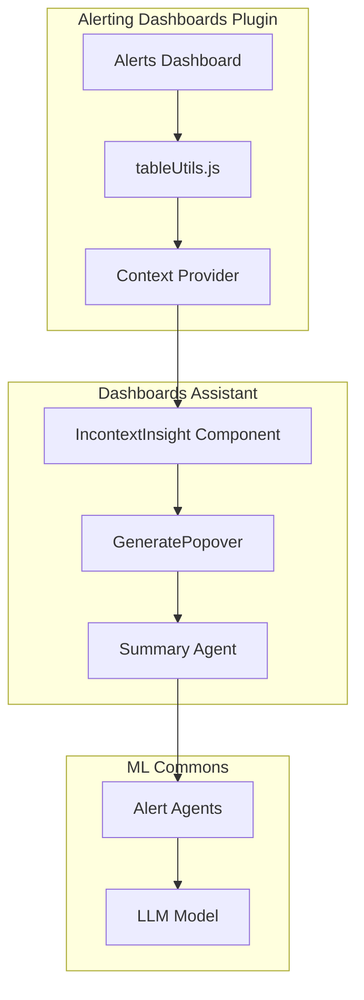

---
tags:
  - dashboards
  - ml
  - sql
---

# Alerting Summary & Insights

## Summary

OpenSearch v2.18.0 introduces AI-powered alert insights in the Alerting Dashboards plugin. This feature integrates with the OpenSearch Dashboards Assistant to provide context-aware alert analysis, generating summaries and log pattern analysis for triggered alerts using large language models (LLMs).

## Details

### What's New in v2.18.0

- **Context-aware alert analysis**: Users can generate AI-powered summaries directly from the alerts dashboard
- **In-context prompting**: Popover interface for quick alert summarization without leaving the alerts view
- **Log pattern analysis**: Automatic detection and display of top N log patterns for visual editor monitors
- **Assistant integration**: Leverages the IncontextInsight component from dashboards-assistant plugin

### Technical Changes

#### Architecture Changes



#### New Components

| Component | Description |
|-----------|-------------|
| `contextProvider` | Async function that builds alert context for LLM summarization |
| `IncontextInsight` wrapper | Wraps alert links to enable AI insight generation |
| `OPERATORS_PPL_QUERY_MAP` | Maps DSL filter operators to PPL equivalents for log pattern queries |

#### New Configuration

| Setting | Description | Default |
|---------|-------------|---------|
| `assistant.alertInsight.enabled` | Enable alert insights feature | `false` |
| `DEFAULT_LOG_PATTERN_TOP_N` | Number of top log patterns to display | `3` |
| `DEFAULT_LOG_PATTERN_SAMPLE_SIZE` | Sample size for log pattern analysis | `20` |
| `DEFAULT_ACTIVE_ALERTS_TOP_N` | Maximum active alerts sent to LLM | `10` |

#### API Changes

The feature uses the existing Assistant APIs:
- `POST /api/assistant/summary` - Generate alert summaries
- `POST /api/assistant/insight` - Generate alert insights

### Usage Example

When alert insights are enabled and configured:

1. Navigate to **OpenSearch Plugins > Alerting**
2. Hover over alerts to see the sparkle icon (✨)
3. Click to generate AI-powered summary
4. View log patterns and insights in the popover

```javascript
// Context provider builds rich context for LLM
const contextProvider = async () => {
  // 1. Get monitor definition
  const monitorDefinition = await getMonitor(alert.monitor_id);
  
  // 2. Translate DSL filters to PPL for log pattern analysis
  const pplFilters = uiFilters.map(filter => 
    OPERATORS_PPL_QUERY_MAP[filter.operator].query(filter)
  );
  
  // 3. Execute log pattern query
  const topNLogPatternPPL = `${basePPL} | patterns ${patternField} | 
    stats count() as count, take(${patternField}, ${sampleSize}) 
    by patterns_field | sort - count | head ${topN}`;
  
  // 4. Return context for LLM
  return {
    context: `Monitor: ${monitorDefinition}...`,
    additionalInfo: { topNLogPatternData, dsl, index }
  };
};
```

### Migration Notes

To enable alert insights:

1. Enable the feature in `opensearch_dashboards.yml`:
   ```yaml
   assistant.alertInsight.enabled: true
   ```

2. Create required ML agents using Flow Framework templates:
   - Alert summary agent
   - Alert summary with log patterns agent
   - Alert insights agent

3. Register root agents in `.plugins-ml-config` index

## Limitations

- Log pattern analysis only available for query monitors created via visual editor
- Requires dashboards-assistant plugin to be installed
- LLM model must be configured and deployed
- Context size limited to top 10 active alerts to manage token usage

## References

### Documentation
- [Alert Insights Documentation](https://docs.opensearch.org/2.18/dashboards/dashboards-assistant/alert-insight/): Official documentation
- [Flow Framework Templates](https://github.com/opensearch-project/flow-framework/tree/2.x/sample-templates): Agent templates

### Pull Requests
| PR | Description |
|----|-------------|
| [#996](https://github.com/opensearch-project/alerting-dashboards-plugin/pull/996) | Context aware alert analysis |
| [#1119](https://github.com/opensearch-project/alerting-dashboards-plugin/pull/1119) | Support top N log pattern data in summary context provider |

### Issues (Design / RFC)
- [Issue #995](https://github.com/opensearch-project/alerting-dashboards-plugin/issues/995): Feature request for context-aware alert analysis

## Related Feature Report

- [Full feature documentation](../../../features/alerting-dashboards-plugin/alerting-dashboards-plugin-alerting-summary-insights.md)
