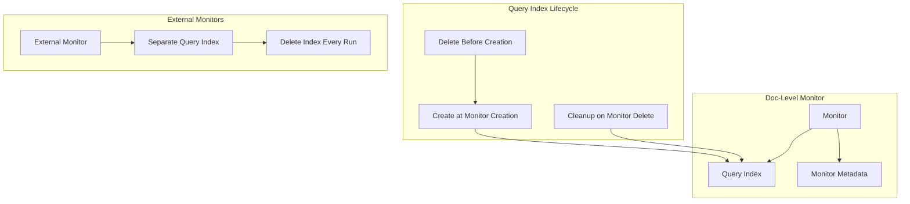

---
tags:
  - indexing
  - observability
  - performance
  - search
  - security
---

# Alerting Doc-Level Monitor Bugfixes

## Summary

This release includes several bug fixes and improvements for doc-level monitors in the Alerting plugin. Key changes include adding Alerting Comments system indices with security integration tests, improved logging for remote monitor execution, separate query indices for externally defined monitors, and optimized query index lifecycle management.

## Details

### What's New in v2.18.0

This release addresses multiple issues related to doc-level monitor query index management and adds infrastructure for alerting comments.

### Technical Changes

#### Architecture Changes



#### New Components

| Component | Description |
|-----------|-------------|
| `CommentsIndices` | System indices for alerting comments with security integration |
| `deleteQueryIndexInEveryRun` | Boolean flag to control query index deletion behavior for external monitors |
| `deleteDocLevelQueryIndex` | New method to delete doc-level query index |

#### New Configuration

| Setting | Description | Default |
|---------|-------------|---------|
| `delete_query_index_in_every_run` | Controls whether query index is deleted on every monitor run | `false` |

### Usage Example

Creating a doc-level monitor with external query index management:

```json
POST _plugins/_alerting/monitors
{
  "type": "monitor",
  "name": "external-doc-level-monitor",
  "monitor_type": "doc_level_monitor",
  "enabled": true,
  "owner": "sample-remote-monitor-plugin",
  "schedule": {
    "period": {
      "interval": 1,
      "unit": "MINUTES"
    }
  },
  "inputs": [{
    "doc_level_input": {
      "indices": ["logs-*"],
      "queries": [{
        "id": "query1",
        "name": "error-query",
        "query": "level:ERROR"
      }]
    }
  }],
  "triggers": [{
    "name": "error-trigger",
    "severity": "1",
    "condition": {
      "script": {
        "source": "return true",
        "lang": "painless"
      }
    }
  }]
}
```

### Migration Notes

- Monitors with `deleteQueryIndexInEveryRun=true` (typically externally defined monitors) will have their query indices deleted after each run
- Query indices are now created at monitor creation time rather than at first execution
- The deletion of query index now happens before its creation to prevent stale data issues

## Limitations

- External monitors with `deleteQueryIndexInEveryRun=true` may have slightly higher overhead due to index recreation
- Comments system indices require security plugin integration for proper access control

## References

### Documentation
- [Per Document Monitors Documentation](https://docs.opensearch.org/2.18/observing-your-data/alerting/per-document-monitors/): Official documentation for per-document monitors
- [Alerting Documentation](https://docs.opensearch.org/2.18/observing-your-data/alerting/index/): Main alerting documentation
- [PR #1655](https://github.com/opensearch-project/alerting/pull/1655): Related PR for alerting comments feature
- [PR #1673](https://github.com/opensearch-project/alerting/pull/1673): Related PR for query index creation

### Pull Requests
| PR | Description |
|----|-------------|
| [#1659](https://github.com/opensearch-project/alerting/pull/1659) | Adding Alerting Comments system indices and Security ITs |
| [#1663](https://github.com/opensearch-project/alerting/pull/1663) | Add logging for remote monitor execution flows |
| [#1664](https://github.com/opensearch-project/alerting/pull/1664) | Separate doc-level monitor query indices for externally defined monitors |
| [#1668](https://github.com/opensearch-project/alerting/pull/1668) | Move deletion of query index before its creation |
| [#1674](https://github.com/opensearch-project/alerting/pull/1674) | Create query index at the time of monitor creation |

## Related Feature Report

- [Full feature documentation](../../../../features/alerting/alerting.md)
