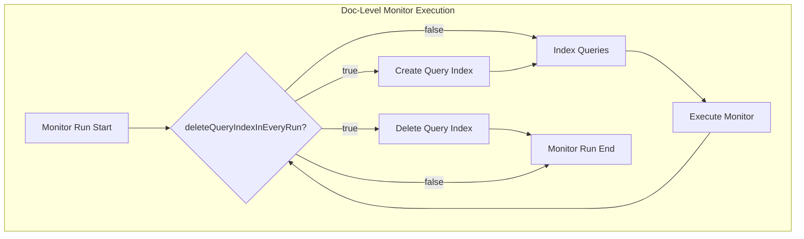

# Doc-Level Monitor Query Indices

## Summary

This enhancement adds support for dynamic deletion of doc-level monitor query indices through a new `delete_query_index_in_every_run` configuration flag. This feature is designed for externally defined monitors (such as those created by Security Analytics) that manage their own query indices and need to recreate them on each monitor run.

## Details

### What's New in v2.18.0

A new boolean field `delete_query_index_in_every_run` has been added to the Monitor model. When set to `true`, the doc-level monitor will automatically delete its query index at the end of each execution run and recreate it at the start of the next run.

### Technical Changes

#### Architecture Changes



#### New Configuration

| Setting | Description | Default |
|---------|-------------|---------|
| `delete_query_index_in_every_run` | When true, deletes and recreates the query index on each monitor run | `false` |

#### API Changes

The Monitor API now accepts the new field:

```json
{
  "type": "monitor",
  "monitor_type": "doc_level_monitor",
  "delete_query_index_in_every_run": true,
  ...
}
```

### Usage Example

Creating a doc-level monitor with dynamic query index deletion:

```json
POST _plugins/_alerting/monitors
{
  "type": "monitor",
  "name": "external-doc-level-monitor",
  "monitor_type": "doc_level_monitor",
  "enabled": true,
  "delete_query_index_in_every_run": true,
  "schedule": {
    "period": {
      "interval": 1,
      "unit": "MINUTES"
    }
  },
  "inputs": [{
    "doc_level_input": {
      "description": "External monitor input",
      "indices": ["logs-*"],
      "queries": [{
        "id": "query1",
        "name": "error-detection",
        "query": "level:ERROR",
        "tags": ["error"]
      }]
    }
  }],
  "triggers": [{
    "name": "error-trigger",
    "severity": "1",
    "condition": {
      "script": {
        "source": "return true",
        "lang": "painless"
      }
    },
    "actions": []
  }],
  "owner": "security_analytics"
}
```

### Behavior Changes

1. **Monitor Creation**: When `delete_query_index_in_every_run` is `true`, query indices are NOT created at monitor creation time
2. **Monitor Execution**: Query index is created at the start of each run and deleted at the end
3. **Monitor Update**: Existing queries are deleted before re-indexing if the query index exists
4. **Monitor Deletion**: Query index is deleted directly without checking for other monitors' queries

### Migration Notes

- Existing monitors are unaffected (default value is `false`)
- External systems (like Security Analytics) that manage their own query indices should set this flag to `true`
- No migration required for existing monitors

## Limitations

- When enabled, query indices are ephemeral and not persisted between runs
- May increase overhead for monitors that run frequently due to index creation/deletion
- Not recommended for standard alerting use cases where query persistence is beneficial

## References

### Documentation
- [Per Document Monitors Documentation](https://docs.opensearch.org/2.18/observing-your-data/alerting/per-document-monitors/): Official documentation for per-document monitors

### Pull Requests
| PR | Description |
|----|-------------|
| [common-utils#734](https://github.com/opensearch-project/common-utils/pull/734) | Add `deleteQueryIndexInEveryRun` flag to Monitor model |
| [alerting#1664](https://github.com/opensearch-project/alerting/pull/1664) | Implement dynamic query index deletion for doc-level monitors |

## Related Feature Report

- [Full feature documentation](../../../../features/alerting/alerting.md)
