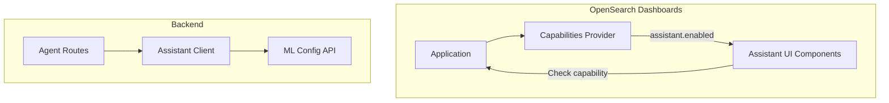

# Assistant Capabilities

## Summary

This release introduces assistant capabilities to the OpenSearch Dashboards Assistant plugin, enabling fine-grained control over which assistant UI components are rendered. The feature allows users to override capability switcher functions to conditionally show or hide assistant features based on application capabilities. Additionally, a new API is exposed to check if a given agent config name has an agent ID configured.

## Details

### What's New in v2.18.0

- **Capability-based UI rendering**: Assistant UI components now check `application.capabilities.assistant.enabled` before rendering
- **Agent config existence API**: New endpoint to verify if an agent configuration exists
- **Renamed API methods**: `agentName` parameter renamed to `agentConfigName` for clarity

### Technical Changes

#### Architecture Changes



#### New Components

| Component | Description |
|-----------|-------------|
| `capabilitiesProvider` | Server-side provider that registers `assistant.enabled` capability |
| `agentConfigExists` | Client method to check if agent config has an agent ID |
| `CONFIG_EXISTS` API | New REST endpoint at `/api/assistant/agent_config/_exists` |

#### New Configuration

| Setting | Description | Default |
|---------|-------------|---------|
| `assistant.enabled` | Capability flag controlling assistant UI visibility | `true` |

#### API Changes

New endpoint:
```
GET /api/assistant/agent_config/_exists?agentConfigName={name}&dataSourceId={id}
```

Response:
```json
{
  "exists": true
}
```

Renamed parameters:
- `agentName` → `agentConfigName` (for clarity, as agents have their own `name` field)

### Usage Example

Check if an agent configuration exists:

```typescript
const assistantService = getAssistantService();
const { exists } = await assistantService.client.agentConfigExists('os_summary', {
  dataSourceId: 'my-data-source'
});

if (exists) {
  // Agent is configured, show assistant features
}
```

Capability-based rendering in components:

```typescript
const assistantEnabled = coreStart.application.capabilities?.assistant?.enabled === true;
if (assistantEnabled) {
  // Render assistant UI components
}
```

### Migration Notes

- Update any code using `executeAgentByName` to use `executeAgentByConfigName`
- Update any code using `agentName` query parameter to use `agentConfigName`

## Limitations

- The capability check is performed at runtime, so UI may briefly render before being hidden if capability is disabled
- Agent config existence check requires a valid data source ID for multi-data-source environments

## References

### Documentation
- [OpenSearch Assistant Documentation](https://docs.opensearch.org/2.18/dashboards/dashboards-assistant/index/)
- [dashboards-assistant Repository](https://github.com/opensearch-project/dashboards-assistant)

### Pull Requests
| PR | Description |
|----|-------------|
| [#267](https://github.com/opensearch-project/dashboards-assistant/pull/267) | Add assistant capabilities to control rendering components |
| [#307](https://github.com/opensearch-project/dashboards-assistant/pull/307) | Expose API to check if agent config name has agent ID configured |

## Related Feature Report

- [Full feature documentation](../../../../features/dashboards-assistant/ai-assistant-chatbot.md)
