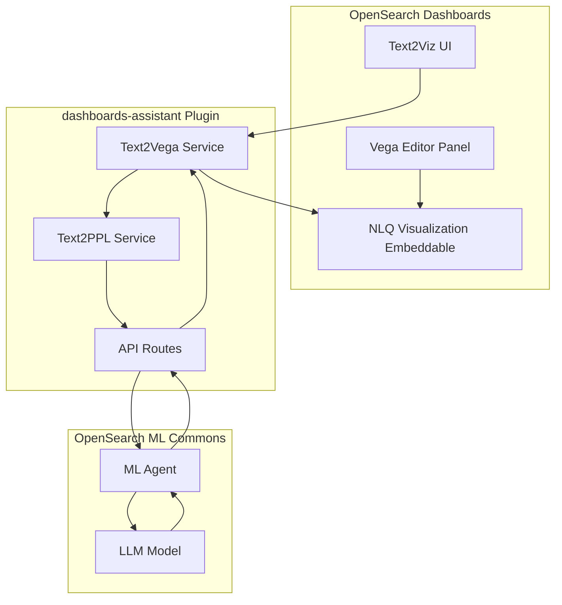
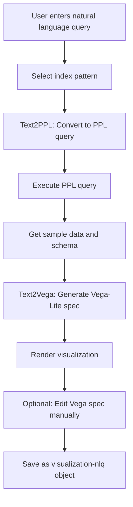

---
tags:
  - domain/ml
  - component/dashboards
  - dashboards
  - indexing
  - ml
  - search
  - sql
---
# Text to Visualization (t2viz)

## Summary

Text to Visualization (t2viz) is a new feature in OpenSearch Dashboards that enables users to generate visualizations using natural language queries. Instead of manually configuring charts and graphs, users can describe what they want to see in plain text, and the system uses LLM-powered agents to automatically generate Vega-Lite specifications for the visualization.

This feature was introduced in v2.18.0 as an experimental capability within the dashboards-assistant plugin.

## Details

### What's New in v2.18.0

- New `visualization-nlq` saved object type for storing natural language query visualizations
- New embeddable type `NLQVisualizationEmbeddable` for rendering t2viz visualizations in dashboards
- Integration with Discover page to pass index patterns and query assistant input to t2viz
- Data summary API (`/api/assistant/data2summary`) for generating summaries from data
- Configuration options to enable/disable the feature via `assistant.text2viz.enabled`

### Technical Changes

#### Architecture



#### Data Flow



#### New Components

| Component | Description |
|-----------|-------------|
| `Text2Viz` | Main React component for the t2viz page |
| `Text2Vega` | Service class that orchestrates text-to-visualization conversion |
| `NLQVisualizationEmbeddable` | Embeddable for rendering NLQ visualizations |
| `NLQVisualizationEmbeddableFactory` | Factory for creating NLQ embeddables |
| `EditorPanel` | Code editor for manual Vega spec editing |
| `SourceSelector` | Index pattern selector component |

#### New Configuration

| Setting | Description | Default |
|---------|-------------|---------|
| `assistant.text2viz.enabled` | Enable/disable text to visualization feature | `false` |

#### API Endpoints

| Endpoint | Method | Description |
|----------|--------|-------------|
| `/api/assistant/text2vega` | POST | Convert natural language to Vega-Lite spec |
| `/api/assistant/text2ppl` | POST | Convert natural language to PPL query |
| `/api/assistant/data2summary` | POST | Generate data summary using LLM |

### Usage Example

1. Navigate to **Visualize** > **Create visualization** > **Natural language**
2. Select a data source (index pattern)
3. Enter a natural language question:
   ```
   Show average bytes by machine OS over time
   ```
4. The system generates a Vega-Lite visualization
5. Optionally edit the generated Vega spec
6. Save the visualization

### Migration Notes

To enable text to visualization:

1. Configure `opensearch_dashboards.yml`:
   ```yaml
   assistant.text2viz.enabled: true
   ```

2. Set up the required ML agents using Flow Framework (see documentation for agent configuration)

3. Configure the root agent in `.plugins-ml-config`:
   ```json
   POST /.plugins-ml-config/_doc/os_text2vega
   {
     "type": "os_chat_root_agent",
     "configuration": {
       "agent_id": "<ROOT_AGENT_ID>"
     }
   }
   ```

## Limitations

- Experimental feature - not recommended for production use
- Requires ML Commons agents to be configured
- Input size limit of 400 characters for questions and instructions
- Currently only supports Vega-Lite visualization type
- Requires LLM model (e.g., Claude) to be configured via connector

## References

### Documentation
- [Documentation](https://docs.opensearch.org/2.18/dashboards/dashboards-assistant/text-to-visualization/): Official text to visualization docs
- [ML Commons Agents](https://docs.opensearch.org/2.18/ml-commons-plugin/agents-tools/index/): Agent configuration guide

### Pull Requests
| PR | Description |
|----|-------------|
| [#264](https://github.com/opensearch-project/dashboards-assistant/pull/264) | Add new feature to support text to visualization |
| [#295](https://github.com/opensearch-project/dashboards-assistant/pull/295) | Add discovery summary API |
| [#349](https://github.com/opensearch-project/dashboards-assistant/pull/349) | Take index pattern and user input to t2viz from discover |

### Issues (Design / RFC)
- [Issue #294](https://github.com/opensearch-project/dashboards-assistant/issues/294): Feature request for data summary API

## Related Feature Report

- Full feature documentation
